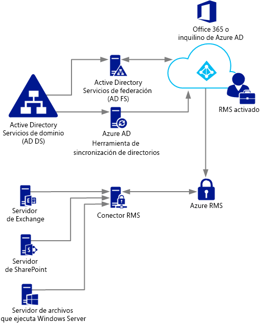
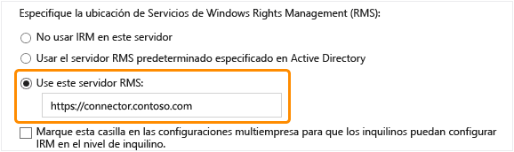

# Implementaci&#243;n del conector de Azure Rights Management
Use esta información para obtener más detalles acerca del conector Microsoft y sobre cómo puede usarlo para proporcionar protección de la información con implementaciones locales existentes que usan Microsoft Exchange Server, Microsoft SharePoint Server, o servidores de archivo que ejecutan Windows Server y usan la función de la Infraestructura de clasificación de archivos (FCI) del administrador de recursos del servidor de archivos.

> [!TIP]
> Para ver un escenario de ejemplo de alto nivel con capturas de pantalla, consulte la sección [Protección automática de archivos en los servidores de archivos con Windows Server y la infraestructura de clasificación de archivos](../Topic/What_is_Azure_Rights_Management_.md#BKMK_Example_FCI) en el tema [¿Qué es Rights Management de Azure?](../Topic/What_is_Azure_Rights_Management_.md).

## <a name="OverviewConnector"></a>Visión general del conector Rights Management de Microsoft
El conector Rights Management (RMS) de Microsoft le permite habilitar rápidamente servidores locales existentes para usar su funcionalidad de Information Rights Management (IRM) con el servicio Rights Management de Microsoft basado en la nube (Azure RMS). Con esta funcionalidad, los TI y los usuarios pueden proteger fácilmente documentos e imágenes tanto dentro como fuera de la organización, sin tener que instalar más infraestructuras o establecer relaciones de confianza con otras organizaciones. Puede usar este conector incluso si algunos de los usuarios se conectan a servicios en línea, en un escenario híbrido. Por ejemplo, los buzones de algunos usuarios usan Exchange Online y los buzones de otros usuarios usan Exchange Server. Después de instalar el conector RMS, todos los usuarios pueden proteger y consumir mensajes de correo electrónico y archivos adjuntos con Azure RMS, y la protección de la información funciona sin problemas entre las dos configuraciones de implementación.

El conector RMS es un servicio de una superficie pequeña que instala localmente en servidores que ejecutan Windows Server 2012 R2, Windows Server 2012 o Windows Server 2008 R2. Además de ejecutar el conector en equipos físicos, también puede ejecutarlo en máquinas virtuales, incluidas las máquinas virtuales de IaaS de Azure. Después de que instalar y configurar el conector, actúa como una interfaz de comunicaciones (una retransmisión) entre servidores locales y el servicio en la nube.

Si administra su propia clave de inquilino para Azure RMS (el escenario bring your own key o BYOK), el conector RMS y los servidores locales que lo usan no tienen acceso al módulo de seguridad de hardware (HSM) que contiene la clave de inquilino. Esto se debe a que todas las operaciones criptográficas que utilizan la clave de inquilino se ejecutan en Azure RMS y no a nivel local.



El conector RMS admite los siguientes servidores locales: Exchange Server, SharePoint Server y servidores de archivos que ejecutan Windows Server y usan las Infraestructuras de clasificación de archivos para clasificar y aplicar directivas a documentos de Office de una carpeta. Si desea proteger todos los tipos de archivos mediante la clasificación de archivos, no use el conector RMS, sino los [cmdlets de protección de RMS](https://msdn.microsoft.com/library/azure/mt433195.aspx).

> [!NOTE]
> Para obtener más información acerca de versiones compatibles de estos servidores locales, consulte "Servidores locales que admite Azure RMS" en la sección [Aplicaciones que son compatibles con Azure RMS](../Topic/Requirements_for_Azure_Rights_Management.md#BKMK_SupportedApplications) del tema [Requisitos de Azure Rights Management](../Topic/Requirements_for_Azure_Rights_Management.md).

Use las secciones siguientes para tratar de planificar, instalar y configurar el conector RMS. A continuación, debe modificar la configuración después de la instalación para que sus servidores puedan usar el conector.

-   [Requisitos previos para el conector RMS](../Topic/Deploying_the_Azure_Rights_Management_Connector.md#BKMK_Prereqs)

-   **Paso 1:**  [Instalación del conector RMS](../Topic/Deploying_the_Azure_Rights_Management_Connector.md#BKMK_InstallingConnector)

-   **Paso 2:**  [Introducción de credenciales](../Topic/Deploying_the_Azure_Rights_Management_Connector.md#EnteringCredentials)

-   **Paso 3:**  [Autorización para que los servidores usen el conector RMS](../Topic/Deploying_the_Azure_Rights_Management_Connector.md#AuthorizingServers)

-   **Paso 4:**  [Configuración del equilibrio de carga y alta disponibilidad](../Topic/Deploying_the_Azure_Rights_Management_Connector.md#ConfiguringConnector)

-   Opcional: [Configuración del conector RMS para usar HTTPS](../Topic/Deploying_the_Azure_Rights_Management_Connector.md#BKMK_ConfiguringHTTPS)

-   Opcional: [Configuración del conector RMS para un servidor proxy web](../Topic/Deploying_the_Azure_Rights_Management_Connector.md#BKMK_ConfiguringWebProxy)

-   Opcional: [Instalación de la herramienta de administración del conector RMS en equipos administrativos](../Topic/Deploying_the_Azure_Rights_Management_Connector.md#BKMK_InstallingStandaloneTool)

-   **Paso 5:**  [Configuración de servidores para que usen el conector RMS](../Topic/Deploying_the_Azure_Rights_Management_Connector.md#ConfiguringServers)

    -   [Configuración de un servidor Exchange para usar el conector](../Topic/Deploying_the_Azure_Rights_Management_Connector.md#BKMK_ExchangeServer)

    -   [Configuración de un servidor SharePoint para usar el conector](../Topic/Deploying_the_Azure_Rights_Management_Connector.md#BKMK_ConfiguringSharePoint)

    -   [Configuración de un servidor de archivos para que la Infraestructura de clasificación de archivos use el conector](../Topic/Deploying_the_Azure_Rights_Management_Connector.md#BKMK_FileServer)

-   [Pasos siguientes](../Topic/Deploying_the_Azure_Rights_Management_Connector.md#BKMK_NextSteps)

## <a name="BKMK_Prereqs"></a>Requisitos previos para el conector RMS
Antes de instalar el conector RMS, asegúrese de que se cumplen los requisitos siguientes.

|Requisito|Más información|
|-------------|-------------------|
|El servicio Rights Management (RMS) está activado|[Activar Rights Management de Azure](../Topic/Activating_Azure_Rights_Management.md)|
|Sincronización de directorios entre sus bosques de Active Directory y Azure Active Directory|Tras activar RMS, se debe configurar Azure Active Directory para trabajar con los usuarios y grupos de tu base de datos de Active Directory. **Important:** Debe realizar este paso de sincronización de directorios para que el conector RMS funcione, incluso en una red de prueba. Aunque puede usar Office 365 y Azure Active Directory mediante cuentas que crea manualmente en Azure Active Directory, este conector requiere que las cuentas de Azure Active Directory se sincronicen con Servicios de dominio de Active Directory; la sincronización de contraseñas manual no es suficiente.<br />Para obtener más información, vea los recursos siguientes:<br /><br />-   [Instrucciones para la configuración de su inquilino Azure AD](http://technet.microsoft.com/library/hh967611.aspx)<br />-   [Instrucciones para habilitar la sincronización de directorios con AAD mediante DirSync](http://technet.microsoft.com/library/hh967642.aspx)|
|Opcional pero recomendable:<br /><br />-   Habilitar la federación entre los Active Directory y Azure Active Directory locales|Puede habilitar la federación de identidades entre sus directorios locales y Azure Active Directory. Esta configuración habilita una experiencia de usuario más sencilla mediante un único inicio de sesión en el servicio RMS. Sin un inicio de sesión único, a los usuarios se les piden sus credenciales para que puedan usar el contenido protegido por derechos.<br /><br />Para obtener información para configurar la federación mediante Active Directory Federation Services (AD FS) entre los Servicios de dominio Active Directory y Azure Active Directory, vea la [Lista de comprobación: Usar AD FS para implementar y administrar inicios de sesión únicos](http://technet.microsoft.com/library/jj205462.aspx) en la biblioteca de Windows Server.|
|Dos equipos miembro como mínimo en los que instalar el conector RMS:<br /><br /><ul><li>Un ordenador virtual o físico de 64 bits que ejecute uno de los sistemas operativos siguientes:<br /><br /><ul><li>Windows Server 2012 R2</li><li>Windows Server 2012</li><li>Windows Server 2008 R2</li></ul></li><li>Como mínimo 1 GB de RAM</li><li>Un mínimo de 64 GB de espacio en disco</li><li>Como mínimo una interfaz de red</li><li>Acceso a Internet a través de un firewall (o proxy web) que no precise autenticación</li><li>Debe encontrarse en un bosque o dominio que confíe en otros bosques de la organización que contengan instalaciones de servidores de Exchange o SharePoint que quiera usar con el conector RMS.</li></ul>|Para la tolerancia a errores y alta disponibilidad, debe instalar el conector RMS como mínimo en dos equipos. **Tip:** Si utiliza Outlook Web Access o dispositivos móviles que utilizan Exchange ActiveSync IRM y es fundamental mantener el acceso a los correos electrónicos y archivos adjuntos protegidos por RMS de Azure, se recomienda implementar un grupo de servidores de conector de carga equilibrada para garantizar una alta disponibilidad.<br />No necesita servidores dedicados para ejecutar el conector pero debe instalarlo en un ordenador independiente respecto a los servidores que usarán el conector. **Important:** No instale el conector en un equipo que ejecute Exchange Server, SharePoint Server o un servidor de archivos que esté configurado para las infraestructuras de clasificación de archivos si quiere usar la funcionalidad desde estos servicios con Azure RMS. Además, no instale este conector en un controlador de dominio.|

## <a name="BKMK_InstallingConnector"></a>Instalación del conector RMS
Tras haber confirmado los requisitos previos en la sección anterior, use las instrucciones siguientes para instalar el conector RMS:

1.  Identifique los equipos (dos como mínimo) que ejecutarán el conector RMS. Deben cumplir con las especificaciones mínimas enumeradas en la sección anterior.

    > [!NOTE]
    > Instalará un solo conector RMS (que consta de múltiples servidores para alta disponibilidad) por inquilino (inquilino de Office 365 o Azure AD). Al contrario de lo que sucede con Active Directory RMS, no tendrá que instalar un conector RMS en cada bosque.

2.  Descargue los archivos de origen para el conector RMS desde el [Centro de descarga de Microsoft](http://go.microsoft.com/fwlink/?LinkId=314106).

    Para instalar el conector RMS, descargue RMSConnectorSetup.exe.

    Además:

    -   Si posteriormente quiere configurar el conector desde un equipo de 32 bits, descargue también RMSConnectorAdminToolSetup_x86.exe.

    -   Si quiere usar la herramienta de configuración del servidor para el conector RMS, para automatizar la configuración de los parámetros de registro en tus servidores locales, descargue también GenConnectorConfig.ps1.

3.  En el equipo en que desea instalar el conector RMS, ejecute **RMSConnectorSetup.exe** con privilegios de administrador.

4.  En la página de bienvenida de la página de Configuración del conector de Rights Management de Microsoft, seleccione **Instalar el conector de Rights Management de Microsoft en el ordenador** y después haga clic en **Siguiente**.

5.  Lea y acepte los términos de licencia del conector RMS y, a continuación, haga clic en **Siguiente**.

Para continuar, escriba una cuenta y una contraseña para configurar el conector RMS.

## <a name="EnteringCredentials"></a>Introducción de credenciales
Para poder configurar el conector RMS, debe introducir las credenciales para una cuenta en que tenga suficientes privilegios para configurar el conector RMS.

Además, si implementó [controles de incorporación](https://technet.microsoft.com/library/jj658941.aspx), asegúrese de que la cuenta especificada es capaz de proteger el contenido. Por ejemplo, si restringió la capacidad de proteger el contenido al grupo “Departamento de TI”, la cuenta que especifique aquí debe pertenecer a ese grupo. En caso contrario, verá el mensaje de error: **Error al intentar detectar la ubicación de la organización y el servicio de administración. Asegúrese de que el servicio Microsoft Rights Management está habilitado para su organización.**

Puede usar una cuenta que tenga solo uno de los privilegios siguientes:

-   **Administrador de inquilinos de Office 365**: una cuenta que sea un administrador global para el inquilino de Office 365.

-   **Administrador global de Azure Rights Management**: Una cuenta con privilegios de administrador para su inquilino de Azure RMS.

-   **Administrador de conector de Microsoft RMS**: Una cuenta de Azure Active Directory que tiene garantizados los permisos para instalar y administrar el conector RMS para la organización.

    > [!NOTE]
    > Si quiere usar la cuenta de administrador del conector de Microsoft RMS, en primer lugar, debe seguir las siguientes indicaciones para asignar el rol de administrador del conector RMS:
    > 
    > 1.  En el mismo equipo, descargue e instale Windows PowerShell para Rights Management. Para obtener más información, vea [Instalación de Windows PowerShell para Azure Rights Management](../Topic/Installing_Windows_PowerShell_for_Azure_Rights_Management.md).
    > 
    >     Inicie Windows PowerShell con el comando **Ejecutar como administrador** y conecte el servicio Azure RMS mediante el comando [Connect-AadrmService](https://msdn.microsoft.com/library/azure/dn629415.aspx):
    > 
    >     ```
    >     Connect-AadrmService                   //provide Office 365 tenant administrator or Azure RMS global administrator credentials
    >     ```
    > 2.  Luego ejecute el comando [Add-AadrmRoleBasedAdministrator](https://msdn.microsoft.com/library/azure/dn629417.aspx) mediante solo uno de los parámetros siguientes:
    > 
    >     ```
    >     Add-AadrmRoleBasedAdministrator -EmailAddress <email address> -Role "ConnectorAdministrator"
    >     ```
    > 
    >     ```
    >     Add-AadrmRoleBasedAdministrator -ObjectId <object id> -Role "ConnectorAdministrator"
    >     ```
    > 
    >     ```
    >     Add-AadrmRoleBasedAdministrator -SecurityGroupDisplayName <group Name> -Role "ConnectorAdministrator"
    >     ```
    >     Por ejemplo, escriba: **Add-AadrmRoleBasedAdministrator -EmailAddress melisa@contoso.com -Role " ConnectorAdministrator "**
    > 
    >     Aunque estos comandos usan el rol ConnectorAdministrator, aquí también puede usar el rol GlobalAdministrator.

Durante el proceso de instalación del conector RMS, se valida e instala todo el software que sea un requisito previo, se instala Internet Information Services (IIS) si ya no lo está, y se instalará y configurará el software del conector. Además, se prepara RMS para su configuración mediante la creación de los siguientes elementos:

-   Una tabla vacía de servidores autorizados para usar el conector para comunicarse con Azure RMS. Agregará servidores a esta tabla posteriormente.

-   Un conjunto de tokens de seguridad para el conector que autorizan operaciones con Azure RMS. Estos tokens se descargan de Azure RMS y se instalan en el equipo local en el Registro. Están protegidos mediante la interfaz de programación de aplicaciones de protección de datos (DPAPI) y las credenciales de la cuenta del sistema local.

En la página final del asistente, haga lo que se indica y, a continuación, haga clic en **Finalizar**:

-   Si este es el primer conector que ha instalado, no seleccione **Iniciar la consola de administración del conector para autorizar servidores**. Seleccionará esta opción después de que haya instalado su segundo (o último) conector RMS. En su lugar, ejecute el asistente de nuevo como mínimo en otro equipo. Debe instalar un mínimo de dos conectores.

-   Si ha instalado su segundo (o último) conector, seleccione **Iniciar la consola de administración del conector para autorizar servidores**.

> [!TIP]
> Llegado a este punto, encontramos una prueba de comprobación que puede llevar a cabo para evaluar si los servicios web para el conector RMS son operativos:
> 
> -   En un explorador web, conéctese a **http://&lt;connectoraddress&gt;/_wmcs/certification/servercertification.asmx**, reemplace *&lt;connectoraddress&gt;* por la dirección o el nombre del servidor que tenga instalado el conector RMS. Si la conexión es correcta aparecerá una página **ServerCertificationWebService**.

Si necesita desinstalar el conector RMS, ejecute el asistente de nuevo y seleccione la opción desinstalar.

## <a name="AuthorizingServers"></a>Autorización para que los servidores usen el conector RMS
Cuando haya instalado el conector RMS en dos equipo al menos, estará preparado para autorizar a los servidores y servicios en que quiera usar el conector RMS. Por ejemplo, sus servidores que ejecutan Exchange Server 2013 o SharePoint Server 2013.

Para definir estos servidores, ejecute la herramienta de administración del conector RMS y agregue entradas a la lista de servidores permitidos. Puede ejecutar esta herramienta cuando seleccione **Iniciar la consola de administración del conector para autorizar servidores** al final del asistente de configuración del conector Rights Management de Microsoft, o puede ejecutarla de forma independiente desde el asistente.

Cuando autorice estos servidores, tenga en cuenta las consideraciones siguientes:

-   Los servidores que agregue tendrán garantizados privilegios especiales. Se concederá el [rol de superusuario](https://technet.microsoft.com/library/mt147272.aspx) en Azure RMS a todas las cuentas que especifique para el rol de Exchange Server en la configuración del conector, lo que les permitirá acceder a todo el contenido de este inquilino de RMS. La característica de superusuario se habilita automáticamente en este momento, si es necesario. Para evitar el riesgo de seguridad de elevación de privilegios, tenga la precaución de especificar únicamente las cuentas que van a ser usadas por los servidores de Exchange de la organización. Todos los servidores configurados como servidores de SharePoint o servidores de archivos que usen FCI tendrán garantizados los privilegios de usuario regular.

-   Puede agregar servidores múltiples como una entrada única especificando un grupo de seguridad o distribución de Active Directory, o una cuenta de servicio usada por más de un servidor. Cuando use esta configuración, el grupo de servidores compartirá los mismos certificados RMS y todos serán considerados propietarios del contenido que cualquiera de ellos haya protegido. Para minimizar la sobrecarga administrativa, es recomendable que use esta configuración de un solo grupo, en lugar de servidores individuales para autorizar sus servidores de Exchange de la organización o una granja de servidores de SharePoint.

En la página **Servidores a los que se permite utilizar el conector**, haga clic en **Agregar**.

### <a name="BKMK_AddServer"></a>Agregar un servidor a la lista de servidores autorizados
En la página **Permitir a un servidor que utilice el conector**, escriba el nombre del objeto, o explore para identificar el objeto que se autorizará.

Es importante que autorice el objeto apropiado. Para que un servidor use el conector, se debe seleccionar la cuenta que ejecuta el servicio local (por ejemplo, Exchange o SharePoint) para recibir la autorización. Por ejemplo, si el servicio se ejecuta como una cuenta de servicio configurada, agregue el nombre de esa cuenta de servicio a la lista. Si el servicio se ejecuta como sistema local, agregue el nombre del objeto de equipo (por ejemplo, SERVERNAME$). Como consejo, cree un grupo que contenga estas cuentas y especifique el grupo en lugar de nombres de servidor individuales.

Más información acerca de los diferentes roles del servidor:

-   Para servidores que ejecutan Exchange: Debe especificar un grupo de seguridad y puede usar el grupo predeterminado (**Servidores de Exchange**) que Exchange crea y mantiene automáticamente de todos los servidores Exchange del bosque.

-   Para servidores que ejecutan SharePoint:

    -   Si un servidor de SharePoint 2010 se configura para ejecutarse como sistema local (no usa una cuenta de servicio), cree manualmente un grupo de seguridad en Servicios de dominio de Active Directory y agregue el objeto de nombre del equipo para el servidor de esta configuración a este grupo.

    -   Si un servidor de SharePoint se configura para usar una cuenta de servicio (la práctica recomendada para SharePoint 2010 y la única opción para SharePoint 2013), haga lo siguiente:

        1.  Agregue la cuenta de servicio que ejecuta el servicio de administración central SharePoint para habilitar SharePoint a fin de que se configure desde la consola del administrador.

        2.  Agregue la cuenta que se ha configurado para el grupo de aplicaciones SharePoint.

        > [!TIP]
        > Si estas dos cuentas son diferentes, tenga en cuenta la creación de un solo grupo que contenga ambas cuentas para minimizar las sobrecargas administrativas.

-   Para servidores de archivos que usan Infraestructura de clasificación de archivos, los servicios asociados se ejecutan como la cuenta del sistema local, de modo que debe autorizar la cuenta del equipo para los servidores de archivo (por ejemplo, SERVERNAME$) o un grupo que contenga esas cuentas de equipo.

Cuando haya acabado de agregar servidores a la lista, haga clic en **Cerrar**.

Si todavía no lo ha hecho, debe configurar ahora el equilibrio de carga para los servidores que tengan instalado el conector RMS, y considerar si usar HTTPS para las conexiones entre estos servidores y los servidores que acaba de autorizar.

## <a name="ConfiguringConnector"></a>Configuración del equilibrio de carga y alta disponibilidad
Tras haber instalado la segunda o última instancia del conector RMS, defina un nombre de servidor URL conector y configure un sistema de equilibrio de carga.

El nombre de servidor URL conector puede ser cualquier nombre en un espacio de nombres que controle. Por ejemplo, podría crear una entrada en su sistema DNS para **rmsconnector.contoso.com** y configurar dicha entrada para usar una dirección IP en su sistema de equilibrio de carga. No existen requisitos especiales para este nombre y no es necesario configurarlo en los servidores del conector propiamente dichos. A menos que los servidores Exchange y SharePoint vayan a comunicarse con el conector a través de Internet, este nombre no tiene que resolverse en Internet.

> [!IMPORTANT]
> Recomendamos que no cambie este nombre tras haber configurado servidores Exchange o SharePoint para usar el conector, ya que tendrá que limpiar posteriormente estos servidores de todas las configuraciones de IRM y, después, reconfigurarlos.

Tras crear el nombre en DNS y configurarlo para una dirección IP, configure el equilibrio de carga para esa dirección, que dirige el tráfico a los servidores del conector. Puede usar cualquier equilibrador de carga basado en IP con este motivo, que incluye la característica Equilibrio de carga de red (NLB) en Windows Server. Para obtener más información, consulte [Método de equilibrio de carga de conmutación por error](http://technet.microsoft.com/library/cc754833%28v=WS.10%29.aspx).

Use la configuración siguiente para configurar el clúster NLB:

-   Puertos: 80 (para HTTP) o 443 (para HTTPS)

    Para obtener más información acerca de si usar HTTP o HTTPS, vea la sección siguiente.

-   Afinidad: Ninguno

-   Método de distribución: Igual

Este nombre que defina para el sistema de carga equilibrada (para los servidores que ejecutan el servicio de conector de RMS) es el nombre del conector RMS de su organización que utilizará más adelante, cuando configure los servidores locales para usar Azure RMS.

## <a name="BKMK_ConfiguringHTTPS"></a>Configuración del conector RMS para usar HTTPS
> [!NOTE]
> Este paso de configuración es opcional, pero es recomendable para conseguir más seguridad.

Aunque el uso de TLS o SSL es opcional para el conector RMS, lo recomendamos para cualquier servicio de seguridad basado en HTTP. Esta configuración autentica los servidores que ejecutan el conector en sus servidores Exchange y SharePoint que usen el conector. Además, todos los datos que se envían desde estos servidores al conector son cifrados.

Para habilitar el conector RMS para que use TLS, en cada servidor que se ejecuta el conector RMS, instale un certificado de autenticación del servidor que contenga el nombre que usará para el conector. Por ejemplo, si el nombre del conector RMS que ha definido en DNS es **rmsconnector.contoso.com**, implemente un certificado de autenticación del servidor que contenga **rmsconnector.contoso.com** en el asunto del certificado como el nombre común. También puede especificar **rmsconnector.contoso.com** en el nombre de certificado alternativo como el valor DNS. El certificado no tiene que incluir el nombre del servidor. A continuación, en IIS, enlace este certificado al sitio web predeterminado.

Si usa la opción HTTPS, asegúrese de que todos los servidores que ejecutan el conector tienen un certificado de autenticación de servidor válido que se encadena a una CA raíz en que confían sus servidores Exchange y SharePoint. Además, si la autoridad de certificación (CA) que han emitido los certificados para los servidores del conector publica una lista de revocaciones de certificados (CRL), los servidores Exchange y SharePoint deben ser aptos para descargar esta CRL.

> [!TIP]
> Puede usar la información y los recursos siguientes para tratar de solicitar e instalar un certificado de autenticación de servidor, y para enlazar este certificado al sitio web predeterminado en IIS:
> 
> -   Si usa Active Directory Certificate Services (AD CS) y una autoridad de certificación (CA) empresarial para implementar estos certificados de autenticación de servidor, puede duplicar y, a continuación, usar la plantilla de certificados del servidor web. Esta plantilla de certificados usa **Suministrado en la solicitud** para el nombre del asunto del certificado, lo que significa que puede proporcionar el FQDN del nombre del conector RMS para el nombre del asunto del certificado o el nombre alternativo del asunto cuando solicite el certificado.
> -   Si usa un CA independiente o compra este certificado desde otra compañía, consulte [Configuración de certificados de servidores de Internet (IIS 7)](http://technet.microsoft.com/library/cc731977%28v=ws.10%29.aspx) de la biblioteca de documentación del [Servidor web (IIS)](http://technet.microsoft.com/library/cc753433%28v=ws.10%29.aspx) en TechNet.
> -   Para configurar IIS para usar el certificado, consulte [Agregar un enlace a un sitio (IIS 7)](http://technet.microsoft.com/library/cc731692.aspx) de la biblioteca de documentación del [Servidor web (IIS)](http://technet.microsoft.com/library/cc753433%28v=ws.10%29.aspx) en TechNet.

## <a name="BKMK_ConfiguringWebProxy"></a>Configuración del conector RMS para un servidor proxy web
Si los servidores del conector están instalados en una red que no tiene conexión directa con Internet y precisa configuración manual de un servidor proxy web para acceso de salida a Internet, debe configurar el registro en estos servidores para el conector RMS.

#### Para configurar el conector RMS para que use el servidor proxy web

1.  En cada servidor que ejecute el conector RMS, abra un editor de registro, como Regedit.

2.  Navegue hasta **HKEY_LOCAL_MACHINE\SOFTWARE\Microsoft\AADRM\Connector**

3.  Agregue el valor de la cadena de **ProxyAddress** y luego establezca que los datos para este valor sean **http://&lt;MyProxyDomainOrIPaddress&gt;:&lt;MyProxyPort&gt;**

    Por ejemplo: **http://proxyserver.contoso.com:8080**

4.  Cierre el editor del registro y, a continuación, reinicie el servidor o realice un comando IISReset para reiniciar IIS.

## <a name="BKMK_InstallingStandaloneTool"></a>Instalación de la herramienta de administración del conector RMS en equipos administrativos
Puede ejecutar la herramienta de administración del conector RMS desde un equipo que no tenga instalado el conector RMS si cumple los requisitos siguientes:

-   Un equipo físico o virtual que ejecute Windows Server 2012 o Windows Server 2012 R2 (todas las ediciones), Windows Server 2008 R2 o Windows Server 2008 R2 Service Pack 1 (todas las ediciones), Windows 8.1, Windows 8 o Windows 7.

-   Como mínimo 1 GB de RAM.

-   Un mínimo de 64 GB de espacio en disco.

-   Como mínimo una interfaz de red.

-   Acceso a Internet a través de un firewall (o proxy web).

Para instalar la herramienta de administración del conector RMS, ejecute los archivos siguientes:

-   Para un equipo de 32 bits: RMSConnectorAdminToolSetup_x86.exe

-   Para un equipo de 64 bits: RMSConnectorSetup.exe

Si ya ha descargado estos archivos, puede hacerlo desde el [Centro de descarga de Microsoft](http://go.microsoft.com/fwlink/?LinkId=314106).

## <a name="ConfiguringServers"></a>Configuración de servidores para que usen el conector RMS
Después de haber instalado y configurado el conector RMS, está listo para configurar los servidores locales que utilizarán Rights Management y se conectarán a Azure RMS mediante el conector. Esto supone configurar los siguientes servidores:

-   Para Exchange 2013: Servidores de acceso de cliente y servidores de buzones

-   Para Exchange 2010: Servidores de acceso de cliente y servidores de transporte de concentradores

-   Para SharePoint: Servidores web front-end de SharePoint, incluidos los que hospedan el servidor de la administración central

-   Para la infraestructura de clasificación de archivos: Equipos con Windows Server que tienen instalado el administrador de recursos de archivos

Esta configuración precisa parámetros de registro. Para hacer esto, tiene dos opciones:

|Opción de configuración|Ventajas|Desventajas|
|---------------------------|------------|---------------|
|Automáticamente, al usar la herramienta de configuración del servidor para el conector RMS de Microsoft|Sin edición directa del registro. Este proceso se automatiza para usted mediante un script.<br /><br />Sin necesidad de ejecutar un cmdlet de Windows PowerShell para obtener su URL de Microsoft RMS.<br /><br />Si la ejecuta de forma local, se comprueban automáticamente los requisitos previos (pero no se solucionan de forma automática).|Cuando ejecuta la herramienta, debe realizar una conexión a un servidor que ya ejecuta el conector RMS.|
|De forma manual, mediante la edición del registro|No se requiere conexión a un servidor que ejecute el conector RMS.|Más sobrecargas administrativas que son propensas a errores.<br /><br />Debe obtener tu URL de Microsoft RMS, lo que precisa que ejecute un comando Windows PowerShell.<br /><br />Siempre debe hacer la comprobación de todos los requisitos previos.|
> [!IMPORTANT]
> En ambos casos, debe instalar los requisitos previos manualmente y configurar Exchange, SharePoint y la infraestructura de clasificación de archivos para utilizar Rights Management.

Para la mayoría de organizaciones, la configuración automática mediante la herramienta de configuración del servidor para el conector RMS de Microsoft será la mejor opción, ya que proporciona mayor eficacia y fiabilidad que la configuración manual.

Después de realizar los cambios de configuración en estos servidores, debe reiniciarlos si se está ejecutando Exchange o SharePoint y los ha configurado previamente para usar AD RMS. No es necesario reiniciar estos servidores si es la primera vez que los va a configurar para Rights Management. Siempre debe reiniciar el servidor de archivos configurado para utilizar la infraestructura de clasificación de archivos después de realizar estos cambios de configuración.

#### Cómo usar la herramienta de configuración del servidor para el conector de Microsoft RMS

1.  Si no ha descargado ya el script para la herramienta de configuración del servidor para el conector de Microsoft RMS (GenConnectorConfig.ps1), descárguela desde el [Centro de descarga de Microsoft](http://go.microsoft.com/fwlink/?LinkId=314106).

2.  Guarde el archivo GenConnectorConfig.ps1 en el equipo en que ejecutará la herramienta. Si va a ejecutar la herramienta localmente, debe ser el servidor que desea configurar para comunicarse con el conector RMS. De otro modo, puede guardarla en cualquier equipo.

3.  Decida cómo ejecutar la herramienta:

    -   **Localmente**: Puede ejecutar la herramienta de forma interactiva, desde el servidor que se va a configurar para comunicarse con el conector RMS. Esta ejecución es útil para una configuración de uso único, como un entorno de evaluación.

    -   **Implementación de software** Puede ejecutar la herramienta para producir archivos de registro que, a continuación, implementará en un servidor pertinente (o más) mediante una aplicación de administración de sistemas que admite la implementación de software, como un administrador de la configuración del centro de sistemas.

    -   **Directiva de grupo**: Puede ejecutar la herramienta para producir un script que le proporcione a un administrador que pueda crear objetos de directivas de grupo para los servidores que se van a configurar. Este script crea un objeto de directiva de grupo para cada tipo de servidor que se va a configurar, que el administrador pueda asignar a servidores pertinentes posteriormente.

    > [!NOTE]
    > Esta herramienta configura los servidores que se comunicarán con el conector RMS y que se enumeran al principio de esta sección. No ejecute esta herramienta en los servidores que ejecutan el conector RMS.

4.  Inicie Windows PowerShell con la opción **Ejecutar como administrador** y use el comando Get-help para leer instrucciones sobre cómo usar la herramienta para el método de configuración elegido:

    ```
    Get-help .\GenConnectorConfig.ps1 -detailed
    ```

Para ejecutar el script, debe escribir la dirección URL del conector RMS para la organización. Escriba el prefijo del protocolo (HTTP:// o HTTPS://) y el nombre del conector que ha definido en DNS para la dirección equilibrada de carga de su conector. Por ejemplo, https://connector.contoso.com. Entonces la herramienta usa esa URL para poner en contacto los servidores que ejecutan el conector RMS y obtener otros parámetros que se usan para crear las configuraciones requeridas.

> [!IMPORTANT]
> Al ejecutar esta herramienta, asegúrese de especificar el nombre del conector RMS de carga equilibrada para su organización y no el nombre de un único servidor que ejecuta el servicio del conector RMS.

Use las secciones siguientes para obtener información específica para cada tipo de servicio:

-   [Configuración de un servidor Exchange para usar el conector](../Topic/Deploying_the_Azure_Rights_Management_Connector.md#BKMK_ExchangeServer)

-   [Configuración de un servidor SharePoint para usar el conector](../Topic/Deploying_the_Azure_Rights_Management_Connector.md#BKMK_ConfiguringSharePoint)

-   [Configuración de un servidor de archivos para que la Infraestructura de clasificación de archivos use el conector](../Topic/Deploying_the_Azure_Rights_Management_Connector.md#BKMK_FileServer)

> [!NOTE]
> Después de configurar estos servidores para usar el conector, es posible que las aplicaciones cliente que se han instalado localmente en esos servidores no funcionen con RMS. Cuando esto ocurre, se debe a que las aplicaciones tratan de usar el conector en lugar de usar RMS directamente, que no es compatible.
> 
> Además, si Office 2010 se instala localmente en un servidor Exchange, es posible que las características IRM de la aplicación cliente funcionen desde ese equipo después de configurar el servidor para usar el conector, pero esto no es compatible.
> 
> En ambos escenarios, debe instalar las aplicaciones cliente en equipos independientes que no estén configurados para usar el conector. Entonces usarán correctamente RMS de forma directa.

### <a name="BKMK_ExchangeServer"></a>Configuración de un servidor Exchange para usar el conector
Los siguientes roles de Exchange se comunican con el conector RMS:

-   Para Exchange 2013: Servidor de acceso de cliente y servidor de buzones

-   Para Exchange 2010: Servidor de acceso de cliente y servidor de transporte de concentradores

Para usar el conector RMS, estos servidores con Exchange deben ejecutar una de las versiones de software siguientes:

-   Exchange Server 2013 con la actualización acumulativa 3 de Exchange 2013

-   Exchange Server 2010 con la actualización acumulativa 6 de Exchange 2010 Service Pack 3

También necesitará instalar en estos servidores una versión del cliente de RMS que incluye compatibilidad con el Modo criptográfico 2 de RMS. La versión mínima compatible en Windows Server 2008 está incluida en la revisión que puede descargarse desde [Se aumentó la longitud de la clave RSA hasta 2048 bits para AD RMS en Windows Server 2008 R2 y Windows Server 2008](http://support.microsoft.com/kb/2627272). La versión mínima para Windows Server 2008 R2 se puede descargar desde [Se ha aumentado la longitud de la clave RSA hasta 2048 bits para AD RMS en Windows 7 o Windows Server 2008 R2](http://support.microsoft.com/kb/2627273). Windows Server 2012 y Windows Server 2012 R2 son compatibles de forma nativa con el Modo 2 criptográfico.

> [!IMPORTANT]
> Si estas versiones (o posteriores) de Exchange y del cliente RMS no están instaladas, no podrá configurar Exchange para usar el conector. Compruebe que estas versiones están instaladas antes de continuar.

##### Para configurar los servidores Exchange para que usen el conector

1.  En los roles de servidor de Exchange que se comunican con el conector RMS, realice una de las acciones siguientes:

    -   Ejecute la herramienta de configuración del servidor para el conector de Microsoft RMS. Para obtener más información, consulte [Cómo usar la herramienta de configuración del servidor para el conector de Microsoft RMS](../Topic/Deploying_the_Azure_Rights_Management_Connector.md#BKMK_HowToRunTheTool) en este tema.

        Por ejemplo, para ejecutar la herramienta de forma local y configurar un servidor que ejecute Exchange 2013:

        ```
        .\GenConnectorConfig.ps1 -ConnectorUri https://rmsconnector.contoso.com -SetExchange2013
        ```

    -   Efectúe modificaciones en el registro de forma manual usando las tablas de las secciones siguientes para agregar manualmente configuraciones de registro en los servidores.

2.  Habilita la funcionalidad IRM en Exchange. Para obtener más información, consulte [Procedimientos de Information Rights Management](https://technet.microsoft.com/library/dd351212%28v=exchg.150%29.aspx) en la biblioteca de Exchange.

Use las tablas de las secciones siguientes solamente si quiere agregar o comprobar las configuraciones de registro en los servidores de forma manual, lo que configura los servidores para usar el conector RMS. Instrucciones para cuando uses estas tablas:

-   *MicrosoftRMSURL* es la URL del servicio de Microsoft RMS de tu organización. Para encontrar este valor:

    1.  Ejecute el cmdlet [Get-AadrmConfiguration](http://msdn.microsoft.com/library/windowsazure/dn629410.aspx) para Azure RMS. Si no ha instalado todavía el módulo Windows PowerShell para Azure RMS, consulte [Instalación de Windows PowerShell para Azure Rights Management](../Topic/Installing_Windows_PowerShell_for_Azure_Rights_Management.md).

    2.  En la salida, identifique el valor **LicensingIntranetDistributionPointUrl**.

        Por ejemplo: **LicensingIntranetDistributionPointUrl   : https://5c6bb73b-1038-4eec-863d-49bded473437.rms.na.aadrm.com/_wmcs/licensing**

    3.  En el valor, quite **/_wmcs/licensing** de esta cadena. La cadena resultante es su URL de Microsoft RMS. En nuestro ejemplo, la URL de Microsoft RMS sería el valor siguiente:

        **https://5c6bb73b-1038-4eec-863d-49bded473437.rms.na.aadrm.com**

-   *ConnectorFQDN* es el nombre de equilibrio de carga que definió en DNS para el conector. Por ejemplo, **rmsconnector.contoso.com**.

-   Use el prefijo HTTPS para la URL del conector si ha configurado el conector para usar HTTPS para comunicarte con tus servidores locales. Para obtener más información, consulte la sección [Configuración del conector RMS para usar HTTPS](../Topic/Deploying_the_Azure_Rights_Management_Connector.md#BKMK_ConfiguringHTTPS) de este tema. Las URL de Microsoft RMS usan siempre HTTPS.

#### Tabla para configuraciones de registro de Exchange 2013

|Ruta de acceso del registro|Tipo|Valor|Datos|
|-------------------------------|--------|---------|---------|
|HKEY_LOCAL_MACHINE\Software\Microsoft\MSDRM\ServiceLocation\Activation|Reg_SZ|Default|https://*MicrosoftRMSURL/_wmcs/certification*|
|HKEY_LOCAL_MACHINE\Software\Microsoft\MSDRM\ServiceLocation\EnterprisePublishing|Reg_SZ|Default|https://MicrosoftRMSURL/_wmcs/Licensing|
|HKEY_LOCAL_MACHINE\SOFTWARE\Microsoft\ExchangeServer\v15\IRM\CertificationServerRedirection|Reg_SZ|https://*MicrosoftRMSURL*|Una de las siguientes, en función de si usas HTTP o HTTPS desde tu servidor Exchange al conector RMS:<br /><br />-   http://*ConnectorFQDN*<br />-   https://*ConnectorFQDN*|
|HKEY_LOCAL_MACHINE\SOFTWARE\Microsoft\ExchangeServer\v15\IRM\LicenseServerRedirection|Reg_SZ|https://*MicrosoftRMSURL*|Una de las siguientes, en función de si usas HTTP o HTTPS desde tu servidor Exchange al conector RMS:<br /><br />-   http://*ConnectorFQDN*<br />-   https://*ConnectorFQDN*|

#### Tabla para configuraciones del Registro de Exchange 2010

|Ruta de acceso del registro|Tipo|Valor|Datos|
|-------------------------------|--------|---------|---------|
|HKEY_LOCAL_MACHINE\Software\Microsoft\MSDRM\ServiceLocation\Activation|Reg_SZ|Default|https://*MicrosoftRMSURL*/_wmcs/certification|
|HKEY_LOCAL_MACHINE\Software\Microsoft\MSDRM\ServiceLocation\EnterprisePublishing|Reg_SZ|Default|https://*MicrosoftRMSURL*/_wmcs/Licensing|
|HKEY_LOCAL_MACHINE\SOFTWARE\Microsoft\ExchangeServer\v14\IRM\CertificationServerRedirection|Reg_SZ|https://*MicrosoftRMSURL*|Una de las siguientes, en función de si usas HTTP o HTTPS desde tu servidor Exchange al conector RMS:<br /><br />-   http://*ConnectorFQDN*<br />-   https://*ConnectorFQDN*|
|HKEY_LOCAL_MACHINE\SOFTWARE\Microsoft\ExchangeServer\v14\IRM\LicenseServerRedirection|Reg_SZ|https://*MicrosoftRMSURL*|Una de las siguientes, en función de si usas HTTP o HTTPS desde tu servidor Exchange al conector RMS:<br /><br />-   http://*ConnectorFQDN*<br />-   https://*ConnectorFQDN*|

### <a name="BKMK_ConfiguringSharePoint"></a>Configuración de un servidor SharePoint para usar el conector
Los siguientes roles de SharePoint se comunican con el conector RMS:

-   Servidores web front-end de SharePoint, incluidos los que hospedan el servidor de la administración central

Para usar el conector RMS, estos servidores con SharePoint deben ejecutar una de las versiones de software siguientes:

-   SharePoint Server 2013

-   SharePoint Server 2010

Un servidor SharePoint 2013 también debe ejecutar una versión del cliente MSIPC 2.1, que abarca de 1.0.622.34 a 1.0.10907.0.

> [!WARNING]
> Hay múltiples versiones del cliente MSIPC 2.1, de modo que asegúrese de instalar una versión que mencionamos en este artículo.
> 
> Puede verificar la versión del cliente comprobando el número de la versión de MSIPC.dll, que está ubicada en **\Program Files\Active Directory Rights Management Services Client 2.1**. El cuadro de diálogo Propiedades muestra el número de la versión del cliente MSIPC 2.1.

Estos servidores que ejecutan SharePoint 2010 deben tener instalada una versión del cliente MSDRM que sea compatible con el Modo criptográfico 2 de RMS. La versión mínima compatible para Windows Server 2008 está incluida en la revisión que puedes descargar desde [Se aumentó la longitud de la clave RSA hasta 2048 bits para AD RMS en Windows Server 2008 R2 y en Windows Server 2008](http://support.microsoft.com/kb/2627272), y la versión mínima para Windows Server 2008 R2 se puede descargar desde [Se aumentó la longitud de la clave RSA hasta 2048 bits para AD RMS en Windows 7 o en Windows Server 2008 R2](http://support.microsoft.com/kb/2627273). Windows Server 2012 y Windows Server 2012 R2 son compatibles de forma nativa con el Modo criptográfico 2.

##### Para configurar servidores SharePoint para que usen el conector

1.  En los servidores de SharePoint que se comunican con el conector RMS, realice una de las acciones siguientes:

    -   Ejecute la herramienta de configuración del servidor para el conector de Microsoft RMS. Para obtener más información, consulte [Cómo usar la herramienta de configuración del servidor para el conector de Microsoft RMS](../Topic/Deploying_the_Azure_Rights_Management_Connector.md#BKMK_HowToRunTheTool) en este tema.

        Por ejemplo, para ejecutar la herramienta de forma local y configurar un servidor que ejecute SharePoint 2013:

        ```
        .\GenConnectorConfig.ps1 -ConnectorUri https://rmsconnector.contoso.com -SetSharePoint2013
        ```

    -   Si usa SharePoint 2013, efectúe modificaciones en el registro de forma manual usando la tabla de la sección siguiente para agregar manualmente configuraciones de registro en los servidores.

2.  Habilite IRM en SharePoint. Para obtener más información, lea [Configurar Information Rights Management (SharePoint Server 2010)](https://technet.microsoft.com/library/hh545607%28v=office.14%29.aspx) en la biblioteca de SharePoint.

    Cuando siga estas instrucciones, debe configurar SharePoint para usar el conector especificando **Usar este servidor RMS** y, a continuación, escriba la dirección URL del conector de equilibrio de carga que ha configurado. Escriba el prefijo del protocolo (HTTP:// o HTTPS://) y el nombre del conector que ha definido en DNS para la dirección equilibrada de carga de su conector. Por ejemplo, si el nombre del conector es https://connector.contoso.com, la configuración se parecerá a la imagen siguiente:

    

    Después de habilitar IRM en una granja de SharePoint, puede habilitar IRM en bibliotecas individuales mediante la opción **Information Rights Management** en la página **Configuración de la biblioteca** para cada una de ellas.

    > [!IMPORTANT]
    > Para que SharePoint acceda a RMS mediante el conector, debe autorizar las cuentas correspondientes en la herramienta de administración del conector RMS. Si no ha hecho esto todavía, consulte [Autorización para que los servidores usen el conector RMS](../Topic/Deploying_the_Azure_Rights_Management_Connector.md#AuthorizingServers) en este tema.

Use la tabla de la sección siguiente solamente si quiere agregar o comprobar las configuraciones del registro de forma manual en un servidor que ejecute SharePoint 2013.

#### Tabla para configuraciones de registro de SharePoint 2013
Instrucciones para cuando use esta tabla:

-   *MicrosoftRMSURL* es la URL del servicio de Microsoft RMS de tu organización. Para encontrar este valor:

    1.  Ejecute el cmdlet [Get-AadrmConfiguration](http://msdn.microsoft.com/library/windowsazure/dn629410.aspx) para Azure RMS. Si no ha instalado todavía el módulo Windows PowerShell para Azure RMS, consulte [Instalación de Windows PowerShell para Azure Rights Management](../Topic/Installing_Windows_PowerShell_for_Azure_Rights_Management.md).

    2.  En la salida, identifique el valor **LicensingIntranetDistributionPointUrl**.

        Por ejemplo: **LicensingIntranetDistributionPointUrl   : https://5c6bb73b-1038-4eec-863d-49bded473437.rms.na.aadrm.com/_wmcs/licensing**

    3.  En el valor, quite **/_wmcs/licensing** de esta cadena. La cadena resultante es su URL de Microsoft RMS. En nuestro ejemplo, la URL de Microsoft RMS sería el valor siguiente:

        **https://5c6bb73b-1038-4eec-863d-49bded473437.rms.na.aadrm.com**

-   *ConnectorFQDN* es el nombre de equilibrio de carga que definió en DNS para el conector. Por ejemplo, **rmsconnector.contoso.com**.

-   Use el prefijo HTTPS para la URL del conector si ha configurado el conector para usar HTTPS para comunicarte con tus servidores locales. Para obtener más información, consulte la sección [Configuración del conector RMS para usar HTTPS](../Topic/Deploying_the_Azure_Rights_Management_Connector.md#BKMK_ConfiguringHTTPS) de este tema. Las URL de Microsoft RMS usan siempre HTTPS.

|Ruta de acceso del registro|Tipo|Valor|Datos|
|-------------------------------|--------|---------|---------|
|HKEY_LOCAL_MACHINE\SOFTWARE\Microsoft\MSIPC\ServiceLocation\LicensingRedirection|Reg_SZ|https://*MicrosoftRMSURL*/_wmcs/licensing|Una de las siguientes, en función de si usa HTTP o HTTPS desde su servidor SharePoint al conector RMS:<br /><br />-   http://*ConnectorFQDN*/_wmcs/licensing<br />-   https://*ConnectorFQDN*/_wmcs/licensing|
|HKEY_LOCAL_MACHINE\SOFTWARE\Microsoft\MSIPC\ServiceLocation\EnterpriseCertification|Reg_SZ|Default|Una de las siguientes, en función de si usa HTTP o HTTPS desde su servidor SharePoint al conector RMS:<br /><br />-   http://*ConnectorFQDN*/_wmcs/certification<br />-   https://*ConnectorFQDN*/_wmcs/certification|
|HKEY_LOCAL_MACHINE\SOFTWARE\Microsoft\MSIPC\ServiceLocation\EnterprisePublishing|Reg_SZ|Default|Una de las siguientes, en función de si usa HTTP o HTTPS desde su servidor SharePoint al conector RMS:<br /><br />-   http://*ConnectorFQDN*/_wmcs/licensing<br />-   https://*ConnectorFQDN*/_wmcs/licensing|

### <a name="BKMK_FileServer"></a>Configuración de un servidor de archivos para que la Infraestructura de clasificación de archivos use el conector
Para usar el conector RMS y la Infraestructura de la clasificación de archivos para proteger documentos de Office, el servidor de archivos debe ejecutar uno de los sistemas operativos siguientes:

-   Windows Server 2012 R2

-   Windows Server 2012

##### Para configurar servidores de archivo para que usen el conector

1.  En los servidores de archivos configurados para la infraestructura de clasificación de archivos y que se comunicarán con el conector RMS, realice una de las acciones siguientes:

    -   Ejecute la herramienta de configuración del servidor para el conector de Microsoft RMS. Para obtener más información, consulte [Cómo usar la herramienta de configuración del servidor para el conector de Microsoft RMS](../Topic/Deploying_the_Azure_Rights_Management_Connector.md#BKMK_HowToRunTheTool) en este tema.

        Por ejemplo, para ejecutar la herramienta de forma local y configurar un servidor de archivos que ejecute FCI:

        ```
        .\GenConnectorConfig.ps1 -ConnectorUri https://rmsconnector.contoso.com -SetFCI2012
        ```

    -   Efectúe modificaciones en el registro de forma manual usando la tabla de la sección siguiente para agregar manualmente configuraciones de registro en los servidores.

2.  Cree reglas de clasificación y tareas de administración de archivos para proteger los documentos con el cifrado de RMS y, a continuación, especifique una plantilla de RMS para aplicar automáticamente las directivas de RMS. Para obtener más información, consulte [Información general sobre el Administrador de recursos del servidor de archivos](http://technet.microsoft.com/library/hh831701.aspx) en la biblioteca de documentación de Windows Server.

Use la tabla de la sección siguiente solamente si quiere agregar o comprobar las configuraciones del registro de forma manual en un servidor de archivo que use la Infraestructura de la clasificación de archivos para proteger documentos.

#### Tabla para configuración de registros del servidor de archivos y de la Infraestructura de la clasificación de archivos
Instrucciones para cuando use esta tabla:

-   *ConnectorFQDN* es el nombre de equilibrio de carga que definió en DNS para el conector. Por ejemplo, **rmsconnector.contoso.com**.

-   Use el prefijo HTTPS para la URL del conector si ha configurado el conector para usar HTTPS para comunicarte con tus servidores locales. Para obtener más información, consulte la sección [Configuración del conector RMS para usar HTTPS](../Topic/Deploying_the_Azure_Rights_Management_Connector.md#BKMK_ConfiguringHTTPS) de este tema. Las URL de Microsoft RMS usan siempre HTTPS.

|Ruta de acceso del registro|Tipo|Valor|Datos|
|-------------------------------|--------|---------|---------|
|HKEY_LOCAL_MACHINE\SOFTWARE\Microsoft\MSDRM\ServiceLocation\EnterprisePublishing|Reg_SZ|Default|http://*ConnectorFQDN*/_wmcs/licensing|
|HKEY_LOCAL_MACHINE\SOFTWARE\Microsoft\MSDRM\ServiceLocation\Activation|Reg_SZ|Default|http://*ConnectorFQDN*/_wmcs/certification|

## <a name="BKMK_NextSteps"></a>Pasos siguientes
Ahora que ya está instalado y configurado el conector RMS, y sus servidores están configurados para usarlo, los administradores informáticos y los usuarios pueden proteger y consumir mensajes de correo electrónico y documentos mediante Azure RMS. Para facilitar este proceso a los usuarios, implemente la aplicación de uso compartido RMS, que instala un complemento para Office y agrega nuevas opciones de menú contextual al Explorador de archivos. Para más información, consulte la [Guía de administrador de la aplicación Rights Management sharing](http://technet.microsoft.com/library/%20dn339003%28v=ws.10%29.aspx).

Además, debería considerar los siguientes aspectos para facilitar la supervisión del conector RMS y de cómo se usa Azure RMS en la organización:

-   Los contadores de rendimiento integrados del **conector Microsoft Rights Management**.

-   La [herramienta RMS Analyzer](https://www.microsoft.com/en-us/download/details.aspx?id=46437), con la opción del conector RMS para ayudarle a supervisar el estado del conector y a identificar cualquier problema de configuración.

-   [Registro y análisis del uso de Azure Rights Management](../Topic/Logging_and_Analyzing_Azure_Rights_Management_Usage.md)

Puede consultar [Plan para la implementación de Azure Rights Management](../Topic/Azure_Rights_Management_Deployment_Roadmap.md) para comprobar si hay otros pasos de configuración que puedan ser necesarios antes de revertir [!INCLUDE[aad_rightsmanagement_1](../Token/aad_rightsmanagement_1_md.md)] a usuarios y administradores. Si no es necesario ningún otro paso de configuración, consulte [Uso de Azure Rights Management](../Topic/Using_Azure_Rights_Management.md) para obtener instrucciones operativas para apoyar una implementación correcta en su organización.

## Vea también
[Configuración de Azure Rights Management](../Topic/Configuring_Azure_Rights_Management.md)

