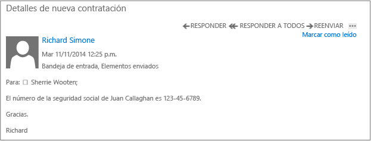

# Imagen a pantalla completa: correo electr&#243;nico no protegido (interno)

Volver a [Azure RMS en acción: Protección automática de los mensajes de correo electrónico con Exchange Online y las directivas de prevención de pérdida de datos](http://technet.microsoft.com/library/jj585026.aspx)

