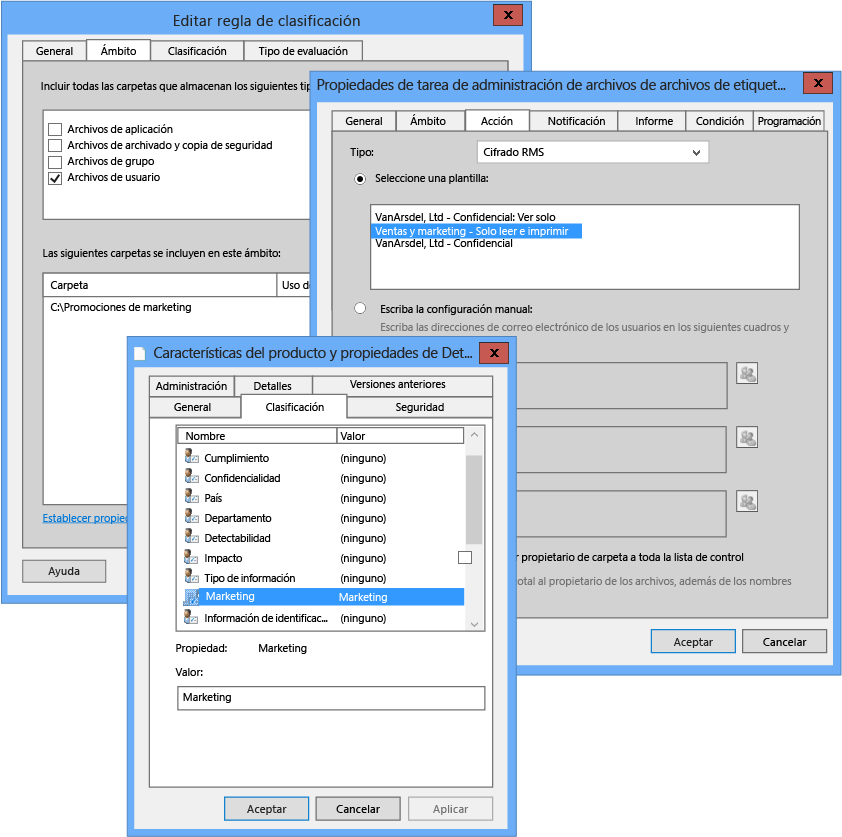

# Imagen a pantalla completa: Configurar FCI para la clasificaci&#243;n de Marketing

Volver a [Azure RMS en acción: Protección automática de archivos en los servidores de archivos con Windows Server y la infraestructura de clasificación de archivos](http://technet.microsoft.com/library/jj585026.aspx).

