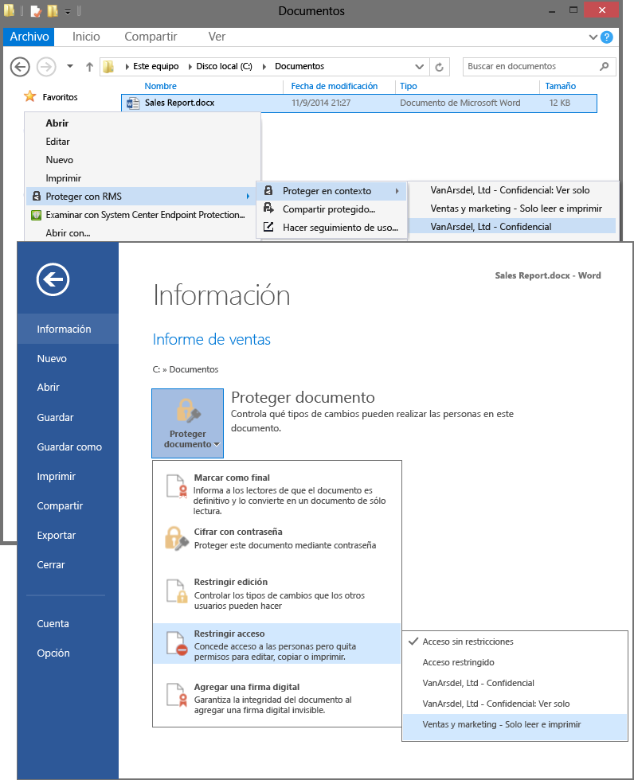

# Imagen a pantalla completa: Seleccionar plantillas de RMS en las aplicaciones, como el Explorador de archivos y Word

Volver a [Azure RMS en acción: Activación y configuración de Rights Management](http://technet.microsoft.com/library/jj585026.aspx)

