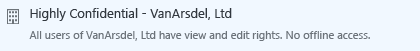

# C&#243;mo compartir de forma segura un documento por correo electr&#243;nico

## &lt;Instrucciones para administradores - eliminen esta sección antes de enviarla a los usuarios&gt;
Utilice este documento como punto de partida para sus propias instrucciones para el usuario final con el fin de ayudar a los usuarios a compartir documentos por correo electrónico de forma segura.Realice las modificaciones que desee en las instrucciones de la sección siguiente y después elimine esta primera sección y envíe este documento a los usuarios.

Las siguientes instrucciones se han preparado para una compañía ficticia, **VanArsdel, Ltd**.Antes de enviar estas instrucciones a los usuarios, reemplace las capturas de pantalla y las instrucciones para que muestren el nombre de su organización, o modifique las instrucciones para que los usuarios sepan que siempre que las instrucciones hagan referencia a VanArsdel, Ltd, verán el nombre de su compañía.Otras personalizaciones que puede realizar:

-   En el paso 2, le sugerimos solo dos de las opciones disponibles si va a enviar a personas fuera de la organización.Puede que desee cambiar estas sugerencias.

-   En el paso 2, le sugerimos descripciones que ayudarán a los usuarios a identificar qué plantilla pueden seleccionar.Es posible que quiera cambiar estas descripciones para ser más específico o descriptivo para su empresa y usuarios.

-   En el paso 3, sugerimos **Permítame revocar el acceso a estos documentos de forma instantánea** para la opción **Visor - solo ver**, como ejemplo para cuando desee incluir esta opción de configuración para los usuarios.Sin embargo, podría decidir que los usuarios seleccionen siempre esta opción cuando envíen el documento a alguien fuera de la organización o que nunca seleccionen esta opción.

-   En el paso 4, se recomienda la opción **Enviarme un correo electrónico cuando alguien intente abrir estos documentos**.Si los usuarios realizan el seguimiento de sus documentos mediante el portal de seguimiento de documentos, puede decidir que la notificación de correo electrónico no es necesaria y eliminar este paso.

> [!NOTE]
> Para obtener más información sobre las opciones que pueden seleccionar los usuarios, consulte [Opciones del cuadro de diálogo para la aplicación Rights Management sharing](https://technet.microsoft.com/library/dn574738.aspx)

Para que funcionen las instrucciones de usuario, debe disponer de lo siguiente:

|Check|Requisito|Si necesita más información|
|---------|-------------|-------------------------------|
||Ha preparado cuantas y grupos para Azure Active Directory|[Preparación de Azure Rights Management](https://technet.microsoft.com/library/jj585029.aspx)|
||Azure Rights Management no está activado|[Activar Rights Management de Azure](https://technet.microsoft.com/library/jj658941.aspx)|
||La aplicación Rights Management sharing se implementa en los equipos de los usuarios que ejecutan Windows|[Implementación automática de la aplicación Microsoft Rights Management sharing](https://technet.microsoft.com/library/dn339003%28v=ws.10%29.aspx)|
||Si usa Exchange Server en lugar de Exchange Online:  -   Se ha implementado el conector RMS y se han configurado roles de Exchange Server para utilizarlo.|[Implementación del conector de Azure Rights Management](https://technet.microsoft.com/library/dn375964.aspx)|
||Los usuarios usan Outlook de Office 2010.|Si los usuarios tienen Office 2013, reemplace las capturas de pantalla por las versiones equivalentes para que coincidan con lo que ven los usuarios.|
||Ha configurado plantillas personalizadas tal como se describe a continuación.|[Configuración de plantillas personalizadas para Azure Rights Management](https://technet.microsoft.com/library/dn642472.aspx)|

#### Para configurar las plantillas personalizadas:

1.  Archive las dos plantillas predeterminadas.

2.  Cree tres nuevas plantillas mediante la copia de las plantillas predeterminadas y realice los cambios siguientes:

    |Plantilla para copiar|Nuevo nombre|Nueva descripción|Conceder estos derechos personalizados|Otra configuración|
    |-------------------------|----------------|---------------------|------------------------------------------|----------------------|
    |**&lt;nombreDeOrganización&gt;- Solo vista confidencial**|**Extremadamente confidencial - &lt;nombreDeOrganización&gt;**|Todos los usuarios de &lt;nombreDeOrganización&gt; tienen permiso para ver y editar.Acceso sin conexión.|**Ver contenido**  **Guardar archivo**  **Editar contenido**|Actualice el nombre y la descripción de los idiomas que utilizan los usuarios.  Para **expiración del contenido**: Mantenga el valor predeterminado de **El contenido nunca expira**.  Para **acceso sin conexión**: Seleccione **El contenido está disponible solo con conexión a Internet**.|
    |**&lt;nombreDeOrganización&gt;- Solo vista confidencial**|**Confidencial - &lt;nombreDeOrganización&gt;**|Todos los usuarios de &lt;nombreDeOrganización&gt; tienen permiso para ver y editar.|**Ver contenido**  **Guardar archivo**  **Editar contenido**|Actualice el nombre y la descripción de los idiomas que utilizan los usuarios.  Para **expiración del contenido**: Mantenga el valor predeterminado de **El contenido nunca expira**.  Para **acceso sin conexión**: Seleccione **Número de días durante los cuales el contenido está disponible sin conexión a Internet** y escriba **1**.|
    |**&lt;nombreDeOrganización&gt; - Confidencial**|**Interno - &lt;nombreDeOrganización&gt;**|Todos los usuarios de &lt;nombreDeOrganización&gt; tienen plenos derechos, pero no pueden desproteger el contenido.|**Ver contenido**  **Guardar archivo**  **Editar contenido**  **Copiar y extraer contenido**  **Imprimir**|Actualice el nombre y la descripción de los idiomas que utilizan los usuarios.  Para **expiración del contenido**: Mantenga el valor predeterminado de **El contenido nunca expira**.  Para **acceso sin conexión**: Mantenga el valor predeterminado de **Número de días durante los cuales el contenido está disponible sin conexión a Internet** y mantenga el valor predeterminado de **7**|

3.  Publique las tres nuevas plantillas.

## &lt;Las instrucciones para el usuario comienzan aquí, elimine este título&gt;
De ahora en adelante, cada vez que envíe un documento importante a alguien por correo electrónico, siga estas instrucciones para impedir que el documento lo lean personas que no deberían hacerlo.

1.  Cree el mensaje de correo electrónico especificando la dirección o direcciones de correo electrónico, escriba el mensaje y adjunte el archivo que quiere compartir de manera segura.A continuación, en la pestaña **Mensaje**, en el grupo **RMS**, haga clic en **Compartir protegido** y después otra vez en **Compartir protegido**:

    

2.  En el cuadro de diálogo **Compartir protegido**, especifique lo siguiente:

    Cuando envía un documento al menos a una persona que trabaja para otra organización:

    |Si se aplica esto...|Haga esto:|
    |------------------------|--------------|
    |La **protección genérica** está seleccionada automáticamente →|Mantenga esta selección:  |
    |Información del documento que no debe ser modificada →|Seleccione **Visor: solo ver**:  |
    |Información del documento que debe ser modificada →|Seleccione **Coautor: ver, editar, copiar e imprimir**  |
    Cuando envía un documento a personas dentro de la organización:

    |Si se aplica esto...|Haga esto:|
    |------------------------|--------------|
    |La **protección genérica** está seleccionada automáticamente →|Mantenga esta selección:  |
    |La información del documento es sumamente confidencial y podría causar un perjuicio excepcionalmente alto a la organización o a sus empleados si se muestra públicamente →|Seleccione **Extremadamente confidencial - VanArsdel, Ltd**:  |
    |La información del documento es confidencial y podría causar un perjuicio a la organización o a sus empleados si muestra públicamente →|Seleccione **Confidencial - VanArsdel, Ltd**:  |
    |La información del documento no se debe compartir con personas fuera de la organización, pero no contiene información confidencial sobre la organización o sus empleados →|Seleccione **Interno – VanArsdel, Ltd**:  |

3.  Si seleccionó **Visor: solo ver**: Seleccione **Permítame revocar el acceso a estos documentos de forma instantánea**:

    

4.  Seleccione **Enviarme un correo electrónico cuando alguien intente abrir estos documentos**:

    

5.  Haga clic en **Enviar ahora**:

    

Cuando alguien al que ha enviado un documento protegido recibe el correo electrónico, ve un mensaje con las instrucciones sobre cómo leerlo.Lo pueden leer en varios dispositivos, como tabletas y teléfonos iPad, iPhone y Android, equipos Mac y equipos Windows.

Para ver si las personas a las que ha enviado documentos protegidos han tenido acceso a ellos, utilice el [sitio de seguimiento de documentos](https://track.azurerms.com/).

**¿Necesita ayuda?**

-   Para obtener información adicional:

    -   [Proteger un archivo que comparte por correo electrónico](https://technet.microsoft.com/library/dn574735%28v=ws.10%29.aspx)

    -   [Realizar el seguimiento y revocar los documentos](https://technet.microsoft.com/library/dn986611.aspx)

-   Póngase en contacto con el departamento de soporte técnico:

    -   &lt;detalles de contacto&gt;

