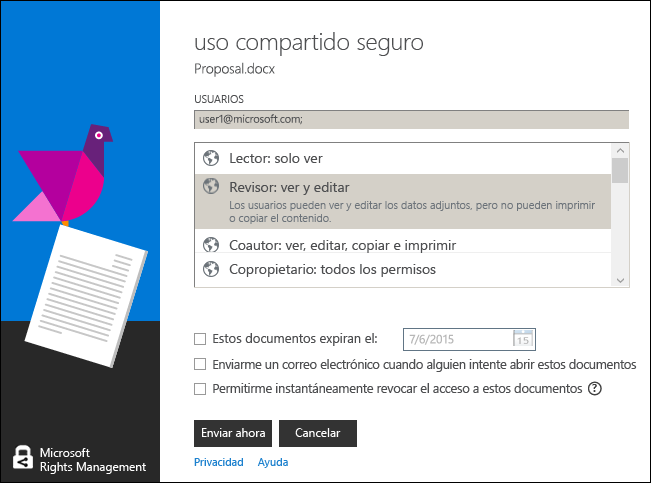

# Manual de usuario de la aplicaci&#243;n para uso compartido de Microsoft Rights Management (Publicaci&#243;n original)
Este manual del usuario de la aplicación Microsoft Rights Management sharing para Windows incluye las siguientes secciones:

-   [Evaluar e instalar la aplicación para uso compartido de Microsoft Rights Management](../Topic/Microsoft_Rights_Management_sharing_application_user_guide_-_original_publication.md#BKMK_Eval)

-   [Usar la aplicación para uso compartido de Microsoft Rights Management](../Topic/Microsoft_Rights_Management_sharing_application_user_guide_-_original_publication.md#BKMK_UsingMSRMSApp)

-   [Usar permisos creados por el usuario y compartir contenido protegido](../Topic/Microsoft_Rights_Management_sharing_application_user_guide_-_original_publication.md#BKMK_Custom)

-   [Usar el complemento de la barra de herramientas de Office](../Topic/Microsoft_Rights_Management_sharing_application_user_guide_-_original_publication.md#BKMK_OfficeToolbar)

-   [Guía del administrador de la aplicación para uso compartido de Microsoft Rights Management](../Topic/Microsoft_Rights_Management_sharing_application_user_guide_-_original_publication.md#BKMK_AdminGuide)

Para ver las preguntas más frecuentes e información de solución de problemas, consulte [Preguntas más frecuentes sobre la aplicación Microsoft Rights Management sharing para Windows](http://go.microsoft.com/fwlink/?LinkId=303971).

## <a name="BKMK_Eval"></a>Evaluación e instalación de la aplicación Microsoft Rights Management sharing
En esta sección se explica qué es la aplicación Microsoft Rights Management sharing y cómo usarla:

-   [¿Qué es la aplicación para uso compartido de Microsoft Rights Management?](../Topic/Microsoft_Rights_Management_sharing_application_user_guide_-_original_publication.md#BKMK_WhatIs)

-   [Requisitos de la aplicación para uso compartido de Microsoft Rights Management](../Topic/Microsoft_Rights_Management_sharing_application_user_guide_-_original_publication.md#BKMK_Reqs)

-   [Instalar la aplicación para uso compartido de Microsoft Rights Management](../Topic/Microsoft_Rights_Management_sharing_application_user_guide_-_original_publication.md#BKMK_Install)

### <a name="BKMK_WhatIs"></a>¿Qué es la aplicación Microsoft Rights Management sharing?
La aplicación Microsoft Rights Management sharing es una aplicación opcional que se puede descargar para Microsoft Windows y que proporciona lo siguiente:

-   Mejora el Explorador de archivos (también conocido como el Explorador de Windows en Windows 7 y versiones anteriores) porque permite proteger un único archivo o varios archivos en masa, así como todos los archivos de una carpeta seleccionada.

-   Incorpora funcionalidad para proteger cualquier tipo de archivo y un visor integrado para los tipos de archivo de texto y de imagen más comunes

-   Agrega nuevos botones a la barra de herramientas de Microsoft Office para Word, PowerPoint y Excel.

### <a name="BKMK_Reqs"></a>Requisitos de la aplicación Microsoft Rights Management sharing
Para utilizar la aplicación Microsoft Rights Management sharing, su equipo debe ejecutar Windows 8.1, Windows 8 o Windows 7.

La aplicación Microsoft Rights Management sharing requiere el cliente de AD RMS 2.1, que se instala como parte del paquete de instalación.La aplicación Microsoft Rights Management sharing solo funcionará con esta versión del cliente de AD RMS.

### <a name="BKMK_Install"></a>Instalación de la aplicación Microsoft Rights Management sharing
Para instalar la aplicación Microsoft Rights Management sharing, siga estos pasos:

1.  Vaya a la página de [Microsoft Rights Management](http://go.microsoft.com/fwlink/?LinkId=303970) en el sitio web de Microsoft.

2.  En la sección **Equipos**, haga clic en el icono de la **Aplicación RMS para Windows** y guarde el paquete de instalación de la aplicación Microsoft Rights Management sharing en el equipo.

3.  Haga doble clic en el archivo comprimido que se descargó y después en **setup.exe**.Si el sistema le pregunta si desea continuar, haga clic en **Sí**.

4.  En la página **Instalar Microsoft RMS**, haga clic en **siguiente** y espere a que finalice la instalación.

5.  Cuando finalice la instalación, haga clic en **Reiniciar** para reiniciar el equipo y completar la instalación.O bien haga clic en **Cerrar** y reinicie el equipo para completar la instalación.

## <a name="BKMK_UsingMSRMSApp"></a>Uso de la aplicación Microsoft Rights Management sharing
En esta sección se describen distintas formas de utilizar la aplicación Microsoft Rights Management sharing:

-   [Crear un archivo de texto protegido (.ptxt)](../Topic/Microsoft_Rights_Management_sharing_application_user_guide_-_original_publication.md#BKMK_CreatePTXT)

-   [Ver un archivo de texto protegido (.ptxt) o un archivo de imagen protegido](../Topic/Microsoft_Rights_Management_sharing_application_user_guide_-_original_publication.md#BKMK_ViewPTXT)

-   [Crear un archivo protegido genérico (.pfile)](../Topic/Microsoft_Rights_Management_sharing_application_user_guide_-_original_publication.md#BKMK_CreatePFILE)

-   [Ver un archivo protegido genérico (.pfile)](../Topic/Microsoft_Rights_Management_sharing_application_user_guide_-_original_publication.md#BKMK_ViewPFILE)

-   [Quitar la protección de un archivo](../Topic/Microsoft_Rights_Management_sharing_application_user_guide_-_original_publication.md#BKMK_Unprotect)

### <a name="BKMK_CreatePTXT"></a>Creación de un archivo de texto protegido (.ptxt)
La aplicación Microsoft Rights Management sharing puede usarse para convertir un archivo de texto normal (.txt) en un archivo protegido (.ptxt).

##### Para crear un archivo de texto protegido (.ptxt)

1.  En el Explorador de archivos, haga clic con el botón derecho en una carpeta, seleccione **Nuevo** y haga clic en **Documento de texto**.

2.  Cambie el nombre del archivo (por ejemplo, Sample.txt).

3.  Haga doble clic en el archivo para abrirlo en el Bloc de notas.

4.  En el Bloc de notas, agregue algunas líneas de texto al archivo, como las siguientes, y guárdelo:

    ```
    This is a sample text file.
    This is a sample text file.
    This is a sample text file.
    This is a sample text file. 
    This is a sample text file.
    This is a sample text file.
    ```

5.  Haga clic con el botón derecho en el archivo, seleccione **Proteger en contexto** y elija una plantilla de la lista.Tenga en cuenta que, si es la primera vez que usa la herramienta, debe seleccionar **Protección de la compañía** para iniciar la descarga de las plantillas para su organización.

6.  En la pantalla **aplicación Microsoft Rights Management sharing**, confirme la directiva que desea aplicar, haga clic en **Aplicar** y, una vez protegido el archivo, elija **Cerrar**.

### <a name="BKMK_ViewPTXT"></a>Visualización de un archivo de texto protegido (.ptxt) o un archivo de imagen protegido
Para ver un archivo de texto protegido (.ptxt) en el Explorador de archivos, haga doble clic en el archivo (por ejemplo, Sample.ptxt).Puede que se le pida autorización para que la aplicación obtenga derechos.La directiva de protección aparece al principio del archivo.

Las imágenes protegidas pueden abrirse y visualizarse de forma similar.

### <a name="BKMK_CreatePFILE"></a>Creación de un archivo protegido genérico (.pfile)
El formato de archivo de protección genérica (.pfile) puede utilizarse para ofrecer un nivel de protección genérico para los tipos de archivo que no se admiten directamente en la aplicación Microsoft Rights Management sharing u otras aplicaciones que proporcionen protección de tipo RMS integrada.

Por ejemplo, el formato de archivo de protección genérica puede proteger archivos .vsd creados con Microsoft Visio (que no admite actualmente la protección integrada).

> [!NOTE]
> Los archivos que utilizan protección general se protegen solo para la autenticación.Un usuario que está autorizado para usar el archivo protegido (.pfile) se autentica y se muestran sus derechos y permisos, pero no se pueden aplicar una vez que se abre el archivo en su formato original (por ejemplo, si se abre el archivo .vsd en Visio).Un usuario que no está autorizado o no se puede autenticar no podrá abrir el archivo protegido.

##### Para crear un archivo genérico protegido (.pfile) de un archivo de dibujo de Visio (.vsd)

1.  En el Explorador de archivos, haga clic con el botón derecho en una carpeta, seleccione **Nuevo** y haga clic en **Documento de Visio**.

2.  Cambie el nombre del archivo (por ejemplo, Sample.vsd).

3.  Haga doble clic en el archivo para abrirlo en Visio.

4.  En Visio, agregue elementos al dibujo y guarde y cierre el archivo.

5.  Haga clic con el botón derecho en el archivo, seleccione **Proteger en contexto** y elija una plantilla de directiva de la lista.Tenga en cuenta que, si es la primera vez que usa la herramienta, debe seleccionar **Protección de la compañía** para iniciar la descarga de las plantillas para su organización.

6.  En la pantalla **aplicación Microsoft Rights Management sharing**, seleccione la directiva que desea aplicar y haga clic en **Aplicar**.

7.  Un mensaje indica que se ha guardado el archivo protegido como Sample.vsd.pfile (se ha eliminado el archivo original).

### <a name="BKMK_ViewPFILE"></a>Visualización de un archivo protegido genérico (.pfile)
Para ver un archivo protegido genérico (.pfile), en el Explorador de archivos, haga doble clic en el archivo protegido genérico (.pfile) (por ejemplo, Sample.vsd.pfile) y haga clic en **Abrir**.

### <a name="BKMK_Unprotect"></a>Anulación de la protección de un archivo
La aplicación Microsoft Rights Management sharing ofrece la opción de quitar la protección de archivos que se hayan protegido anteriormente.

Para quitar la protección (es decir, desproteger) un archivo protegido previamente, use la opción **Quitar protección**, del siguiente modo:

1.  Haga clic en **Sample.ptxt**, seleccione **proteger en contexto**, y haga clic en **Quitar protección**.Puede que se le pida autorización para que la aplicación obtenga derechos.

2.  Sample.ptxt se elimina y se reemplaza por Sample.txt.

## <a name="BKMK_Custom"></a>Uso de permisos y contenido protegido compartido creados por el usuario
En esta sección se explica cómo proteger y consumir un archivo mediante permisos creados por el usuario, cómo compartir contenido protegido y cómo proteger varios archivos:

-   [Proteger un archivo con permisos creados por el usuario](../Topic/Microsoft_Rights_Management_sharing_application_user_guide_-_original_publication.md#BKMK_ProtectCustom)

-   [Consumir archivos que tienen protección creada por el usuario](../Topic/Microsoft_Rights_Management_sharing_application_user_guide_-_original_publication.md#BKMK_UserDefined)

-   [Compartir contenido protegido](../Topic/Microsoft_Rights_Management_sharing_application_user_guide_-_original_publication.md#BKMK_ShareProtected)

-   [Uso de los métodos abreviados de teclado](../Topic/Microsoft_Rights_Management_sharing_application_user_guide_-_original_publication.md#BKMK_AccessKeys)

-   [Aplicar protección a varios archivos y carpetas](../Topic/Microsoft_Rights_Management_sharing_application_user_guide_-_original_publication.md#BKMK_Multiple)

### <a name="BKMK_ProtectCustom"></a>Protección de un archivo con permisos creados por el usuario
Se puede usar protección creada por el usuario para lograr lo siguiente:

-   Limitar el acceso a archivos a solo una lista específica de usuarios concretos identificados por sus direcciones de correo electrónico.

-   Limitar el uso de archivos a derechos específicos, como los derechos de solo lectura para un documento.

Para proteger un archivo con permisos creados por el usuario, haga clic con el botón derecho en el archivo, elija **Proteger en contexto** y haga clic en **Permisos personalizados**.Aparece la siguiente pantalla:


Escriba las direcciones de correo electrónico de la lista de usuarios, utilice el control deslizante para seleccionar los permisos para el archivo y haga clic en **Aplicar**.

### <a name="BKMK_UserDefined"></a>Consumo de archivos que tienen protección creada por el usuario
La mayoría de los archivos protegidos controlados con la aplicación Microsoft Rights Management sharing se protegen aplicando niveles de protección basados en plantillas.Sin embargo, la aplicación Microsoft Rights Management sharing puede admitir también archivos con un nivel de protección creado por el usuario.

Se puede usar protección creada por el usuario para lograr lo siguientes tipos de protección para un archivo:

-   Limitar el acceso a archivos a solo una lista muy específica de usuarios concretos identificados por sus direcciones de correo electrónico.

-   Limitar el uso del archivo a un único derecho específico, como derechos solo para imprimir el documento.

Para formatos de archivo de texto y de imagen, este nivel de protección requiere que todas las aplicaciones que se utilizan para editar, guardar o restringir archivos de texto o de imagen estén diseñadas para admitir la protección de RMS e implementar las API de protección incluidas en AD RMS SDK.

Cuando vea un archivo de texto con protección creada por el usuario, observará una pequeña diferencia en los permisos, que se muestran para el archivo como se indica en el ejemplo siguiente.

Para los archivos que están protegidos con el formato de archivo de protección genérica (.pfile), los derechos específicos o permisos que estaban por el usuario aparecen en la pantalla de confirmación en lugar del nombre de la plantilla que se utilizó para proteger el archivo, como se muestra en la ilustración siguiente.


### <a name="BKMK_ShareProtected"></a>Uso compartido de contenido protegido
Para proteger y compartir el contenido, haga clic con el botón derecho en el archivo y elija **Agregar protegido**.Aparece la siguiente pantalla:


Escriba las direcciones de correo electrónico de la lista de usuarios, utilice el control deslizante para seleccionar los permisos para el archivo y haga clic en **Enviar**.La aplicación inicia Outlook con un correo electrónico preliminar con el archivo protegido adjunto.El archivo original no se protegerá.

Para permitir que los usuarios vean archivos protegidos en dispositivos que no tengan Windows, haga clic en **Permitir el consumo en todos los dispositivos**.Los usuarios deberán [descargar la aplicación Microsoft Rights Management sharing](http://go.microsoft.com/fwlink/?LinkId=303970) para su dispositivo.

### <a name="BKMK_AccessKeys"></a>Uso de métodos abreviados de teclado
Presione la tecla **Alt** para ver las claves de acceso disponibles.Presione **Alt** + tecla de acceso para seleccionar una opción.Por ejemplo, en el cuadro de diálogo **Agregar protegido**, presione **Alt** para ver las claves de acceso y después **Alt + u** para seleccionar **Los usuarios deben iniciar sesión cada vez que abran este archivo**.



### <a name="BKMK_Multiple"></a>Aplicación de protección a varios archivos y carpetas
La aplicación Microsoft Rights Management sharing puede utilizarse también para aplicar protección a más de un archivo; por ejemplo, seleccionando varios archivos o una carpeta que contenga los archivos desprotegidos en el Explorador de archivos.

##### Para proteger varios archivos o todos los archivos de una carpeta

1.  En el Explorador de archivos, seleccione varios archivos o seleccione una carpeta que contenga varios archivos para proteger.

2.  Haga clic con el botón derecho en la carpeta o los archivos seleccionados, elija **Proteger en contexto** y seleccione una plantilla de la lista.Tenga en cuenta que, si es la primera vez que usa la herramienta, debe seleccionar **Protección de la compañía** para iniciar la descarga de las plantillas para su organización.

3.  En la pantalla **aplicación Microsoft Rights Management sharing**, confirme que se protegieron los archivos.

Si se producen errores, consulte [Preguntas más frecuentes sobre la aplicación Microsoft Rights Management sharing para Windows](http://go.microsoft.com/fwlink/?LinkId=303971).

## <a name="BKMK_OfficeToolbar"></a>Uso del complemento de la barra de herramientas de Office
Puede proteger y compartir archivos de Word, PowerPoint y Excel directamente desde Microsoft Office con el complemento de la cinta de opciones de Office para la aplicación Microsoft Rights Management sharing.Haga clic en **Agregar protegido** en la cinta de opciones para iniciar la aplicación Microsoft Rights Management sharing.


## <a name="BKMK_AdminGuide"></a>Guía del administrador de la aplicación Microsoft Rights Management sharing
La Guía del administrador de la aplicación Microsoft Rights Management sharing incluye las siguientes secciones:

-   [Información técnica sobre la aplicación para uso compartido de Microsoft Rights Management](../Topic/Microsoft_Rights_Management_sharing_application_user_guide_-_original_publication.md#BKMK_AdminOverview)

-   [Tipos de archivo compatibles](../Topic/Microsoft_Rights_Management_sharing_application_user_guide_-_original_publication.md#BKMK_SupportFileTypes)

-   [Implementación automática de la aplicación para uso compartido de Microsoft Rights Management](../Topic/Microsoft_Rights_Management_sharing_application_user_guide_-_original_publication.md#BKMK_ScriptedInstall)

### <a name="BKMK_AdminOverview"></a>Información técnica acerca de la aplicación Microsoft Rights Management sharing
La aplicación Microsoft Rights Management sharing es una aplicación opcional que se puede descargar para Microsoft Windows y otras plataformas que proporciona lo siguiente:

-   Protección de un solo archivo o protección masiva de varios archivos y de todos los archivos de una carpeta seleccionada.

-   Funcionalidad completa para proteger cualquier tipo de archivo y un visor integrado para los tipos de archivo de texto y de imagen más comunes.

-   Protección genérica para archivos que no admiten la protección de RMS.

-   Interoperabilidad completa con los archivos protegidos con Office Information Rights Management (IRM).

-   Interoperabilidad completa con los archivos PDF protegidos con SharePoint, FCI y herramientas de creación de PDF admitidas.

La aplicación Microsoft Rights Management sharing usa el nuevo [motor de tiempo de ejecución del cliente de AD RMS 2.1](http://www.microsoft.com/download/details.aspx?id=38396).Proporciona a los usuarios la capacidad de proteger contenido con plantillas predefinidas o definidas por el usuario que puede personalizar e implementar para su organización.Con la funcionalidad de AD RMS 2.1, la aplicación Microsoft Rights Management sharing proporciona a los usuarios finales una experiencia sencilla de protección y consumo.

Con la versión de octubre de 2013 de Microsoft Azure AD RMS, puede proteger documentos de forma nativa usando Office 2010 y enviarlos a personas de otra compañía, que los pueden usar con Microsoft Azure AD RMS.Además, con esta versión, si usa AD RMS en Modo criptográfico 2, puede usar RMS para usuarios y consumir contenido de personas de otra compañía que use Microsoft Azure AD RMS.Para obtener más información sobre el Modo criptográfico 2, consulte [Modos criptográficos de AD RMS](http://technet.microsoft.com/library/hh867439%28v=ws.10%29.aspx).

Para descargar la aplicación Microsoft Rights Management sharing, siga estos pasos:

1.  Inicie sesión en [Microsoft Connect](http://connect.microsoft.com/) con su cuenta de Microsoft (antes conocida como Live ID).

2.  En la **Página principal**, busque **Rights Management Services** y únase al grupo.

3.  Haga clic en **Descargas** y elija **Aplicación Microsoft Rights Management sharing**.

4.  En la página **Detalles de la descarga**, seleccione **Microsoft Rights Management sharing application.zip** y haga clic en **Descargar**.

5.  Si es necesario, instale Microsoft File Transfer Manager y siga los pasos para descargar la aplicación Microsoft Rights Management sharing.

#### Niveles de protección que admite la aplicación Microsoft Rights Management sharing
La aplicación Microsoft Rights Management sharing admite la protección en dos niveles distintos, como se describe en la tabla siguiente.

||||
|-|-|-|
|Tipo de protección|Nativa|Genérico|
|Descripción|Para archivos de texto, de imagen, de Microsoft Office (Word, Excel, PowerPoint), archivos .pdf y otros tipos de archivo de aplicaciones que admiten AD RMS, la protección nativa ofrece un nivel de protección alto que incluye cifrado y la obligación de tener derechos (permisos).|Para las demás aplicaciones y tipos de archivo, la protección genérica ofrece un nivel de protección que incluye encapsulación de archivos usando el tipo de archivo .pfile y autenticación para comprobar si un usuario está autorizado para abrir el archivo.|
|Protección|Los archivos se cifran totalmente y se exige protección de varias formas:<br /><br />-   Antes de representar el contenido protegido, deben autenticarse correctamente los usuarios que reciben el archivo por correo electrónico o que obtienen acceso a él mediante permisos de archivo o uso compartido.<br />-   Además, los derechos de uso y la directiva establecida por el propietario del contenido cuando se protegen los archivos deben exigirse en su totalidad cuando se representa el contenido en el Visor de IP (para archivos de texto y de imagen protegidos) o la aplicación asociada (para todos los demás tipos de archivo admitidos).|La protección de archivos se exige de varias formas:<br /><br />-   Antes de representar contenido protegido, deben autenticarse correctamente los usuarios autorizados para abrir el archivo y a los que se les ha dado acceso a él.Si se produce un error de autenticación, el archivo no se abre.<br />-   Los derechos de uso y la directiva establecida por el propietario del contenido se muestran para informar a los usuarios autorizados de la directiva de uso aplicable.<br />-   Se realiza el registro de auditoría de los usuarios autorizados que abren los archivos y obtienen acceso a ellos; sin embargo, las aplicaciones no admitidas no exigen derechos de uso.|
|Tipos de archivo para los que es el nivel predeterminado|Este es el nivel de protección predeterminado para los siguientes tipos de archivo:<br /><br />-   Archivos de texto y de imagen<br />-   Archivos de Microsoft Office (Word, Excel, PowerPoint)<br />-   Portable Document Format (.pdf)<br /><br />Para obtener más información, vea Tipos de archivo admitidos.|Esta es la protección predeterminada para todos los demás tipos de archivo (por ejemplo, .vsdx, .rtf, etc.) que no se admiten para la protección completa.|

### <a name="BKMK_SupportFileTypes"></a>Tipos de archivos admitidos
En la tabla siguiente se enumeran los tipos de archivo que admite la aplicación Microsoft Rights Management sharing.

|Extensión de archivo|Descripción|Extensión de archivo original|
|------------------------|---------------|---------------------------------|
|.ptxt|Archivo de texto protegido|.txt|
|.pxml|Archivo XML protegido|.xml|
|.pjpg|Archivo de imagen JPG protegido|.jpg|
|.pjpeg|Archivo de imagen JPEG protegido|.jpeg|
|.ppng|Archivo de imagen PNG protegido|.png|
|.ptiff|Archivo de imagen TIFF protegido|.tiff|
|.pbmp|Archivos de mapa de bits de Windows:|.bmp|
|.pgif|Archivo de imagen GIF protegido|.gif|
|.pgiff|Archivo de imagen GIFF protegido|.giff|
|.pjpe|Archivo de imagen JPE protegido|.jpe|
|.pjfif|Archivo de imagen JFIF protegido|.jfif|
|.pjif|Archivo de imagen JIF protegido|.jif|
En la tabla siguiente se enumeran los tipos de archivo que se admiten en Microsoft Office 2013, Office 2010 y Office 2007.Hay dos tipos de protector: MsoIrmProtector y OpcIrmProtector.Para obtener más información acerca de estos tipos de protector, consulte [Protectores de formato de archivo de Microsoft Office](http://archive.msdn.microsoft.com/OfficeProtectors)

|||
|-|-|
|MsoIrmProtector admite los siguientes tipos de archivo:<br /><br />-   doc<br />-   dot<br />-   xla<br />-   xls<br />-   xlt<br />-   pps<br />-   ppt|OpcIrmProtector admite los siguientes tipos de archivo:<br /><br />-   docm<br />-   docx<br />-   dotm<br />-   dotx<br />-   xlam<br />-   xlsb<br />-   xlsm<br />-   xlsx<br />-   xltm<br />-   xltx<br />-   xps<br />-   potm<br />-   potx<br />-   ppsx<br />-   ppsm<br />-   pptm<br />-   pptx<br />-   thmx|

### <a name="BKMK_ScriptedInstall"></a>Implementación automática de la aplicación Microsoft Rights Management sharing
La versión para Windows de la aplicación RMS sharing admite una instalación con scripts, por lo que es adecuada para las implementaciones empresariales.

##### Para descargar la aplicación RMS sharing para la implementación automática

1.  Vaya a la página de la [aplicación Microsoft Rights Management sharing para Windows](http://www.microsoft.com/download/details.aspx?id=40857) en el Centro de descarga de Microsoft y haga clic en **Descargar**.

2.  Seleccione y descargue los archivos que necesita.Hay dos paquetes de instalación del cliente: uno para Windows de 64 bits (Microsoft Rights Management sharing application x64.zip) y otro para Windows de 32 bits (Microsoft Rights Management sharing application x86.zip).

3.  Extraiga los archivos de los paquetes de instalación comprimidos, por ejemplo, haciendo doble clic en ellos.A continuación, copie los archivos extraídos en una ubicación de red a la que puedan tener acceso los equipos cliente.

Los paquetes de instalación de la aplicación RMS sharing admite distintos escenarios de implementación e incluyen lo siguiente:

|Descripción|Escenario de implementación|
|---------------|-------------------------------|
|Microsoft Online Services - Ayudante para el inicio de sesión|Se requiere para lo siguiente:<br /><br />-   Office 2010 y Microsoft Azure RMS|
|Revisión para Office (KB 2596501)|Se requiere para lo siguiente:<br /><br />-   Office 2010 y Microsoft Azure RMS|
|Revisión para Modo criptográfico 2 (KB 2627273)|Se requiere para lo siguiente:<br /><br />-   Office 2010 y Microsoft Azure RMS|
|Cliente de AD RMS y aplicación RMS sharing|Se requiere para lo siguiente:<br /><br />-   Office 2013 y Microsoft Azure RMS<br />-   Office 2010 y Microsoft Azure RMS<br />-   Office 2013 y Active Directory RMS<br />-   Office 2010 y Active Directory RMS<br />-   Actualización de la aplicación RMS sharing|
|Complemento de Office para la cinta de opciones|Se requiere para lo siguiente:<br /><br />-   Office 2013 y Microsoft Azure RMS<br />-   Office 2013 y Active Directory RMS<br />-   Office 2010 y Active Directory RMS<br />-   Actualización de la aplicación RMS sharing|
|Herramienta de preparación de Microsoft Azure Active Directory Rights Management|Se requiere para lo siguiente:<br /><br />-   Office 2010 y Microsoft Azure RMS|
> [!NOTE]
> Para el escenario **Office 2010 y Microsoft Azure RMS**, puede que esté usando Microsoft Azure RMS o que esté usando Active Directory RMS y quiera enviar documentos de manera segura a personas de otra compañía que usan Microsoft Azure RMS.
> 
> Al instalar y ejecutar la herramienta de preparación de Microsoft Azure Active Directory Rights Management para admitir Office 2010, hace dos cosas:
> 
> -   Modifica el registro para admitir la aplicación RMS sharing.
> -   Crea un "arranque" para el usuario, es decir, el equipo se pone en contacto con el servidor AD RMS o Microsoft Azure y obtiene los certificados que el equipo y el usuario necesitan para usar RMS.

Utilice los procedimientos siguientes para identificar los comandos necesarios para implementar la aplicación RMS sharing en estos escenarios de implementación:

-   Office 2013 y Microsoft Azure RMS

-   Office 2010 y Microsoft Azure RMS

-   Office 2013 u Office 2010 y Active Directory RMS

-   Actualización de la aplicación RMS sharing

En los ejemplos de los comandos se asume que ha copiado los archivos descargados y extraídos en un recurso compartido de red al que tienen acceso los equipos cliente usando **\\server5\apps\rms** y que los equipos cliente ya tienen una carpeta denominada **C:\Log files**, donde se almacenan los archivos de registro de la instalación de la aplicación.Para cada instalación, puede elegir el nombre del archivo de registro de instalación, pero debe tener la extensión de archivo .log.

> [!IMPORTANT]
> Antes de implementar la aplicación RMS sharing, debe empaquetar los comandos necesarios de estos procedimientos para que se puedan instalar en el contexto de equipo para todos los usuarios y con privilegios de administrador local.A continuación, puede implementar el paquete en equipos con su mecanismo de implementación de aplicaciones estándar, por ejemplo, la directiva de grupo o System Center Configuration Manager.
> 
> La excepción es la herramienta de preparación de Microsoft Azure Active Directory Rights Management: Debe ejecutarse una vez para cada usuario del equipo y con privilegios elevados para editar correctamente el registro.Hay diferentes maneras de lograrlo; entre ellas, pedir al usuario que ejecute el comando (por ejemplo, un vínculo en un mensaje de correo electrónico o un vínculo en el portal del departamento de soporte técnico) o agregarlo a su script de inicio de sesión.Si no puede utilizar el comando runas porque los usuarios no tienen una cuenta de administrador local, hay herramientas de implementación que pueden elevar automáticamente un comando, según las reglas que especifique.

##### Para implementar la aplicación RMS sharing para Office 2013 y Microsoft Azure RMS

1.  Instale el cliente de AD RMS y la aplicación RMS sharing con los siguiente comandos:

    -   Para Windows de 64 bits: x64\setup_ipviewer.exe /norestart /quiet /msicl "MSIRESTARTMANAGERCONTROL=Disable" /log "&lt;ruta de acceso y nombre del archivo de registro&gt;"

        ```
        x64\setup_ipviewer.exe /norestart /quiet /msicl "MSIRESTARTMANAGERCONTROL=Disable" /log "<log file path and name>"
        ```

    -   Para Windows de 32 bits:

        ```
        X86\setup_ipviewer.exe /norestart /quiet /msicl "MSIRESTARTMANAGERCONTROL=Disable" /log "<log file path and name>"
        ```

    Por ejemplo: `\\server5\apps\rms\x64\setup_ipviewer.exe /norestart /quiet /msicl "MSIRESTARTMANAGERCONTROL=Disable" /log "C:\Log files\ipviewerinstall.log"`

2.  Instale el complemento para Office con los siguientes comandos:

    -   Para la versión de 64 bits de Office:

        ```
        msiexec.exe /norestart /quiet MSIRESTARTMANAGERCONTROL=Disable /i "x64\Setup64.msi" /L*v "<log file path and name>"
        ```

    -   Para la versión de 32 bits de Office:

        ```
        msiexec.exe /norestart /quiet MSIRESTARTMANAGERCONTROL=Disable /i "x86\Setup.msi" /L*v "<log file path and name>"
        ```

    > [!NOTE]
    > Debe reiniciar el equipo para completar la instalación.Puede iniciar un reinicio automático con un comando como shutdown /i.

    Por ejemplo: `\\server5\apps\rms\msiexec.exe /norestart /quiet MSIRESTARTMANAGERCONTROL=Disable /i "x64\Setup64.msi" /L*v "C:\Log files\rmsoffice.log"`

##### Para implementar la aplicación RMS sharing para Office 2010 y Microsoft Azure RMS

1.  Instale Microsoft Online Services - Ayudante para el inicio de sesión con los siguientes comandos:

    -   Para Windows de 64 bits:

        ```
        msiexec.exe /norestart /quiet MSIRESTARTMANAGERCONTROL=Disable /i "x64\msoidcli_64bit.msi" /L*v "<log file path and name >"
        ```

    -   Para Windows de 32 bits:

        ```
        msiexec.exe /norestart /quiet MSIRESTARTMANAGERCONTROL=Disable /i "x64\msoidcli_64bit.msi" /L*v "<log file path and name>"
        ```

    Por ejemplo: `\\server5\apps\rms\msiexec.exe /norestart /quiet MSIRESTARTMANAGERCONTROL=Disable /i "x64\msoidcli_64bit.msi" /L*v "C:\Log files\assistant.log"`

2.  Instale la revisión para Office con los siguientes comandos:

    -   Para la versión de 64 bits de Office:

        ```
        x64\office2010-kb2596501-fullfile-x64-glb.exe /norestart /quiet /log:"<log file path and name >"
        ```

    -   Para la versión de 32 bits de Office:

        ```
        x86\office2010-kb2596501-fullfile-x86-glb.exe /norestart /quiet /log:"<log file path and name>"
        ```

    Por ejemplo: `\\server5\apps\rms\x64\office2010-kb2596501-fullfile-x64-glb.exe /norestart /quiet /log:"C:\Log files\kb2596501install.log"`

3.  Instale la revisión para el Modo criptográfico 2 con los siguientes comandos:

    -   Para Windows de 64 bits:

        ```
        wusa.exe /norestart /quiet "x64\Windows6.1-KB2627273-v4-x64.msu" /log:"<log file path and name >"
        ```

    -   Para Windows de 32 bits:

        ```
        wusa.exe /norestart /quiet "x86\Windows6.1-KB2627273-v4-x86.msu" /log:"<log file path and name>"
        ```

    Por ejemplo: `\\server5\apps\rms\wusa.exe /norestart /quiet "x64\Windows6.1-KB2627273-v4-x64.msu" /log:"C:\Log files\kb267273.log"`

4.  Instale el cliente de AD RMS y la aplicación RMS sharing con el siguiente comando:

    -   Para Windows de 64 bits:

        ```
        x64\setup_ipviewer.exe /norestart /quiet /msicl "MSIRESTARTMANAGERCONTROL=Disable" /log "<log file path and name >"
        ```

    -   Para Windows de 32 bits:

        ```
        X86\setup_ipviewer.exe /norestart /quiet /msicl "MSIRESTARTMANAGERCONTROL=Disable" /log "<log file path and name>"
        ```

    Por ejemplo: `\\server5\apps\rms\x64\setup_ipviewer.exe /norestart /quiet /msicl "MSIRESTARTMANAGERCONTROL=Disable" /log "C:\Log files\ipviewerinstall.log"`

5.  Instale el complemento para Office con los siguientes comandos:

    -   Para la versión de 64 bits de Office:

        ```
        msiexec.exe /norestart /quiet MSIRESTARTMANAGERCONTROL=Disable /i "x64\Setup64.msi" /L*v "<log file path and name>"
        ```

    -   Para la versión de 32 bits de Office:

        ```
        msiexec.exe /norestart /quiet MSIRESTARTMANAGERCONTROL=Disable /i "x86\Setup.msi" /L*v "<log file path and name>"
        ```

    > [!NOTE]
    > Debe reiniciar el equipo para completar la instalación.Puede iniciar un reinicio automático con un comando como shutdown /i.

    Por ejemplo: `\\server5\apps\rms\msiexec.exe /norestart /quiet MSIRESTARTMANAGERCONTROL=Disable /i "x64\Setup64.msi" /L*v "C:\Log files\rmsoffice.log"`

6.  Instale la herramienta de preparación de Microsoft Azure Active Directory Rights Management agregando el siguiente comando a los scripts de inicio de sesión:

    > [!IMPORTANT]
    > Para ejecutar este comando correctamente, los usuarios deben tener privilegios de administrador local.

    -   Para Windows 8, 64 bits:

        ```
        x64\aadrmprep.exe /initiateMe /logfile "<log file path and name>"
        ```

    -   Para Windows 8, 32 bits:

        ```
        X86\aadrmprep.exe /initiateMe /logfile "<log file path and name>"
        ```

    -   Para Windows 7, 64 bits:

        ```
        x64\win7\aadrmprep.exe /initiateMe /logfile "<log file path and name>"
        ```

    -   Para Windows 7, 32 bits:

        ```
        X86\win7\aadrmprep.exe /initiateMe /logfile "<log file path and name>"
        ```

    > [!NOTE]
    > Es posible que este comando solicite al usuario que escriba sus credenciales de Microsoft Azure.Si el equipo no está unido a un dominio, se le pedirán las credenciales al usuario.Si el equipo está unido a un dominio, la herramienta puede utilizar las credenciales almacenadas en caché.

    Por ejemplo: `\\server5\apps\rms\x64\aadrmprep.exe /initiateMe /logfile "C:\Log files\aadrmprepinstall.log"`

##### Para implementar la aplicación RMS sharing para Office 2013 u Office 2010 y Active Directory RMS

1.  Instale el cliente de AD RMS y la aplicación RMS sharing con los siguiente comandos:

    -   Para Windows de 64 bits:

        ```
        x64\setup_ipviewer.exe /norestart /quiet /msicl "MSIRESTARTMANAGERCONTROL=Disable" /log "<log file path and name>"
        ```

    -   Para Windows de 32 bits:

        ```
        X86\setup_ipviewer.exe /norestart /quiet /msicl "MSIRESTARTMANAGERCONTROL=Disable" /log "<log file path and name>"
        ```

    Por ejemplo: `\\server5\apps\rms\x64\setup_ipviewer.exe /norestart /quiet /msicl "MSIRESTARTMANAGERCONTROL=Disable" /log "C:\Log files\ipviewerinstall.log"`

2.  Instale el complemento para Office con los siguientes comandos:

    -   Para la versión de 64 bits de Office:

        ```
        msiexec.exe /norestart /quiet MSIRESTARTMANAGERCONTROL=Disable /i "x64\Setup64.msi" /L*v "<log file path and name>"
        ```

    -   Para la versión de 32 bits de Office:

        ```
        msiexec.exe /norestart /quiet MSIRESTARTMANAGERCONTROL=Disable /i "x86\Setup.msi" /L*v "<log file path and name>"
        ```

    > [!NOTE]
    > Debe reiniciar el equipo para completar la instalación.Puede iniciar un reinicio automático con un comando como shutdown /i.

    Por ejemplo: `\\server5\apps\rms\msiexec.exe /norestart /quiet MSIRESTARTMANAGERCONTROL=Disable /i "x64\Setup64.msi" /L*v "C:\Log files\rmsofficeinstall.log"`

##### Para actualizar la aplicación RMS sharing

1.  Instale el cliente de AD RMS y la aplicación RMS sharing con el siguiente comando:

    -   Para Windows de 64 bits:

        ```
        x64\setup_ipviewer.exe /norestart /quiet /msicl "MSIRESTARTMANAGERCONTROL=Disable" /log "<log file path and name>"
        ```

    -   Para Windows de 32 bits:

        ```
        X86\setup_ipviewer.exe /norestart /quiet /msicl "MSIRESTARTMANAGERCONTROL=Disable" /log "<log file path and name>"
        ```

    Por ejemplo: `\\server5\apps\rms\x64\setup_ipviewer.exe /norestart /quiet /msicl "MSIRESTARTMANAGERCONTROL=Disable" /log "C:\Log files\ipviewerinstall.log"`

2.  Instale el complemento para Office con los siguientes comandos:

    -   Para la versión de 64 bits de Office:

        ```
        msiexec.exe /norestart /quiet MSIRESTARTMANAGERCONTROL=Disable /i "x64\Setup64.msi" /L*v "<log file path and name>"
        ```

    -   Para la versión de 32 bits de Office:

        ```
        msiexec.exe /norestart /quiet MSIRESTARTMANAGERCONTROL=Disable /i "x86\Setup.msi" /L*v "<log file path and name>"
        ```

    > [!NOTE]
    > Debe reiniciar el equipo para completar la instalación.Puede iniciar un reinicio automático con un comando como shutdown /i.

    Por ejemplo: `\\server5\apps\rms\msiexec.exe /norestart /quiet MSIRESTARTMANAGERCONTROL=Disable /i "x64\Setup64.msi" /L*v "C:\Log files\rmsofficeinstall.log"`

#### <a name="BKMK_verifyscripted"></a>Comprobación de que la instalación se realizó correctamente
Utilice los archivos de registro de instalación para comprobar si se realizó correctamente.

###### Para comprobar si la instalación se realizó correctamente para Microsoft Online Services - Ayudante para el inicio de sesión

-   Busque el texto siguiente en el archivo de registro de instalación: **Resultado de la instalación: 0**

    Líneas de ejemplo de una instalación correcta:

    **MSI (s) (9C:88) [18:49:04:007]: Producto: Complementos de Office para Microsoft RMS -- La instalación se completó correctamente.**

    **MSI (s) (9C:88) [18:49:04:007]: Windows Installer instaló el producto.Nombre del producto: Complementos de Office para Microsoft RMS.Versión del producto: 1.0.7.Idioma del producto: 1033.Fabricante: Microsoft.Resultado de la instalación: 0.**

###### Para comprobar si la instalación se realizó correctamente para la revisión de Office

-   Busque alguna de las cadenas de texto siguientes en el archivo de registro de instalación:

    -   Para la versión de 64 bits de Office:

        -   **office2010-kb2596501-fullfile-x64-glb.exe salió con el estado SUCCESS**

        -   **office2010-kb2596501-fullfile-x64-glb.exe salió con el estado NOTAPPLICABLE**

    -   Para la versión de 32 bits de Office:

        -   **office2010-kb2596501-fullfile-x86-glb.exe salió con el estado SUCCESS**

        -   **office2010-kb2596501-fullfile-x86-glb.exe salió con el estado NOTAPPLICABLE**

###### Para comprobar si la instalación se realizó correctamente para la revisión del Módulo criptográfico 2

-   Busque alguna de las cadenas de texto siguientes en el archivo de registro de instalación:

    -   Para Windows de 64 bits:

        -   **Windows6.1-KB2627273-v4-x64.msu salió con el estado SUCCESS**

        -   **Windows6.1-KB2627273-v4-x64.msu salió con el estado NOTAPPLICABLE**

    -   Para Windows de 32 bits:

        -   **Windows6.1-KB2627273-v4-x86.msu salió con el estado SUCCESS**

        -   **Windows6.1-KB2627273-v4-x86.msu salió con el estado NOTAPPLICABLE**

###### Para comprobar que la instalación se realizó correctamente para el cliente de AD RMS y la aplicación RMS sharing

-   Busque el texto siguiente en el archivo de registro de instalación: **Resultado de la instalación: 0**

    Líneas de ejemplo de una instalación correcta:

    **MSI (s) (F0:B8) [14:19:57:854]: Producto: Cliente de Active Directory Rights Management Services 2.1 -- La instalación se completó correctamente.**

    **MSI (s) (F0:B8) [14:19:57:854]: Windows Installer instaló el producto.Nombre del producto: Cliente de Active Directory Rights Management Services 2.1.Versión del producto: 1.0.1179.1.Idioma del producto: 1033.Fabricante: Microsoft Corporation.Resultado de la instalación: 0.**

###### Para comprobar si la instalación se realizó correctamente para el complemento de Office

-   Busque el texto siguiente en el archivo de registro de instalación: **Resultado de la instalación: 0**

    Líneas de ejemplo de una instalación correcta:

    **MSI (s) (9C:88) [18:49:04:007]: Producto: Complementos de Office para Microsoft RMS -- La instalación se completó correctamente.**

    **MSI (s) (9C:88) [18:49:04:007]: Windows Installer instaló el producto.Nombre del producto: Complementos de Office para Microsoft RMS.Versión del producto: 1.0.7.Idioma del producto: 1033.Fabricante: Microsoft.Resultado de la instalación: 0.**

###### Para comprobar si la instalación se realizó correctamente para la herramienta de preparación de Microsoft Azure Active Directory Rights Management

-   Busque el texto siguiente en el archivo de registro de instalación: **aadrmprep.exe salió con el estado SUCCESS**

    > [!NOTE]
    > A veces, la instalación se puede ejecutar dos veces; la primera da error y la segunda se realiza correctamente.

Si desea comprobar manualmente los cambios que hace esta herramienta en el Registro, son los siguientes:

-   [HKEY_LOCAL_MACHINE\SOFTWARE\Microsoft\MSDRM\Federation]

    "FederationHomeRealm"="urn:HostedRmsOnlineService:Certification"

-   [HKEY_LOCAL_MACHINE\SOFTWARE\Wow6432Node\Microsoft\MSDRM\Federation]

    "FederationHomeRealm"="urn:HostedRmsOnlineService:Certification"

-   [HKEY_LOCAL_MACHINE\SOFTWARE\Wow6432Node\Microsoft\MSDRM\ServiceLocation\Activation]

    @="&lt;certification url&gt;"

-   [HKEY_CURRENT_USER\SOFTWARE\Microsoft\Office\14.0\Common\DRM]

    DefaultUser="&lt;default_user&gt;"

#### <a name="BKMK_uninstallscripted"></a>Comandos de desinstalación
No todos los comandos de instalación necesarios para estas implementaciones admiten un comando de desinstalación.Puede desinstalar el cliente de AD RMS y la aplicación sharing, y también puede desinstalar el complemento de Office.Use los siguientes comandos para desinstalar estos elementos.

###### Para desinstalar el cliente de AD RMS y la aplicación RMS sharing

-   Use los comandos siguientes:

    -   Para Windows de 64 bits:

        ```
        x64\setup_ipviewer.exe /uninstall /quiet
        ```

    -   Para Windows de 32 bits:

        ```
        x86\setup_ipviewer.exe /uninstall /quiet
        ```

###### Para desinstalar el complemento de Office

-   Use los comandos siguientes:

    -   Para la versión de 64 bits de Office:

        ```
        msiexec /x \x64\Setup[64].msi /quiet
        ```

    -   Para la versión de 32 bits de Office:

        ```
        msiexec /x \x86\Setup.msi /quiet
        ```

## Vea también
[Descarga de la aplicación Microsoft Rights Management sharing (http://go.microsoft.com/fwlink/?LinkId=303970)](http://go.microsoft.com/fwlink/?LinkId=303970)
 [Preguntas más frecuentes para la aplicación de uso compartido Rights Management de Microsoft para Windows](http://go.microsoft.com/fwlink/?LinkId=303971)

