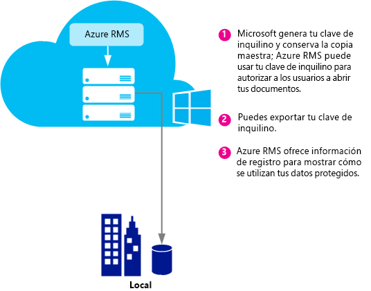
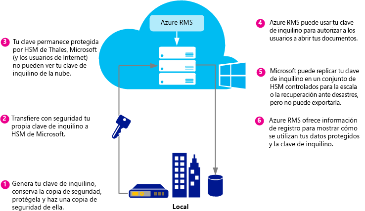
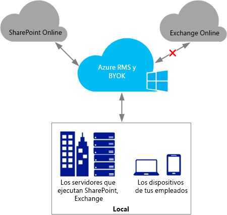
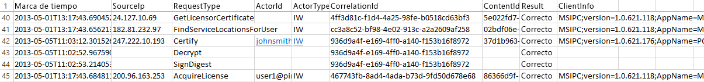

# Planificaci&#243;n e implementaci&#243;n de tu clave de inquilino de Azure Rights Management
Use la información de este tema para tratar de planificar y administrar la clave de inquilino de su servicio Rights Management (RMS) para Azure RMS. Por ejemplo, en lugar de que Microsoft administre su clave de inquilino (valor predeterminado), podría administrar su propia clave de inquilino para cumplir con las normas específicas que se aplican a su organización.  La administración de su propia clave de inquilino también se conoce aportar su propia clave, o BYOK, por sus siglas del inglés.

> [!NOTE]
> También se conoce a la clave de inquilino de RMS como la clave del Certificado emisor de licencias de servidor (SLC). Azure RMS mantiene una clave o más para cada organización que se suscribe a Azure RMS. Siempre que se usa una clave para RMS en una organización (como por ejemplo claves de usuario, claves del equipo, claves de cifrado de documentos), se encadena criptográficamente a su clave de inquilino de RMS.

**En resumen:** Use la tabla siguiente como guía rápida de la topología de clave de inquilino recomendada. Luego, use las secciones adicionales para obtener más información:

Si implementa Azure RMS mediante una clave de inquilino administrada por Microsoft, puede cambiar más adelante a BYOK. Sin embargo, actualmente no puede cambiar su clave de inquilino de Azure RMS de BYOK a administrada por Microsoft.

|Requisito empresarial|Topología de clave de inquilino recomendada|
|-------------------------|-----------------------------------------------|
|Implementación de Azure RMS rápidamente y sin necesidad de hardware especial|Administrada por Microsoft|
|Necesidad de funcionalidad completa en Exchange Online con Azure RMS|Administrada por Microsoft|
|Las claves las crea el usuario y están protegidas en un módulo de seguridad de hardware (HSM).|BYOK<br /><br />Actualmente, esta configuración dará lugar a funcionalidad reducida de IRM en Exchange Online. Para obtener más información, consulte la sección [Precio y restricciones de BYOK](../Topic/Planning_and_Implementing_Your_Azure_Rights_Management_Tenant_Key.md#BKMK_Pricing).|
Use las secciones siguientes para tratar de elegir qué topología de clave de inquilino utilizar, comprender el ciclo de vida de la clave de inquilino, cómo implementar Aportar su propia clave (BYOK), y qué pasos seguir a continuación:

-   [Elija su topología de clave de inquilino: Administrada por Microsoft (opción predeterminada) o por usted (BYOK)](../Topic/Planning_and_Implementing_Your_Azure_Rights_Management_Tenant_Key.md#BKMK_ChooseTenantKey)

-   [Precio y restricciones de BYOK](../Topic/Planning_and_Implementing_Your_Azure_Rights_Management_Tenant_Key.md#BKMK_Pricing)

-   [Implementación de Aportar tu propia clave (BYOK)](../Topic/Planning_and_Implementing_Your_Azure_Rights_Management_Tenant_Key.md#BKMK_ImplementBYOK)

-   [Pasos siguientes](../Topic/Planning_and_Implementing_Your_Azure_Rights_Management_Tenant_Key.md#BKMK_NextSteps)

## <a name="BKMK_ChooseTenantKey"></a>Elija su topología de clave de inquilino: Administrada por Microsoft (opción predeterminada) o por usted (BYOK)
Decide qué topología de clave de inquilino es la mejor para su organización. De forma predeterminada, Azure RMS genera su clave de inquilino y administra la mayoría de aspectos del ciclo de vida de la clave de inquilino. Esta es la opción más simple con las mínimas sobrecargas administrativas. En la mayoría de casos, no es necesario ni tan siquiera que sepa que tiene una clave de inquilino. Simplemente regístresee para Azure RMS y el resto del proceso de administración de la clave será manejado por Microsoft.

De otra forma, podría querer poseer control absoluto sobre tu clave de inquilino, lo que implica la creación de su clave de inquilino y mantener la copia maestra en su infraestructura local. Con frecuencia este escenario también se conoce como Aportar tu propia clave (BYOK). Con esta opción, el proceso es:

1.  Genera su clave de inquilino en la infraestructura local, en línea con sus políticas de TI.

2.  Transfiere de forma segura la clave de inquilino desde un módulo de seguridad de hardware (HSM) que posea hasta los HSM que posee y administra Microsoft. A lo largo de este proceso, su clave de inquilino nunca traspasa la frontera de la protección del hardware.

3.  Cuando transfiere su clave de inquilino a Microsoft, esta continúa protegida gracias a los módulos HSM Thales. Microsoft ha trabajado con Thales a fin de garantizar que su clave de inquilino no se puede extraer de los HSM de Microsoft.

Aunque es opcional, también querrá con toda probabilidad utilizar los registros de uso en tiempo casi real de Azure RMS para consultar cómo y cuándo exactamente se usa la clave de inquilino.

> [!NOTE]
> Como medida de protección adicional, Azure RMS utiliza espacios de seguridad independientes para sus centros de datos en América del Norte, EMEA (Europa, Oriente Medio y África) y Asia. Cuando administra su propia clave de inquilino, está ligada al espacio de seguridad de la región en que está registrado el inquilino de RMS. Por ejemplo, una clave de inquilino de un cliente europeo no puede usarse en centros de datos de América del Norte o Asia.

## <a name="BKMK_OverviewLifecycle"></a>El ciclo de vida de la clave de inquilino
Si decide que Microsoft debe encargarse de administrar su clave de inquilino, se hará cargo de la mayoría de operaciones del ciclo de vida de la clave. Sin embargo, si decide administrar usted mismo la clave de inquilino, será el responsable de muchas de las operaciones del ciclo de vida de la clave y de algunos procedimientos adicionales.

Los diagramas siguientes muestran y comparan estas dos opciones. El primer diagrama muestra las pocas sobrecargas de administrador que se dan en la configuración predeterminada cuando Microsoft administra la clave de inquilino.



El segundo diagrama muestra los pasos adicionales necesarios cuando eres tú el que administra su propia clave de inquilino.



Si decide dejar que Microsoft administre su clave de inquilino, no se necesita hacer nada más para generar la clave y puede omitir las secciones siguientes e ir directamente a [Pasos siguientes](../Topic/Planning_and_Implementing_Your_Azure_Rights_Management_Tenant_Key.md#BKMK_NextSteps).

Si decide administrar usted mismo la clave de inquilino, lea las secciones siguientes para obtener más información.

### Más información acerca de los HSM de Thales y las adiciones de Microsoft
Azure RMS usa HSM de Thales para proteger sus claves.

Thales e-Security es uno de los principales proveedores mundiales de soluciones de cifrado de datos y ciberseguridad para servicios financieros, tecnología punta, industria manufacturera, gobierno y sectores tecnológicos. Las soluciones de Thales cuentan con una trayectoria de 40 años en la protección de información corporativa y gubernamental, son las elegidas por cuatro de las cinco compañías más grandes en el sector energético y aeroespacial, 22 países de la OTAN y aseguran más del 80 % de las operaciones de pago en todo el mundo.

Microsoft ha colaborado con Thales para mejorar la tecnología de vanguardia de los HSM. Estas mejoras te permiten obtener beneficios típicos de servicios hospedados sin la renuncia al control de las claves. De manera específica, estas mejoras permiten que Microsoft administre los HSM para que no lo tenga que hacer usted. Como servicio en la nube, Azure RMS se amplía en muy poco tiempo para cumplir con los picos de uso de la organización. Al mismo tiempo, su clave está protegida dentro de los HSM de Microsoft: Retiene el control sobre el ciclo de vida de la clave porque genera la clave y la transfiere a los HSM de Microsoft.

Para obtener más información, consulte [HSM de Thales y Azure RMS](http://www.thales-esecurity.com/msrms/cloud) en el sitio web de Thales.

## <a name="BKMK_Pricing"></a>Precio y restricciones de BYOK
Las organizaciones que tienen una suscripción a Azure administrada por TI pueden usar BYOK y registrar su uso sin cargos adicionales. Las organizaciones que usan RMS para usuarios no pueden utilizar BYOK ni el registro, porque no tienen un administrador inquilino para configurar estas características.

> [!NOTE]
> Para obtener más información sobre RMS para usuarios, consulte [RMS para usuarios y Azure Rights Management](../Topic/RMS_for_Individuals_and_Azure_Rights_Management.md).



BYOK y el registro funcionan sin problemas con todas las aplicaciones que se integran con Azure RMS. Aquí se incluyen servicios en la nube, como SharePoint Online, servidores locales que ejecutan Exchange y SharePoint que funcionan con Azure RMS mediante el conector RMS y aplicaciones de cliente como Office 2013. Obtendrá los registros de uso de claves independientemente de la aplicación que realiza solicitudes de Azure RMS.

Existe una sola excepción: Actualmente, **BYOK de Azure RMS no es compatible con Exchange Online**.  Si usa Exchange Online, se recomienda implementar ahora Azure RMS en el modo de administración de claves predeterminado, donde Microsoft genera y administra su clave. Tiene la opción de pasar a BYOK más adelante, por ejemplo, cuando Exchange Online no sea compatible con BYOK de Azure RMS. Sin embargo, si no puede esperar, otra opción es implementar Azure RMS con BYOK ahora, con funcionalidad reducida de RMS para Exchange Online (los correos electrónicos y datos adjuntos desprotegidos permanecen completamente funcionales):

-   No se pueden mostrar los mensajes de correo electrónico o los datos adjuntos protegidos en Outlook Web Access.

-   No se pueden mostrar los mensajes de correo electrónico en dispositivos móviles que usan Exchange ActiveSync IRM.

-   El descifrado de transporte (por ejemplo, para explorar el malware) y el descifrado de diario no son posibles, de modo que los mensajes de correo electrónico y los datos adjuntos protegidos se omitirán.

-   Las reglas de protección de transporte y la prevención de pérdida de datos (DLP) que aplican directivas de IRM no son posibles, de modo que no se puede aplicar protección de RMS mediante estos métodos.

-   La búsqueda basada en servidor para los mensajes de correo electrónico protegidos no es posible, de modo que estos se omitirán.

Cuando usa BYOK de Azure RMS con funcionalidad reducida de RMS para Exchange Online, RMS funcionará con los clientes de correo electrónico de Outlook en Windows y Mac y en otros clientes de correo electrónico que no usan Exchange ActiveSync IRM.

Si va a migrar a Azure RMS desde AD RMS, puede que haya importado la clave como un dominio de publicación de confianza (TPD) a Exchange Online (también denominado BYOK en la terminología de Exchange, que es independiente de Azure RMS BYOK). En este escenario, debe quitar el TDP de Exchange Online para evitar conflictos de plantillas y directivas. Para obtener más información, consulte [Remove-RMSTrustedPublishingDomain](https://technet.microsoft.com/library/jj200720%28v=exchg.150%29.aspx) en la biblioteca de cmdlets de Exchange Online.

A veces, la excepción de BYOK de Azure RMS para Exchange Online no es un problema en la práctica. Por ejemplo, las organizaciones que necesitan que BYOK y el registro ejecuten sus aplicaciones de datos (Exchange, SharePoint, Office) localmente y usan Azure RMS para funcionalidades que no son compatibles fácilmente con AD RMS local (por ejemplo, colaboración con otras compañías y acceso desde clientes móviles). BYOK y el registro funcionan bien en este escenario y permiten a la organización tomar el control completo sobre su suscripción de Azure RMS.

## <a name="BKMK_ImplementBYOK"></a>Implementación de Aportar tu propia clave (BYOK)
Usa la información y los procedimientos de esta sección si ha decidido generar y administrar su clave de inquilino; el escenario Aportar tu propia clave (BYOK):

-   [Requisitos previos para BYOK](../Topic/Planning_and_Implementing_Your_Azure_Rights_Management_Tenant_Key.md#BKMK_Preqs)

-   [Generar y transferir su clave de inquilino a través de Internet](../Topic/Planning_and_Implementing_Your_Azure_Rights_Management_Tenant_Key.md#BKMK_BYOK_Internet)

-   [Generar y transferir su clave de inquilino en persona](../Topic/Planning_and_Implementing_Your_Azure_Rights_Management_Tenant_Key.md#BKMK_BYOK_InPerson)

> [!IMPORTANT]
> Si ya empezó a usar [!INCLUDE[aad_rightsmanagement_1](../Token/aad_rightsmanagement_1_md.md)] (el servicio está activado) y tiene usuarios que ejecutan Office 2010, póngase en contacto con los Servicios de soporte al cliente (CSS) de Microsoft antes de ejecutar estos procedimientos. En función del escenario y las solicitudes, aún puede usar BYOK pero con algunas limitaciones o pasos adicionales.
> 
> Póngase en contacto con CSS también si su organización tiene políticas específicas para el manejo de claves.

### <a name="BKMK_Preqs"></a>Requisitos previos para BYOK
Consulte la tabla siguiente para consultar una lista de requisitos previos para Aportar tu propia clave (BYOK).

|Requisito|Más información|
|-------------|-------------------|
|Una suscripción que admita Azure RMS.|Para obtener más información sobre las suscripciones disponibles, consulte la sección [Suscripciones en la nube que son compatibles con Azure RMS](../Topic/Requirements_for_Azure_Rights_Management.md#BKMK_SupportedSubscriptions) del tema [Requisitos de Azure Rights Management](../Topic/Requirements_for_Azure_Rights_Management.md).|
|No use RMS para individuos o Exchange Online. O bien, si usa Exchange Online, comprenda y acepte las limitaciones de uso de BYOK con esta configuración.|Para obtener más información sobre las restricciones y limitaciones actuales para BYOK, vea la sección [Precio y restricciones de BYOK](../Topic/Planning_and_Implementing_Your_Azure_Rights_Management_Tenant_Key.md#BKMK_Pricing) de este tema. **Important:** Actualmente, BYOK no es compatible con Exchange Online.|
|HSM de Thales, tarjetas inteligentes y software de soporte<br /><br />Si está migrando de AD RMS a Azure RMS mediante una clave de software a clave de software, debe tener una versión mínima de 11.62 para los controladores de Thales.|Debe tener acceso al módulo de seguridad de hardware de Thales y al conocimiento operacional básico de los HSM de Thales. Consulte [Módulo de seguridad de hardware de Thales](http://www.thales-esecurity.com/msrms/buy) para conocer la lista de los modelos compatibles o para comprar un HSM si no tiene uno.|
|Si quiere transferir su clave de inquilino por Internet en lugar de que esté presente en Redmond, EE. UU.:<br /><br />1.  Una estación de trabajo sin conexión x64 con un sistema operativo Windows 7 como mínimo y un software Thales nShield que sea como mínimo la versión 11.62.<br />    Si esta estación de trabajo ejecuta Windows 7, debe [instalar Microsoft .NET Framework 4.5](http://go.microsoft.com/fwlink/?LinkId=225702).<br />2.  Una estación de trabajo que esté conectada a Internet y tenga un sistema operativo Windows 7 como mínimo.<br />3.  Una unidad USB u otro dispositivo de almacenamiento portátil que tenga al menos un espacio libre de 16 MB.|Estos requisitos previos no son necesarios si viajas a Redmond y transfiere su clave de inquilino en persona.<br /><br />Por motivos de seguridad, recomendamos que la primera estación de trabajo no esté conectada a una red. Sin embargo, esto no es de obligado cumplimiento. **Note:** En las instrucciones que se indican a continuación, a esta estación de trabajo se la conoce como la estación de trabajo desconectada.<br />Además, si la clave de inquilino es para una red de producción, es recomendable que use una segunda estación de trabajo independiente para descargar el conjunto de herramientas y cargar la clave de inquilino. Sin embargo, con el fin de realizar una prueba, puede usar la misma estación de trabajo como la primera. **Note:** En las instrucciones que se indican a continuación, a esta segunda estación de trabajo se la conoce como la estación de trabajo conectada a Internet.|
|Opcional: la suscripción a Azure|Si desea registrar el uso de su clave de inquilino (y el uso de Rights Management), debes estar suscrito a Azure y disponer de suficiente almacenamiento en Azure para guardar sus registros.|
Los procedimientos para generar y usar su propia clave de inquilino dependen de si desea hacerlo a través de Internet o en persona:

-   **A través de Internet:** Este procedimiento requiere algunos pasos adicionales sobre la configuración, como la descarga y el uso de un conjunto de herramientas y los cmdlets de Windows PowerShell. Sin embargo, no tiene que encontrarse físicamente en una instalación de Microsoft para transferir su clave de inquilino. Se conserva la seguridad mediante los métodos siguientes:

    -   Genera la clave de inquilino desde una estación de trabajo fuera de línea, lo que reduce la superficie de ataque.

    -   La clave de inquilino está cifrada con una Clave de intercambio de claves (KEK), que permanece cifrada hasta que se transfiere a los HSM de Azure RMS. Solo la versión cifrada de su clave de inquilino abandona la estación de trabajo original.

    -   Una herramienta establece las propiedades de su clave de inquilino que enlaza su clave de inquilino con el mundo de seguridad de Azure RMS. De modo que, después de que los HSM de Azure RMS reciban y descifren su clave de inquilino, sean solamente dichos HSM los que puedan usarla. No se puede exportar su clave de inquilino. Este enlace es impuesto por los HSM de Thales.

    -   La Clave de intercambio de claves (KEK) que se usa para cifrar tu clave de inquilino se genera dentro de los HSM de Azure RMS y no es exportable. Los HSM provocan que no pueda haber una versión neta de la KEK fuera de los HSM. Además, el conjunto de herramientas incluye la atestación desde Thales de que la KEK no es exportable y se generó dentro de un HSM genuino que fabricó Thales.

    -   El conjunto de herramientas incluye la atestación desde Thales de que el universo de seguridad de Azure RMS también se generó en un HSM genuino fabricado por Thales. Así se demuestra que Microsoft usa hardware genuino.

    -   Microsoft usa KEK independientes, así como Universos de seguridad independientes en cada región geográfica, lo cual garantiza que su clave de inquilino pueda usarse solamente en centros de datos de la región en que se ha cifrado. Por ejemplo, una clave de inquilino de un cliente europeo no puede usarse en centros de datos de América del Norte o Asia.

    > [!NOTE]
    > Su clave de inquilino se puede transferir con seguridad a través de equipos y redes que no son de confianza porque está cifrada y es segura con permisos de nivel de control de acceso, que hacen que solo se pueda usar dentro de tus HSM y los HSM de Microsoft para Azure RMS. Puede usar los scripts proporcionados en el conjunto de herramientas para comprobar las medidas de seguridad y leer más información acerca de cómo funciona en Thales: [Administración de claves de hardware en la nube de RMS](https://www.thales-esecurity.com/knowledge-base/white-papers/hardware-key-management-in-the-rms-cloud).

-   **En persona:** Este método precisa que se ponga en contacto con los Servicios de soporte al cliente de Microsoft (CSS) para programar una cita a fin de transferir la clave para Azure RMS. Debe viajar a la oficina de Microsoft en Redmond, Washington, Estados Unidos de América, para transferir su clave de inquilino al universo de seguridad de Azure RMS.

### <a name="BKMK_BYOK_Internet"></a>Generar y transferir su clave de inquilino a través de Internet
Use los procedimientos siguientes si quiere transferir su clave de inquilino a través de Internet en lugar de viajar a una oficina de Microsoft para transferir la clave de inquilino en persona:

-   [Prepare su estación de trabajo conectada a Internet.](../Topic/Planning_and_Implementing_Your_Azure_Rights_Management_Tenant_Key.md#BKMK_InternetPrepareWorkstation)

-   [Prepare su estación de trabajo desconectada.](../Topic/Planning_and_Implementing_Your_Azure_Rights_Management_Tenant_Key.md#BKMK_DisconnectedPrepareWorkstation)

-   [Generar su clave de inquilino](../Topic/Planning_and_Implementing_Your_Azure_Rights_Management_Tenant_Key.md#BKMK_InternetGenerate)

-   [Preparar su clave de inquilino para transferirla](../Topic/Planning_and_Implementing_Your_Azure_Rights_Management_Tenant_Key.md#BKMK_InternetPrepareTransfer)

-   [Transferir su clave de inquilino a Azure RMS](../Topic/Planning_and_Implementing_Your_Azure_Rights_Management_Tenant_Key.md#BKMK_InternetTransfer)

#### <a name="BKMK_InternetPrepareWorkstation"></a>Preparar la estación de trabajo conectada a Internet
Para preparar su estación de trabajo conectada a Internet, siga estos 3 pasos:

-   [Paso 1: Instale Windows PowerShell para Azure Rights Management.](../Topic/Planning_and_Implementing_Your_Azure_Rights_Management_Tenant_Key.md#BKMK_PrepareInternetConnectedWorkstation1)

-   [Paso 2: Obtén tu id. de inquilino de Azure Active Directory.](../Topic/Planning_and_Implementing_Your_Azure_Rights_Management_Tenant_Key.md#BKMK_PrepareInternetConnectedWorkstation2)

-   [Paso 3: Descargue el conjunto de herramientas de BYOK.](../Topic/Planning_and_Implementing_Your_Azure_Rights_Management_Tenant_Key.md#BKMK_PrepareInternetConnectedWorkstation3)

##### <a name="BKMK_PrepareInternetConnectedWorkstation1"></a>Paso 1: Instale Windows PowerShell para Azure Rights Management.
En la estación de trabajo conectada a Internet, descargue e instale el módulo Windows PowerShell para Azure Rights Management.

> [!NOTE]
> Si ha descargado anteriormente este módulo de Windows PowerShell, ejecute el siguiente comando para comprobar que su número de versión es 2.1.0.0 como mínimo:`(Get-Module aadrm -ListAvailable).Version`

Para conocer las instrucciones de instalación, consulte [Instalación de Windows PowerShell para Azure Rights Management](../Topic/Installing_Windows_PowerShell_for_Azure_Rights_Management.md).

##### <a name="BKMK_PrepareInternetConnectedWorkstation2"></a>Paso 2: Obtén tu id. de inquilino de Azure Active Directory.
Inicie Windows PowerShell con la opción **Ejecutar como administrador** y luego ejecute los comandos siguientes:

-   Utilice el cmdlet [Connect-AadrmService](http://msdn.microsoft.com/library/windowsazure/dn629415.aspx) para conectarse al servicio de Azure RMS:

    ```
    Connect-AadrmService
    ```
    Cuando se le pida, escriba las credenciales de administrador de inquilinos de [!INCLUDE[aad_rightsmanagement_1](../Token/aad_rightsmanagement_1_md.md)] (normalmente, usará una cuenta de administrador global de Office 365 o Azure Active Directory).

-   Utilice el cmdlet [Get-AadrmConfiguration](http://msdn.microsoft.com/library/windowsazure/dn629410.aspx) para mostrar la configuración del inquilino:

    ```
    Get-AadrmConfiguration
    ```
    Desde la salida, guarde el GUID desde la primera línea (BPOSId). Este es tu id. de inquilino de Azure Active Directory, que necesitará posteriormente cuando prepare su clave de inquilino para cargarla.

-   Utilice el cmdlet [Disconnect-AadrmService](http://msdn.microsoft.com/library/windowsazure/dn629416.aspx) para desconectarse del servicio de Azure RMS hasta que esté preparado para cargar la clave:

    ```
    Disconnect-AadrmService
    ```

No cierre la ventana de Windows PowerShell.

##### <a name="BKMK_PrepareInternetConnectedWorkstation3"></a>Paso 3: Descargue el conjunto de herramientas de BYOK.
Vaya al Centro de descarga de Microsoft y [descargue el conjunto de herramientas de BYOK](http://go.microsoft.com/fwlink/?LinkId=335781) correspondiente a su región:

|Región|Nombre del paquete|
|----------|----------------------|
|América del Norte|AzureRMS-BYOK-tools-UnitedStates.zip|
|Europa|AzureRMS-BYOK-tools-Europe.zip|
|Asia|AzureRMS-BYOK-tools-AsiaPacific.zip|
El conjunto de herramientas incluye los siguientes elementos:

-   Un paquete Clave de intercambio de claves (KEK) que tiene un nombre que comienza con **BYOK-KEK-pkg-**.

-   Un paquete de Mundo de seguridad que tiene un nombre que comienza con **BYOK-SecurityWorld-pkg-**.

-   Un script Python llamado **verifykeypackage.py**.

-   Un archivo ejecutable de la línea de comandos llamado **KeyTransferRemote.exe**, un archivo de metadatos llamado **KeyTransferRemote.exe.config** y archivos DLL asociados.

-   Un paquete Visual C++ Redistributable, llamado **vcredist_x64.exe**.

Copia el paquete a la unidad de USB o a otro almacenamiento portátil.

#### <a name="BKMK_DisconnectedPrepareWorkstation"></a>Prepare su estación de trabajo desconectada.
Para preparar su estación de trabajo que no esté conectada a una red (ya sea a Internet o a la red interna), siga estos 2 pasos:

-   [Paso 1: Preparar la estación de trabajo desconectada con HSM de Thales](../Topic/Planning_and_Implementing_Your_Azure_Rights_Management_Tenant_Key.md#BKMK_PrepareDisconnectedWorkstation1)

-   [Paso 2: Instalar el conjunto de herramientas BYOK en la estación de trabajo desconectada](../Topic/Planning_and_Implementing_Your_Azure_Rights_Management_Tenant_Key.md#BKMK_PrepareDisconnectedWorkstation2)

##### <a name="BKMK_PrepareDisconnectedWorkstation1"></a>Paso 1: Preparar la estación de trabajo desconectada con HSM de Thales
En la estación de trabajo desconectada, instale el software de soporte nCipher (Thales) en un equipo de Windows y, a continuación, adjunte un HSM de Thales a ese equipo.

Asegúrese de que las herramientas de Thales se encuentra en su ruta de acceso (**(%nfast_home%\bin** y **%nfast_home%\python\bin**). Por ejemplo, escriba lo siguiente:

```
set PATH=%PATH%;”%nfast_home%\bin”;”%nfast_home%\python\bin”
```
Para obtener más información, consulte la guía de usuario incluida en el HSM de Thales o visite el sitio web de Thales para Azure RMS en [http://www.thales-esecurity.com/msrms/cloud](http://www.thales-esecurity.com/msrms/cloud).

##### <a name="BKMK_PrepareDisconnectedWorkstation2"></a>Paso 2: Instalar el conjunto de herramientas BYOK en la estación de trabajo desconectada
Copie el paquete del conjunto de herramientas de BYOK de la unidad USB o de otra unidad de almacenamiento portátil y, a continuación, haga lo siguiente:

1.  Extraiga los archivos del paquete descargado en cualquier carpeta.

2.  Desde esa carpeta, ejecute vcredist_x64.exe.

3.  Siga las instrucciones para instalar los componentes de tiempo de ejecución de Visual C++ para Visual Studio 2012.

#### <a name="BKMK_InternetGenerate"></a>Generar su clave de inquilino
En la estación de trabajo desconectada, siga estos 3 pasos para generar tus propias claves de inquilino:

-   [Paso 1: Crear un mundo de seguridad](../Topic/Planning_and_Implementing_Your_Azure_Rights_Management_Tenant_Key.md#BKMK_InternetGenerate1)

-   [Paso 2: Validar el paquete descargado](../Topic/Planning_and_Implementing_Your_Azure_Rights_Management_Tenant_Key.md#BKMK_InternetGenerate2)

-   [Paso 3: Crear una clave nueva](../Topic/Planning_and_Implementing_Your_Azure_Rights_Management_Tenant_Key.md#BKMK_InternetGenerate3)

##### <a name="BKMK_InternetGenerate1"></a>Paso 1: Crear un mundo de seguridad
Inicie un símbolo de comando y ejecute el programa del nuevo mundo de Thales.

```
new-world.exe --initialize --cipher-suite=DLf1024s160mRijndael --module=1 --acs-quorum=2/3
```
Este programa crea un archivo de **Mundo de seguridad** en %NFAST_KMDATA%\local\world, que corresponde a la carpeta C:\ProgramData\nCipher\Key Management Data\local. Puede usar valores diferentes para el quórum, pero en nuestro ejemplo, recibe el aviso de que tiene que escribir tres tarjetas en blanco y anclar todas ellas. A continuación, se solicitará que dos tarjetas cualesquiera tengan acceso administrativo al mundo de seguridad (el cuórum que ha especificado).  Estas tarjetas se convierten en el **conjunto de tarjetas para el administrador** del nuevo mundo de seguridad. En esta fase, puede especificar la contraseña o el PIN de cada tarjeta de ACS, o bien agregarlo más adelante con un comando.

> [!TIP]
> Para comprobar el estado actual de la configuración de HSM, use el comando `nkminfo`.

A continuación, haga lo siguiente:

1.  Instale el proveedor de CNG de Thales como se describe en la documentación de Thales y configúrelo para usar el nuevo mundo de seguridad.

2.  Realice una copia de seguridad del archivo del mundo en **%nfast_kmdata%\local**. Asegure y proteja el archivo del mundo, las tarjetas del administrador y sus anclajes, y asegúrese de que ninguna persona tiene acceso a más de una tarjeta.

##### <a name="BKMK_InternetGenerate2"></a>Paso 2: Validar el paquete descargado
Este paso es opcional, pero es recomendable para que pueda validar estas características:

-   La Clave de intercambio de claves que se incluye en el grupo de herramientas se ha generado en un HSM de Thales genuino.

-   El hash del Mundo de seguridad de Azure RMS que se incluye en el conjunto de herramientas se ha generado desde un HSM de Thales genuino.

-   La Clave de intercambio de claves no es exportable.

> [!NOTE]
> Para validar el paquete descargado, el HSM debe conectarse, encenderse, y tener un mundo de seguridad en él (igual que el acaba de crear).

###### Para validar el paquete descargado

1.  Ejecute el script verifykeypackage.py escribiendo uno de los siguientes, en función de su región:

    -   Para América del Norte:

        ```
        python verifykeypackage.py -k BYOK-KEK-pkg-NA-1 -w BYOK-SecurityWorld-pkg-NA-1
        ```

    -   Para Europa:

        ```
        python verifykeypackage.py -k BYOK-KEK-pkg-EU-1 -w BYOK-SecurityWorld-pkg-EU-1
        ```

    -   Para Asia:

        ```
        python verifykeypackage.py -k BYOK-KEK-pkg-AP-1 -w BYOK-SecurityWorld-pkg-AP-1
        ```

    > [!TIP]
    > El software de Thales incluye un intérprete Python en %NFAST_HOME%\python\bin

2.  Confirme que ve lo que se indica a continuación, lo cual significa que la validación es correcta: **Resultado:  CORRECTO**

Este script valida la cadena del firmante hasta la clave de la raíz de Thales. El hash de esta clave raíz está incrustado en el script y su valor debe ser **59178a47 de508c3f 291277ee 184f46c4 f1d9c639**. También puede confirmar este valor de manera independiente. Para ello, visite el [sitio web de Thales](http://www.thalesesec.com/).

Ahora está listo para crear una clave nueva que será su clave de inquilino de RMS.

##### <a name="BKMK_InternetGenerate3"></a>Paso 3: Crear una clave nueva
Genere una clave CNG mediante los programas **generatekey** y **cngimport** de Thales.

Ejecute el comando siguiente para generar la clave:

```
generatekey --generate simple type=RSA size=2048 protect=module ident=contosokey plainname=contosokey nvram=no pubexp=
```
Cuando ejecute este comando, siga estas instrucciones:

-   Para el tamaño de la clave, recomendamos 2048 bits, pero también admite claves RSA de 1024 bits para clientes de AD RMS existentes que tienen dichas claves y migran a Azure RMS.

-   Reemplace el valor de *contosokey* en **ident** y **plainname** por cualquier valor de cadena. Para minimizar sobrecargas administrativas y reducir el riesgo de errores, recomendamos que use el mismo valor para ambos, y que escriba todos los caracteres en minúsculas.

-   El pubexp se deja en blanco (predeterminado) en este ejemplo, pero puede determinar valores concretos. Para obtener más información, vea la documentación de Thales.

A continuación, ejecute el comando siguiente para importar la clave a CNG:

```
cngimport --import -M --key=contosokey --appname=simple contosokey
```
Cuando ejecute este comando, siga estas instrucciones:

-   Reemplace *contosokey* por el mismo valor que especificó en el [Paso 1: Crear un mundo de seguridad](../Topic/Planning_and_Implementing_Your_Azure_Rights_Management_Tenant_Key.md#BKMK_InternetGenerate1) de la sección *Generar su clave de inquilino*.

-   Utilice la opción **-M** para que la clave sea adecuada para este escenario. Sin esto, la clave resultante será una clave específica de usuario para el usuario actual.

Este comando crea un archivo de clave acortada en la carpeta %NFAST_KMDATA%\local con un nombre que comienza con **key_caping_** seguido por un SID.. Por ejemplo: **key_caping_machine--801c1a878c925fd9df4d62ba001b94701c039e2fb**. Este archivo contiene una clave cifrada.

> [!TIP]
> Puede consultar el estado actual de la configuración de las claves mediante el comando `nkminfo –k`.

Haga una copia de seguridad de este archivo de clave acortado en una ubicación segura.

> [!IMPORTANT]
> Cuando posteriormente transfiera su clave a Azure RMS, Microsoft no le puede volver a exportar esta clave, así que tiene mucha importancia que haga la copia de seguridad de su clave y del mundo de seguridad de forma segura. Póngase en contacto con Thales para averiguar más detalles sobre las instrucciones y las buenas prácticas a la hora de hacer una copia de seguridad de tu clave.

Ahora está listo para transferir su clave de inquilino a Azure RMS.

#### <a name="BKMK_InternetPrepareTransfer"></a>Preparar su clave de inquilino para transferirla
En la estación de trabajo desconectada, siga estos 4 pasos para preparar su propia clave de inquilino:

-   [Paso 1: Crear una copia de su clave con permisos restringidos](../Topic/Planning_and_Implementing_Your_Azure_Rights_Management_Tenant_Key.md#BKMK_InternetPrepareTransfer1)

-   [Paso 2: Inspeccionar la nueva copia de la clave](../Topic/Planning_and_Implementing_Your_Azure_Rights_Management_Tenant_Key.md#BKMK_InternetPrepareTransfer2)

-   [Paso 3: Cifrar su clave mediante la Clave de intercambio de claves de Microsoft](../Topic/Planning_and_Implementing_Your_Azure_Rights_Management_Tenant_Key.md#BKMK_InternetPrepareTransfer3)

-   [Paso 4: Copiar su paquete de transferencia de claves a la estación de trabajo conectada a Internet](../Topic/Planning_and_Implementing_Your_Azure_Rights_Management_Tenant_Key.md#BKMK_InternetPrepareTransfer4)

##### <a name="BKMK_InternetPrepareTransfer1"></a>Paso 1: Crear una copia de su clave con permisos restringidos
Para reducir los permisos en su clave de inquilino, haga lo siguiente:

-   En el símbolo del sistema, ejecute uno de los siguientes, en función de su región:

    -   Para América del Norte:

        ```
        KeyTransferRemote.exe -ModifyAcls -KeyAppName simple -KeyIdentifier contosokey -ExchangeKeyPackage BYOK-KEK-pkg-NA-1 -NewSecurityWorldPackage BYOK-SecurityWorld-pkg-NA-1
        ```

    -   Para Europa:

        ```
        KeyTransferRemote.exe -ModifyAcls -KeyAppName simple -KeyIdentifier contosokey -ExchangeKeyPackage BYOK-KEK-pkg-EU-1 -NewSecurityWorldPackage BYOK-SecurityWorld-pkg-EU-1
        ```

    -   Para Asia:

        ```
        KeyTransferRemote.exe -ModifyAcls -KeyAppName simple -KeyIdentifier contosokey -ExchangeKeyPackage BYOK-KEK-pkg-AP-1 -NewSecurityWorldPackage BYOK-SecurityWorld-pkg-AP-1
        ```

Cuando utilice este comando, reemplace *contosokey* por el mismo valor que especificó en el [Paso 1: Crear un mundo de seguridad](../Topic/Planning_and_Implementing_Your_Azure_Rights_Management_Tenant_Key.md#BKMK_InternetGenerate1) de la sección *Generar su clave de inquilino*.

Se le pedirá que conecte sus tarjetas de ACS del mundo de seguridad y, si se especifica, su contraseña o PIN.

Cuando finalice el comando, verá **Resultado: CORRECTO** y la copia de su clave de inquilino con permisos reducidos estará en el archivo llamado key_xferacId_*&lt;contosokey&gt;*.

##### <a name="BKMK_InternetPrepareTransfer2"></a>Paso 2: Inspeccionar la nueva copia de la clave
De forma opcional, ejecute las utilidades de Thales para confirmar los permisos mínimos en la nueva clave de inquilino:

-   aclprint.py:

    ```
    "%nfast_home%\bin\preload.exe" -m 1 -A xferacld -K contosokey "%nfast_home%\python\bin\python" "%nfast_home%\python\examples\aclprint.py"
    ```

-   kmfile-dump.exe:

    ```
    "%nfast_home%\bin\kmfile-dump.exe" "%NFAST_KMDATA%\local\key_xferacld_contosokey"
    ```

Cuando utilice estos comandos, reemplace *contosokey* por el mismo valor que especificó en el [Paso 1: Crear un mundo de seguridad](../Topic/Planning_and_Implementing_Your_Azure_Rights_Management_Tenant_Key.md#BKMK_InternetGenerate1) de la sección *Generar su clave de inquilino*.

##### <a name="BKMK_InternetPrepareTransfer3"></a>Paso 3: Cifrar su clave mediante la Clave de intercambio de claves de Microsoft
Ejecute uno de los siguientes comandos, en función de su región:

-   Para América del Norte:

    ```
    KeyTransferRemote.exe -Package -KeyIdentifier contosokey -ExchangeKeyPackage BYOK-KEK-pkg-NA-1 -NewSecurityWorldPackage BYOK-SecurityWorld-pkg-NA-1 -TenantBposId GUID -KeyFriendlyName ContosoFirstkey
    ```

-   Para Europa:

    ```
    KeyTransferRemote.exe -Package -KeyIdentifier contosokey -ExchangeKeyPackage BYOK-KEK-pkg-EU-1 -NewSecurityWorldPackage BYOK-SecurityWorld-pkg-EU-1 -TenantBposId GUID -KeyFriendlyName ContosoFirstkey
    ```

-   Para Asia:

    ```
    KeyTransferRemote.exe -Package -KeyIdentifier contosokey -ExchangeKeyPackage BYOK-KEK-pkg-AP-1 -NewSecurityWorldPackage BYOK-SecurityWorld-pkg-AP-1 -TenantBposId GUID -KeyFriendlyName ContosoFirstkey
    ```

Cuando ejecute este comando, siga estas instrucciones:

-   Reemplace *contosokey* por el identificador que usó para generar la clave en el [Paso 1: Crear un mundo de seguridad](../Topic/Planning_and_Implementing_Your_Azure_Rights_Management_Tenant_Key.md#BKMK_InternetGenerate1) de la sección *Generar su clave de inquilino*.

-   Reemplace el *GUID* por el identificador de inquilino de Azure Active Directory que recuperó en el paso [Paso 2: Obtén tu id. de inquilino de Azure Active Directory.](../Topic/Planning_and_Implementing_Your_Azure_Rights_Management_Tenant_Key.md#BKMK_PrepareInternetConnectedWorkstation2) de la sección *Preparar la estación de trabajo conectada a Internet*.

-   Reemplace *ContosoFirstKey* por una etiqueta que se usará para el nombre del archivo de salida.

Cuando esta operación finalice de forma correcta, se mostrará **Resultado: CORRECTO** y habrá un archivo nuevo en la carpeta actual con el nombre siguiente: TransferPackage-*ContosoFirstkey*.byok

##### <a name="BKMK_InternetPrepareTransfer4"></a>Paso 4: Copiar su paquete de transferencia de claves a la estación de trabajo conectada a Internet
Use una unidad USB u otra unidad de almacenamiento portátil para copiar el archivo de salida del paso anterior (KeyTransferPackage-*ContosoFirstkey*.byok) a su estación de trabajo conectada a Internet.

> [!NOTE]
> Utilice prácticas de seguridad para proteger el archivo, ya que incluye su clave privada.

#### <a name="BKMK_InternetTransfer"></a>Transferir su clave de inquilino a Azure RMS
En la estación de trabajo conectada a Internet, siga estos 3 pasos para transferir su nueva clave de inquilino a Azure RMS:

-   [Paso 1: Conectarse a Azure RMS](../Topic/Planning_and_Implementing_Your_Azure_Rights_Management_Tenant_Key.md#BKMK_InternetTransfer1)

-   [Paso 2: Cargar el paquete de la clave](../Topic/Planning_and_Implementing_Your_Azure_Rights_Management_Tenant_Key.md#BKMK_InternetTransfer2)

-   [Paso 3: Enumerar tus claves de inquilino, según sea necesario](../Topic/Planning_and_Implementing_Your_Azure_Rights_Management_Tenant_Key.md#BKMK_InternetTransfer3)

##### <a name="BKMK_InternetTransfer1"></a>Paso 1: Conectarse a Azure RMS
Vuelva a la ventana de Windows PowerShell y escriba lo siguiente:

1.  Vuelva a conectarse al servicio [!INCLUDE[aad_rightsmanagement_1](../Token/aad_rightsmanagement_1_md.md)]:

    ```
    Connect-AadrmService
    ```

2.  Utilice el cmdlet [Get-AadrmKeys](http://msdn.microsoft.com/library/windowsazure/dn629420.aspx) para ver la configuración de la clave de inquilino actual:

    ```
    Get-AadrmKeys
    ```

##### <a name="BKMK_InternetTransfer2"></a>Paso 2: Cargar el paquete de la clave
Utilice el cmdlet [Add-AadrmKey](http://msdn.microsoft.com/library/windowsazure/dn629418.aspx) para cargar el paquete de transferencia de claves que copió desde la estación de trabajo desconectada:

```
Add-AadrmKey –KeyFile <PathToPackageFile> -Verbose
```
> [!WARNING]
> Se le pedirá que confirme esta acción. Es importante que entienda que esta acción no se puede deshacer. Cuando carga una clave de inquilino, automáticamente se convierte en la clave de inquilino principal de su organización y los usuarios comenzarán a usar esta clave de inquilino cuando protegen documentos y archivos.

Si la carga es correcta, verá el mensaje siguiente: **El servicio de Rights Management ha agregado de forma correcta la clave.**

La replicación presentará un retardo cuando el cambio se propague a todos los centros de datos de [!INCLUDE[aad_rightsmanagement_1](../Token/aad_rightsmanagement_1_md.md)].

##### <a name="BKMK_InternetTransfer3"></a>Paso 3: Enumerar tus claves de inquilino, según sea necesario
Use el cmdlet Get-AadrmKeys de nuevo para ver el cambio de tu clave de inquilino, y siempre que quiera ver una lista de sus claves de inquilino. Las claves de inquilino que se muestran incluyen la clave de inquilino inicial que Microsoft había generado para usted, y cualquier clave de inquilino que haya agregado:

```
Get-AadrmKeys
```
La clave de inquilino que está marcada con **Activa** es la única de la organización que se usa actualmente para proteger documentos y archivos.

Ahora ha completado todos los pasos obligatorios para traer su propia clave a través de Internet y puede ir a [Pasos siguientes](../Topic/Planning_and_Implementing_Your_Azure_Rights_Management_Tenant_Key.md#BKMK_NextSteps).

### <a name="BKMK_BYOK_InPerson"></a>Generar y transferir su clave de inquilino en persona
Use los procedimientos siguientes si no quiere transferir su clave de inquilino a través de Internet, sino que prefiere transferirla en persona.

-   [Generar su clave de inquilino](../Topic/Planning_and_Implementing_Your_Azure_Rights_Management_Tenant_Key.md#BKMK_GenerateKey)

-   [Transferir su clave de inquilino a Azure RMS](../Topic/Planning_and_Implementing_Your_Azure_Rights_Management_Tenant_Key.md#BKMK_Transfer)

#### <a name="BKMK_GenerateKey"></a>Generar su clave de inquilino
Para generar su propia clave de inquilino, siga estos 3 pasos:

-   [Paso 1: Preparar una estación de trabajo con HSM de Thales](../Topic/Planning_and_Implementing_Your_Azure_Rights_Management_Tenant_Key.md#BKMK_GenerateYourKey1)

-   [Paso 2: Crear un mundo de seguridad](../Topic/Planning_and_Implementing_Your_Azure_Rights_Management_Tenant_Key.md#BKMK_GenerateYourKey2)

-   [Paso 3: Crear una clave nueva](../Topic/Planning_and_Implementing_Your_Azure_Rights_Management_Tenant_Key.md#BKMK_GenerateYourKey3)

##### <a name="BKMK_GenerateYourKey1"></a>Paso 1: Preparar una estación de trabajo con HSM de Thales
Instale el software de soporte nCipher (Thales) en un equipo con Windows. Conecte un HSM de Thales a ese equipo. Asegúrese de que las herramientas de Thales se encuentran en su ruta de acceso. Para obtener más información, consulte la guía del usuario incluida con el HSM de Thales, o bien visite el sitio web de Thales para Azure RMS en [http://www.thales-esecurity.com/msrms/cloud](http://www.thales-esecurity.com/msrms/cloud).

##### <a name="BKMK_GenerateYourKey2"></a>Paso 2: Crear un mundo de seguridad
Inicie un símbolo de comando y ejecute el programa del nuevo mundo de Thales.

```
new-world.exe --initialize --cipher-suite=DLf1024s160mRijndael --module=1 --acs-quorum=2/3
```
Este programa crea un archivo de **Mundo de seguridad** en %NFAST_KMDATA%\local\world, que corresponde a la carpeta C:\ProgramData\nCipher\Key Management Data\local. Puede usar valores diferentes para el quórum, pero en nuestro ejemplo, recibe el aviso de que tiene que escribir tres tarjetas en blanco y anclar todas ellas. A continuación, dos tarjetas cualquiera le proporcionarán acceso completo al mundo de seguridad.  Estas tarjetas se convierten en el **conjunto de tarjetas para el administrador** del nuevo mundo de seguridad.

A continuación, haga lo siguiente:

1.  Instale el proveedor de CNG de Thales como se describe en la documentación de Thales y configúrelo para usar el nuevo mundo de seguridad.

2.  Haga una copia de seguridad del archivo del mundo. Asegure y proteja el archivo del mundo, las tarjetas del administrador y sus anclajes, y asegúrese de que ninguna persona tiene acceso a más de una tarjeta.

Ahora está listo para crear una clave nueva que será su clave de inquilino de RMS.

##### <a name="BKMK_GenerateYourKey3"></a>Paso 3: Crear una clave nueva
Genere una clave CNG mediante los programas **generatekey** y **cngimport** de Thales.

Ejecute el comando siguiente para generar la clave:

```
generatekey --generate simple type=RSA size=2048 protect=module ident=contosokey plainname=contosokey nvram=no pubexp=
```
Cuando ejecute este comando, siga estas instrucciones:

-   Para el tamaño de la clave, recomendamos 2048 bits, pero también admite claves RSA de 1024 bits para clientes de AD RMS existentes que tienen dichas claves y van a migrar a Azure RMS.

-   Reemplace el valor de *contosokey* en **ident** y **plainname** por cualquier valor de cadena. Para minimizar sobrecargas administrativas y reducir el riesgo de errores, recomendamos que use el mismo valor para ambos, y que escriba todos los caracteres en minúsculas.

-   El pubexp se deja en blanco (predeterminado) en este ejemplo, pero puede determinar valores concretos. Para obtener más información, vea la documentación de Thales.

A continuación, ejecute el comando siguiente para importar la clave a CNG:

```
cngimport --import –M --key=contosokey --appname=simple contosokey
```
Cuando ejecute este comando, siga estas instrucciones:

-   Reemplace *contosokey* por el mismo valor que especificó en el paso 1.

-   Utilice la opción **-M** para que la clave sea adecuada para este escenario. Sin esto, la clave resultante será una clave específica de usuario para el usuario actual.

Este comando crea un archivo de clave acortada en la carpeta %NFAST_KMDATA%\local con un nombre que comienza con **key_caping_** seguido por un SID.. Por ejemplo: **key_caping_machine--801c1a878c925fd9df4d62ba001b94701c039e2fb**. Este archivo contiene una clave cifrada.

Haga una copia de seguridad de este archivo de clave acortado en una ubicación segura.

> [!IMPORTANT]
> Cuando posteriormente transfiera su clave a Azure RMS, Microsoft tendrá una copia no recuperable de su clave. De este modo, nadie puede recuperar su clave de los HSM en Microsoft. Así, le permite conservar el control exclusivo sobre su clave de inquilino. Por tanto, pasa a tener mucha importancia que haga la copia de seguridad de su clave y del mundo de seguridad de forma segura. Póngase en contacto con Thales para averiguar más detalles sobre las instrucciones y las buenas prácticas a la hora de hacer una copia de seguridad de tu clave.

Ahora está listo para transferir su clave de inquilino a Azure RMS.

#### <a name="BKMK_Transfer"></a>Transferir su clave de inquilino a Azure RMS
Después de que haya generado su propia clave, debe transferirla a Azure RMS antes de usarla. Para el nivel más alto de seguridad, esta transferencia es un proceso manual que le obliga a volar a la oficina de Microsoft en Redmond, Washington, Estados Unidos de América. Para completar este proceso, siga estos 3 pasos:

-   [Paso 1: Aportar su clave a Microsoft](../Topic/Planning_and_Implementing_Your_Azure_Rights_Management_Tenant_Key.md#BKMK_TransferYourKey1)

-   [Paso 2: Transferir su clave al mundo de seguridad de Azure RMS de Windows](../Topic/Planning_and_Implementing_Your_Azure_Rights_Management_Tenant_Key.md#BKMK_TransferYourKey2)

-   [Paso 3: Procedimientos de cierre](../Topic/Planning_and_Implementing_Your_Azure_Rights_Management_Tenant_Key.md#BKMK_TransferYourKey3)

###### Paso 1: Aportar su clave a Microsoft

-   Póngase en contacto con los Servicios de soporte al cliente de Microsoft (CSS) para programar una cita a fin de transferir la clave para Azure RMS. Debe presentar a Microsoft en Redmond los siguientes requisitos:

    -   Un quórum de sus tarjetas administrativas. Si ha seguido las instrucciones anteriores en [Paso 2: Crear un mundo de seguridad](../Topic/Planning_and_Implementing_Your_Azure_Rights_Management_Tenant_Key.md#BKMK_GenerateYourKey2), estas serán dos de sus tres tarjetas.

    -   Personal autorizado para transportar tus tarjetas administrativas y anclajes, habitualmente dos (uno para cada tarjeta).

    -   Su archivo de mundo de seguridad (%NFAST_KMDATA%\local\world) en una unidad USB.

    -   Su archivo de clave acortado en una unidad USB.

###### Paso 2: Transferir su clave al mundo de seguridad de Azure RMS de Windows

1.  Cuando llega a Microsoft para transferir su clave, puede pasar lo siguiente:

    -   Microsoft le proporciona una estación de trabajo fuera de línea que tiene un HSM de Thales adjunto, el software de Thales instalado y un archivo de mundo de seguridad Azure RMS cargado previamente en la carpeta C:\Temp\Destination.

    -   En esta estación de trabajo, cargue su archivo de mundo de seguridad y el archivo de clave acortado desde su unidad USB en la carpeta C:\Temp\Source.

    -   Los operadores de Azure RMS transfieren de forma segura tu clave al mundo de seguridad de Azure RMS mediante las utilidades de Thales.

    Este proceso será parecido a lo siguiente, donde el último parámetro de key-xfer-im en este ejemplo se reemplaza por su nombre de archivo de clave acortado:

    **C:\&gt; mk-reprogram.exe --owner c:\Temp\Destination add c:\Temp\Source**

    **C:\&gt; key-xfer-im.exe c:\Temp\Source c:\Temp\Destination --module c:\Temp\Source\key_caping_machine--801c1a878c925fd9df4d62ba001b94701c039e2fb**

2.  Mk-reprogram le pedirá a usted y a los operadores de Azure RMS conectar sus tarjetas de administrador y sus anclajes respectivos. Estos comandos generan un archivo de clave acortado en C:\Temp\Destination que contiene su clave protegida por el mundo de seguridad Azure RMS.

###### Paso 3: Procedimientos de cierre

-   En su presencia, los operadores de Azure RMS hacen lo siguiente:

    -   Ejecutar una herramienta que Microsoft ha desarrollado en colaboración con Thales, que elimina dos permisos: El permiso para recuperar la clave y el permiso para cambiar otros permisos. Después de que se haga esto, esta copia de tu clave está bloqueada para el mundo de seguridad de Azure RMS. Los HSM de Thales no permitirán a los operadores de Azure RMS con sus tarjetas de administrador para recuperar la copia en texto simple de su clave.

    -   Copiar el archivo de la clave resultante a una unidad USB para cargar posteriormente al servicio Azure RMS.

    -   Restablece la configuración predeterminada de fábrica del HSM y barre la estación de trabajo hasta que quede limpia.

Ahora ha completado todos los pasos obligatorios para aportar su propia clave en persona y puede volver a su organización para llevar a cabo los pasos siguientes.

## <a name="BKMK_NextSteps"></a>Pasos siguientes

1.  Empiece a usar su clave de inquilino:

    -   Si no lo ha hecho todavía, debe activar Rights Management para que su organización pueda empezar a usar RMS. Los usuarios empiezan a usar su clave de inquilino (administrada por Microsoft o por ti).

        Para obtener más información acerca de la activación, consulte [Activar Rights Management de Azure](../Topic/Activating_Azure_Rights_Management.md).

    -   Si ya hasactivado Rights Management y, a continuación, ha decidido administrar su propia clave de inquilino, los usuarios harán la transición gradualmente desde la clave de inquilino antigua hacia la clave de inquilino nueva, y esta transición escalonada puede tardar en acabarse unas cuantas semanas. Documentos y archivos que se protegieron con la clave de inquilino antiguo siguen siendo accesibles a usuarios autorizados.

2.  Considere la habilitación del registro de uso, que registra todas las transacciones que lleva a cabo RMS.

    Si ha decidido administrar tu propia clave de inquilino, el registro incluye información acerca del uso de su clave de inquilino. Consulte el ejemplo siguiente de un archivo de registro que se muestra en Excel, donde los tipos de solicitud **Decrypt** y **SignDigest** muestran que se está usando la clave de inquilino.

    

    Para obtener más información sobre el registro del uso, consulte [Registro y análisis del uso de Azure Rights Management](../Topic/Logging_and_Analyzing_Azure_Rights_Management_Usage.md).

3.  Mantenga su clave de inquilino.

    Para obtener más información, vea [Operaciones para su clave de inquilino de Administración de permisos de Azure](../Topic/Operations_for_Your_Azure_Rights_Management_Tenant_Key.md).

## Vea también
[Configuración de Azure Rights Management](../Topic/Configuring_Azure_Rights_Management.md)

