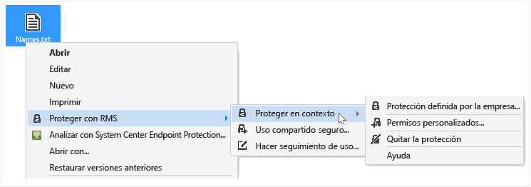
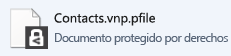

# Proteger un archivo en un dispositivo (proteger en contexto) mediante la aplicaci&#243;n para uso compartido de Rights Management.
Cuando se protege un archivo en contexto, se reemplaza el archivo sin protección original. A continuación, puede dejar el archivo donde se encuentra, copiarlo a otra carpeta o dispositivo, o compartir la carpeta en la que se encuentra, ya que el archivo seguirá estando protegido. También puede adjuntar el archivo protegido a un mensaje de correo electrónico, aunque la manera recomendada para compartir un archivo protegido por correo electrónico es hacerlo directamente desde el Explorador de archivos o una aplicación de Office (consulte [Protección de un archivo que comparte por correo electrónico con la aplicación Rights Management sharing](../Topic/Protect_a_file_that_you_share_by_email_by_using_the_Rights_Management_sharing_application.md)).

> [!TIP]
> Si ve errores al intentar proteger archivos, consulte las [Preguntas más frecuentes sobre la aplicación para uso compartido de Microsoft Rights Management para Windows](http://go.microsoft.com/fwlink/?LinkId=303971).

## Para proteger un archivo en un dispositivo (proteger en contexto)

1.  En el Explorador de archivos, seleccione el archivo que desea proteger. Haga clic con el botón derecho, seleccione **Proteger con RMS** y, a continuación, seleccione **Proteger en contexto**. Por ejemplo:

    

    > [!NOTE]
    > Si no ve la opción **Proteger con RMS**, es probable que la aplicación de uso compartido de RMS no está instalada en el equipo o que deba reiniciar el equipo para completar la instalación. Para obtener más información sobre cómo instalar la aplicación de uso compartido de RMS, vea [Descargar e instalar la aplicación para uso compartido de Rights Management](../Topic/Download_and_install_the_Rights_Management_sharing_application.md).

2.  Realice una de las acciones siguientes:

    -   Seleccione una plantilla de directiva: se trata de permisos predefinidos que normalmente restringen el acceso y el uso a las personas de su organización. Por ejemplo, si el nombre de su organización es "Contoso, Ltd", es posible que vea **Contoso, Ltd - Solo vista confidencial**. Si es la primera vez que protege un archivo en este equipo, primero deberá seleccionar **Protección definida por la empresa** para descargar las plantillas.

        La próxima vez que haga clic en la opción **Proteger en contexto**, verá hasta 10 plantillas entre las que elegir. Si hay más de 10 plantillas disponibles y la que desea no aparece, haga clic en **Protección definida por la compañía** para descargar y ver todas las plantillas.

        Al seleccionar una plantilla de directiva, también puede proteger varios archivos y una carpeta. Cuando se selecciona una carpeta, todos los archivos de esa carpeta se seleccionan automáticamente para protegerlos, pero los archivos nuevos que cree en esa carpeta no estará automáticamente protegidos.

    -   Seleccione **Permisos personalizados**: elija esta opción si las plantillas no proporcionan el nivel de protección que necesita o si desea establecer explícitamente las opciones de protección. Especifique las opciones que desee para este archivo en el [cuadro de diálogo Agregar protección](http://technet.microsoft.com/library/dn574738.aspx) y, a continuación, haga clic en **Aplicar**.

3.  Es probable que vea rápidamente un cuadro de diálogo que le indica que el archivo se está protegiendo y, a continuación, regrese al Explorador de archivos. El archivo o archivos seleccionados ahora están protegidos. En algunos casos (cuando al agregar la protección cambia la extensión de nombre de archivo), el archivo original del Explorador de archivos se reemplaza con un archivo nuevo que tiene el icono de bloqueo de protección de Rights Management. Por ejemplo:

    

Si más adelante necesita quitar la protección de un archivo, vea [Quitar la protección de un archivo mediante la aplicación Rights Management sharing](../Topic/Remove_protection_from_a_file_by_using_the_Rights_Management_sharing_application.md).

## Ejemplos y otras instrucciones
Para obtener ejemplos de cómo puede usar la aplicación para uso compartido de Rights Management e instrucciones de procedimientos, consulte las siguientes secciones de la guía de usuario de la aplicación para uso compartido de Rights Management:

-   [Ejemplos de uso de la aplicación RMS sharing](../Topic/Rights_Management_sharing_application_user_guide.md#BKMK_SharingExamples)

-   [¿Qué desea hacer?](../Topic/Rights_Management_sharing_application_user_guide.md#BKMK_SharingInstructions)

## Vea también
[Guía de usuario de la aplicación de uso compartido Rights Management](../Topic/Rights_Management_sharing_application_user_guide.md)

