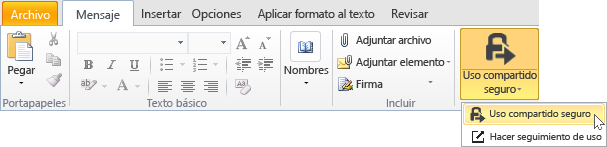
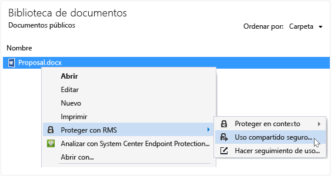
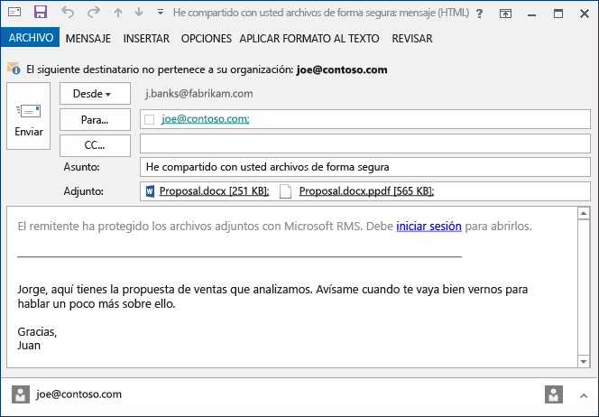

# Protecci&#243;n de un archivo que comparte por correo electr&#243;nico con la aplicaci&#243;n Rights Management sharing
Cuando protege un archivo que comparte por correo electrónico, se crea una nueva versión del archivo original. El archivo original permanece desprotegido y la nueva versión se protege y se adjunta automáticamente a un correo electrónico que luego envía.

En algunos casos (como los archivos creados por Microsoft Word, Excel y PowerPoint), la aplicación RMS sharing crea dos versiones del archivo que se adjunta al mensaje de correo electrónico. La segunda versión del archivo tiene una extensión de nombre de archivo llamada **.ppdf** y es una instantánea PDF del archivo. Esta versión del archivo garantiza que los destinatarios siempre pueden leerlo, incluso si no tienen instalada la misma aplicación que usó para crearlo. Este suele ser el caso cuando las personas leen su correo electrónico en dispositivos móviles y quieren ver los datos adjuntos. Todo lo que necesitan para abrir el archivo es la aplicación RMS sharing. Podrán leer entonces el archivo adjunto, pero no podrán modificarlo hasta que abran la otra versión del archivo con una aplicación que sea compatible con RMS.

Si su organización usa Azure RMS, puede realizar un seguimiento de los archivos que se protegen mediante uso compartido:

-   Seleccione una opción para recibir mensajes de correo electrónico cuando alguien intente abrir estos datos adjuntos protegidos. Cada vez que se tenga acceso al archivo, se le notificará quién intentó abrirlo y cuándo, y si lo lograron (se autenticaron correctamente) o no.

-   Use el sitio de seguimiento de documentación. Puede incluso dejar de compartir el archivo si revoca el acceso a él en el sitio de seguimiento de documentos. Para obtener más información, vea [Seguimiento y revocación de documentos cuando se utiliza la aplicación RMS sharing](../Topic/Track_and_revoke_your_documents_when_you_use_the_RMS_sharing_application.md).

## Uso de Outlook: Para proteger un archivo que se comparte por correo electrónico

1.  Cree su mensaje de correo electrónico y adjunte el archivo. A continuación, en la pestaña **Mensaje**, en el grupo **RMS**, haga clic en **Compartir protegido** y después otra vez en **Compartir protegido**:

    

    Si no ve este botón, es probable que la aplicación RMS sharing no esté instalada en el equipo, que no esté instalada la última versión o que el equipo deba reiniciarse para completar la instalación. Para obtener más información sobre cómo instalar la aplicación de uso compartido, consulte [Descargar e instalar la aplicación para uso compartido de Rights Management](../Topic/Download_and_install_the_Rights_Management_sharing_application.md).

2.  Especifique las opciones que prefiera para este archivo en el [cuadro de diálogo de uso compartido protegido](http://technet.microsoft.com/library/dn574738.aspx) y, luego, haga clic en **Enviar ahora**.

### Otras maneras de proteger un archivo que comparte por correo electrónico
Además de compartir un archivo protegido mediante Outlook, también puede usar estas alternativas:

-   Desde el Explorador de archivos: Este método funciona para todos los archivos.

-   Desde una aplicación de Office: Este método funciona para las aplicaciones compatibles con la aplicación de RMS sharing mediante el complemento de Office, de modo que verá el grupo **RMS** en la cinta de opciones.

##### Uso del Explorador de archivos o una aplicación de Office: Para proteger un archivo que se comparte por correo electrónico

1.  Use una de las siguientes opciones:

    -   En el Explorador de archivos: Haga clic con el botón derecho, seleccione **Proteger con RMS** y, luego, seleccione **Uso compartido seguro**.

        

    -   En las aplicaciones de Office, Word, Excel y PowerPoint: En primer lugar, asegúrese de que ha guardado el archivo. Luego, en la pestaña **Inicio** del grupo **RMS**, haga clic en **Uso compartido seguro** y luego haga clic en **Uso compartido seguro** nuevamente:

        

    Si no ve estas opciones de protección, es probable que la aplicación RMS sharing no esté instalada en el equipo, que no esté instalada la última versión o que el equipo deba reiniciarse para completar la instalación. Para obtener más información sobre cómo instalar la aplicación de uso compartido, consulte [Descargar e instalar la aplicación para uso compartido de Rights Management](../Topic/Download_and_install_the_Rights_Management_sharing_application.md).

2.  Especifique las opciones que prefiera para este archivo en el [cuadro de diálogo de uso compartido protegido](http://technet.microsoft.com/library/dn574738.aspx) y, luego, haga clic en **Enviar**.

3.  Puede que vea rápidamente un cuadro de diálogo que le dice que el archivo se está protegiendo, y que luego vea un mensaje de correo electrónico creado para usted que dice a los destinatarios que los datos adjuntos están protegidos con Microsoft RMS y que deben iniciar la sesión. Al hacer clic en el vínculo para iniciar sesión, verán instrucciones y vínculos para asegurarse de que pueden abrir los datos adjuntos protegidos.

    Ejemplo:

    

    Probablemente se esté preguntando: [¿Qué es el archivo .ppdf que se crea automáticamente?](../Topic/Dialog_box_options_for_the_Rights_Management_sharing_application.md#BKMK_PPDF)

4.  Opcional: Puede cambiar todo lo que quiera de este mensaje de correo electrónico. Por ejemplo, puede agregar o cambiar el asunto o el texto del mensaje.

    > [!WARNING]
    > Aunque puede agregar o quitar usuarios de este mensaje de correo electrónico, esto no cambiará los permisos de los datos adjuntos que especificó en el cuadro de diálogo **Uso compartido seguro**. Si quiere cambiar esos permisos para, por ejemplo, dar a una nueva persona permisos para abrir el archivo, cierre el mensaje de correo electrónico sin guardarlo ni enviarlo y regrese al paso 1.

5.  Envíe el mensaje de correo electrónico.

## Ejemplos y otras instrucciones
Para obtener ejemplos de cómo puede usar la aplicación para uso compartido de Rights Management e instrucciones de procedimientos, consulte las siguientes secciones de la guía de usuario de la aplicación para uso compartido de Rights Management:

-   [Ejemplos de uso de la aplicación RMS sharing](../Topic/Rights_Management_sharing_application_user_guide.md#BKMK_SharingExamples)

-   [¿Qué desea hacer?](../Topic/Rights_Management_sharing_application_user_guide.md#BKMK_SharingInstructions)

## Vea también
[Guía de usuario de la aplicación de uso compartido Rights Management](../Topic/Rights_Management_sharing_application_user_guide.md)

