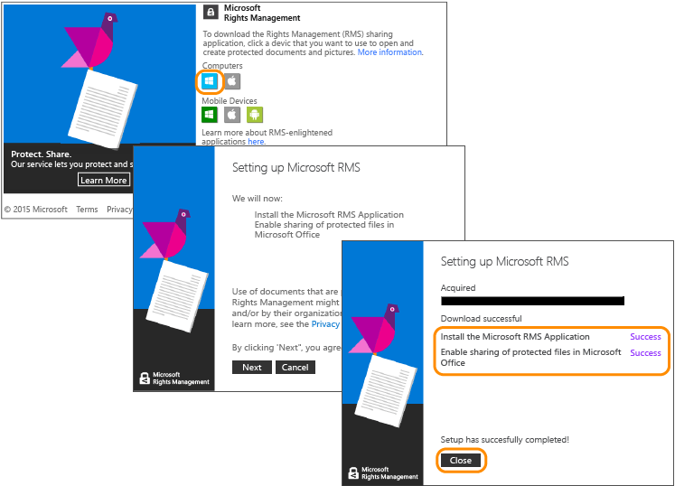

# Tutorial de inicio r&#225;pido de Azure Rights Management
Use este tutorial para probar rápidamente Microsoft Azure Rights Management (también conocido como Azure RMS) para su organización en solo 5 pasos que deberían tomarle menos de 15 minutos. Podrá activar el servicio, enviar de forma segura un documento confidencial por correo electrónico a alguien de otra organización y luego hacer un seguimiento para saber cuándo se abre ese documento. Cuando el documento confidencial se envía, se cifra durante el tránsito y solo lo puede leer la persona a la que se envía, mediante los permisos que establece el remitente.

Este tutorial está destinado a los administradores y consultores de TI a fin de ayudarles a evaluar Azure Rights Management como una solución de protección de información para una organización. En un entorno de producción, las instrucciones para activar el servicio están a cargo del administrador, mientras que las instrucciones para enviar el documento son responsabilidad de los usuarios finales. En este tutorial se incluyen ambos conjuntos de instrucciones para demostrar el escenario completo del envío seguro de un documento confidencial a alguien de otra organización. Si tiene problemas para completar este tutorial, envíe un mensaje de correo electrónico a [AskIPTeam](mailto:askipteam@microsoft.com?subject=Having%20problems%20with%20the%20Quick%20Start%20tutorial) y le ayudaremos.

Para completar este tutorial, necesitará lo siguiente:

-   Una suscripción que admita Azure Rights Management. Esta puede ser una suscripción de pago o una suscripción de prueba. Si quiere usar el seguimiento de documentos, que es un requisito en el paso 5 de este tutorial, su suscripción debe ser compatible con esta característica. Para obtener más información sobre las opciones de suscripción y los vínculos a las pruebas gratuitas, vea la sección [Suscripciones en la nube que son compatibles con Azure RMS](../Topic/Requirements_for_Azure_Rights_Management.md#BKMK_SupportedSubscriptions) del tema [Requisitos de Azure Rights Management](../Topic/Requirements_for_Azure_Rights_Management.md).

    Sugerencia: Si necesita obtener una suscripción, hágalo con anticipación porque el proceso puede durar varios minutos en completarse.

-   Una cuenta de administrador para iniciar sesión en el centro de administración de Office 365 o en el Portal de Azure clásico para poder activar el servicio Rights Management. Esta cuenta también debe tener una dirección de correo electrónico y un servicio de correo electrónico de trabajo (por ejemplo, Exchange Online o Exchange Server).

-   Un equipo que ejecute Windows (a partir de Windows 7 SP1) y que tenga instalado Office 2016, Office 2013 u Office 2010.

Comencemos.

## Paso 1: Activación del servicio Rights Management

Aunque es posible que tenga una suscripción que admita la Azure Rights Management, el servicio viene desactivado de forma predeterminada. Para activarlo, puede usar el Centro de administración de Office 365 o el Portal de Azure clásico:

-   Si tiene una suscripción de Office 365 que incluya Azure Rights Management o una suscripción de Office 365 que excluya Azure Rights Management, pero tiene una suscripción de Azure RMS Premium: **Use el Centro de administración de Office 365**.

-   Si no tiene una suscripción de Office 365: **Use el Portal de Azure clásico**.

#### Para activar Rights Management desde el centro de administración de Office 365

1.  Vaya al [portal de Office 365](https://portal.office.com/) e inicie sesión con su cuenta profesional o educativa.

2.  Si el Centro de administración de Office 365 no se muestra automáticamente, seleccione el icono del iniciador de la aplicación en la parte superior izquierda y elija **Admin**. El icono **Administrador** aparece únicamente para los administradores de Office 365.

    > [!TIP]
    > Para obtener ayuda con el centro de administración, consulte [Sobre el Centro de administración de Office 365: ayuda para el administrador](https://support.office.com/article/About-the-Office-365-admin-center-Admin-Help-58537702-d421-4d02-8141-e128e3703547).

3.  En el panel izquierdo, expanda **CONFIGURACIÓN DEL SERVICIO**.

4.  Haga clic en **Rights Management**.

5.  En la página **RIGHTS MANAGEMENT**, haga clic en **Administrar**.

6.  En la página **Rights Management**, haga clic en **Activar**.

7.  Cuando el sistema le pregunte **¿Desea activar Rights Management?**, haga clic en **Activar**.

Ahora debería ver el texto **Rights Management está activada** y la opción para desactivarla (es posible que deba actualizar la página manualmente).

Por el momento, no haga clic en **Características avanzadas**. Esto le llevará al Portal de Azure clásico, donde podrá configurar las plantillas, que no son necesarias en este tutorial. En su lugar, puede cerrar el centro de administración de Office 365.

#### Para activar Rights Management desde el portal de Azure

1.  Vaya al [Portal de Azure clásico](http://go.microsoft.com/fwlink/p/?LinkID=275081) e inicie sesión.

2.  En el panel izquierdo, haga clic en **ACTIVE DIRECTORY**.

3.  En la página **Active Directory**, haga clic en **RIGHTS MANAGEMENT**.

4.  Seleccione el directorio que desea administrar para [!INCLUDE[aad_rightsmanagement_2](../Token/aad_rightsmanagement_2_md.md)], haga clic en **ACTIVAR** y confirme la acción.

El **ESTADO DE RIGHTS MANAGEMENT** debe indicar ahora **Activo** y la opción **ACTIVAR** debe aparecer reemplazada por **DESACTIVAR**.

Aunque puede configurar otras opciones de Rights Management en el portal, en este tutorial no es necesario, así que puede cerrar el Portal de Azure clásico.

Eso es todo lo que necesita hacer en este primer paso. El servicio está activado para que todos los usuarios de su organización puedan empezar a proteger los documentos importantes y confidenciales. En un entorno de producción, es posible que desee restringir quién puede hacer esto al inicio a fin de llevar a cabo una implementación por fases. Sin embargo, esto no es necesario para este tutorial.

Aunque las plantillas personalizadas no se incluyen aquí, probablemente desee configurar algunas en una implementación de producción. Las plantillas permiten a los usuarios aplicar rápida y fácilmente la configuración de derechos cuando necesitan proteger archivos. Al activar Rights Management, obtendrá automáticamente 2 plantillas predeterminadas, que probablemente desee complementar con sus propias plantillas personalizadas en un entorno de producción. Sin embargo, las plantillas no son necesarias para este tutorial, así que ya puede ir al paso siguiente.

|Si desea obtener más información|Información adicional|
|------------------------------------|-------------------------|
|Acerca de la activación de Rights Management y el control de quién puede proteger archivos y correo electrónico cuando el servicio está activado   →|[Activar Rights Management de Azure](../Topic/Activating_Azure_Rights_Management.md)|
|Acerca de las plantillas predeterminadas y del modo de crear nuevas plantillas personalizadas   →|[Configuración de plantillas personalizadas para Azure Rights Management](../Topic/Configuring_Custom_Templates_for_Azure_Rights_Management.md)|

## Paso 2: Instalación de la aplicación de uso compartido Rights Management

La aplicación de uso compartido Rights Management (también conocida como “aplicación de uso compartido RMS”) no es un requisito para Azure Rights Management, pero se recomienda para todos los equipos y dispositivos móviles compatibles con Azure Rights Management. La aplicación de uso compartido RMS se integra con aplicaciones de Office mediante la instalación de un complemento de Office para que los usuarios puedan proteger fácilmente los archivos directamente desde la cinta. También permite proteger todos los tipos de archivos mediante la aplicación de la protección genérica para los archivos que no son compatibles de forma nativa con Azure Rights Management y un sitio de seguimiento de documentos para que los usuarios controlen y revoquen los archivos que hayan protegido. Usaremos el sitio de seguimiento de documentos más tarde en este tutorial.

Esta aplicación se descarga de forma gratuita y ofrece una instalación con script para entornos de producción. Sin embargo, en este tutorial la instalaremos de forma local.

#### Para descargar e instalar la aplicación Rights Management sharing

1.  Vaya a la página de [Microsoft Rights Management](http://go.microsoft.com/fwlink/?LinkId=303970) en el sitio web de Microsoft.

2.  En la sección **Equipos**, haga clic en el icono de la **Aplicación RMS para Windows** y guarde el archivo **Setup.exe** para instalar la aplicación de uso compartido Microsoft Rights Management.

3.  Para realizar una instalación local, debe usar una cuenta de administrador para ejecutar el archivo Setup.exe que se descargó. Si el sistema le pregunta si desea continuar, haga clic en **Sí**.

4.  En la página **Instalar Microsoft RMS**, haga clic en **Siguiente** y espere a que finalice la instalación.

5.  Cuando finalice la instalación, haga clic en **Reiniciar** si se le pide que reinicie el equipo, o en **Cerrar** para completar la instalación.

Ya está listo para empezar a proteger los archivos que contienen la información que desea compartir solo con las personas que especifique.

|Si desea obtener más información|Información adicional|
|------------------------------------|-------------------------|
|Acerca de una instalación local de la aplicación de uso compartido Rights Management para Windows y las instrucciones de usuario   →|[Guía de usuario de la aplicación de uso compartido Rights Management](http://technet.microsoft.com/library/dn339006.aspx)|
|Acerca de la instalación con scripts de la aplicación de uso compartido Rights Management para Windows y más información técnica   →|[Guía de administrador de la aplicación de uso compartido Rights Management](http://technet.microsoft.com/library/dn339003.aspx)|
|Para comprender la diferencia entre la protección nativa y la protección genérica   →|[¿Cuál es la diferencia entre la protección genérica y la protección incorporada (nativa)?](https://technet.microsoft.com/library/dn574738.aspx)|

## Paso 3: Enviar el documento que desea proteger por correo electrónico

Para este paso, primero use Word para crear y guardar el documento que desea proteger y asígnele un nombre**Confidential.docx**. Para este tutorial, lo que importa no es el texto en concreto, si no el hecho de que haya texto para confirmar más fácilmente si el recipiente autorizado puede leerlo. Por ejemplo, puede escribir: **Si puede leer esto en los datos adjuntos del correo electrónico, el remitente ha compartido correctamente un archivo protegido con Azure RMS.**

A continuación, estará listo para compartir de forma segura este documento por correo electrónico.

#### Para compartir de forma segura el documento por correo electrónico

1.  En Outlook, cree un mensaje nuevo y adjunte el archivo que acaba de crear.

2.  En el cuadro **Para**, escriba una o más direcciones de correo electrónico empresarial. Asegúrese de especificar una dirección de correo electrónico empresarial, como **janetm@contoso.com** o **p.dover@fabrikam.com**, porque, actualmente, Azure Rights Management no es compatible con las direcciones de correo electrónico personales que se usan en casa con el proveedor de Internet. No se preocupe por saber si la persona a la que envía el archivo también tiene Azure Rights Management o no.

3.  Escriba un asunto, como **Documento confidencial** y, a continuación, escriba un mensaje breve para el correo electrónico, como **Lea este documento confidencial y no lo comparta con otros.**

4.  A continuación, en la pestaña **Mensaje** del grupo **RMS**, haga clic en **Uso compartido seguro** y luego haga clic en **Uso compartido seguro** nuevamente:

5.  En el cuadro de diálogo **Uso compartido seguro**:

    1.  Seleccione **Visor – Solo ver**.

        Esto significa que los destinatarios podrán ver el documento pero no editarlo ni imprimirlo.

    2.  Seleccione **Enviarme un correo electrónico cuando alguien trate de abrir estos documentos**.

        Recibirá una notificación por correo electrónico cada vez que los destinatarios intenten abrir el archivo adjunto, y también si alguien más intenta abrirlo (por ejemplo, cuando el destinatario reenvía el correo electrónico a un compañero de trabajo. En este último caso, verá que se deniega el acceso y, a partir de los detalles del usuario, podrá decidir si enviar a esa persona una copia del documento que puede abrir.

    3.  Seleccione **Permítame revocar el acceso a estos documentos de forma instantánea**.

        Esta opción requiere que los destinatarios tengan una conexión a Internet cada vez que abran el archivo adjunto, pero con el beneficio de que si más adelante se revoca el documento, la próxima vez que intenten abrirlo, no podrán hacerlo. Si no selecciona esta opción, es posible que los destinatarios puedan abrirlo incluso sin una conexión a Internet, pero con la desventaja de que si más adelante se revoca el documento, puede producirse una demora para que esto tenga efecto.

    4.  Haga clic en **Enviar ahora**.

        El correo electrónico con datos adjuntos se envía a las direcciones de correo electrónico que especificó. Además del mensaje de correo electrónico, verán instrucciones sobre cómo leer el documento adjunto que está protegido con Azure Rights Management.

Ahora que ha enviado el documento protegido, está listo para pedir a los destinatarios que esperen a que llegue para luego abrirlo. Sin embargo, no debe cerrar Outlook, porque lo volveremos a usar en el último paso para realizar un seguimiento de los datos adjuntos.

|Si desea obtener más información|Información adicional|
|------------------------------------|-------------------------|
|Todas las instrucciones y los métodos alternativos para proteger los archivos que comparte por correo electrónico   →|[Proteger un archivo que comparte por correo electrónico mediante la aplicación de uso compartido Rights Management.](https://technet.microsoft.com/library/dn574735.aspx)|
|Acerca de las opciones del cuadro de diálogo **Uso compartido seguro** →|[Opciones del cuadro de diálogo para la aplicación de uso compartido Rights Management](https://technet.microsoft.com/library/dn574738.aspx)|

## Paso 4: Pedir a los destinatarios que abran el documento por correo electrónico

Los destinatarios pueden usar muchos dispositivos para leer el documento protegido que envía como datos adjuntos por correo electrónico. Entre los dispositivos, se encuentran el iPad, el iPhone, tabletas y teléfonos Android, y equipos Mac, así como los equipos Windows.

Pídales que lean el mensaje de correo electrónico que ha enviado. Verán el mensaje de correo electrónico con el siguiente texto delante:

**El remitente ha protegido los datos adjuntos con Microsoft RMS. Debe** [iniciar sesión](http://aka.ms/rms) **para abrirlos.**

Cuando hacen clic en el vínculo, este los lleva a las instrucciones para instalar la aplicación de uso compartido RMS y, si es necesario, suscribirse a una cuenta gratuita. La cuenta gratuita les concede una suscripción de RMS para individuos, que garantiza que los usuarios autorizados siempre puedan leer un documento protegido, incluso si su organización no dispone de Azure RMS. A continuación, están preparados para leer los datos adjuntos protegidos siguiendo las instrucciones a continuación.

#### Para ver los datos adjuntos del documento protegido

1.  Debido a que Azure Rights Management protegió un documento de Word, hay dos elementos adjuntos en el mensaje de correo electrónico. Estos son en realidad dos versiones del mismo archivo, pero con extensiones de nombre de archivo diferentes. Abra la versión que tiene la extensión de nombre de archivo **.ppdf** (**Confidential.ppdf**).

    Si tiene una versión de [Office en el dispositivo que admite Rights Management](https://technet.microsoft.com/library/dn655136.aspx), puede abrir la otra versión del archivo (**Confidential.docx**) para que se ejecute en Word.

2.  Si se le pide su nombre de usuario y contraseña, escriba su nombre de usuario en el mismo formato que la dirección de correo electrónico que se usó para enviarle el correo electrónico y los datos adjuntos. Por ejemplo, **janetm@contoso.com** o **p.dover@fabrikam.com**. Para la contraseña, escriba la contraseña que proporcionó al suscribirse a RMS para usuarios. O bien, si su organización tiene Azure RMS, debe escribir la contraseña de trabajo habitual.

En este momento, se abre el documento y puede leer el contenido. Por ejemplo, puede decir **Si puede leer esto en los datos adjuntos del correo electrónico, el remitente ha compartido correctamente un archivo protegido con Azure RMS.** Debido a que es de solo lectura, no puede cambiar el contenido.

Como paso opcional, puede pedir el destinatario que reenvíe el correo electrónico a otras personas que no incluyó en el correo electrónico original. Incluso si las otras personas trabajan para una organización como Azure Rights Management o solicitan su propia suscripción de RMS para usuarios, no podrán abrir el archivo adjunto. Cuando se les pide el nombre de usuario, se deniega el acceso al documento.

Ahora que el destinatario ha abierto el archivo adjunto y lo ha enviado de forma opcional a alguien más, espere la notificación por correo electrónico que informa de esta actividad. Sin embargo, los mensajes de correo electrónico son fáciles de perder con el tiempo, así que una mejor manera de realizar un seguimiento de quién tuvo acceso al documento es usar el sitio de seguimiento de documentos, que se explica en el paso final.

|Si desea obtener más información|Información adicional|
|------------------------------------|-------------------------|
|Instrucciones completas para ver archivos protegidos con Azure Rights Management   →|[Ver y usar archivos que han sido protegidos con Rights Management](https://technet.microsoft.com/library/dn574741.aspx)|
|Acerca de la suscripción gratuita, RMS para usuarios   →|[RMS para usuarios y Azure Rights Management](../Topic/RMS_for_Individuals_and_Azure_Rights_Management.md)|
|Acerca de las dos versiones del archivo que ve adjunto al mensaje de correo electrónico   →|[¿Qué es el archivo .ppdf que se crea automáticamente?](https://technet.microsoft.com/library/dn574738.aspx)|

## Paso 5: Hacer un seguimiento del documento protegido

> [!NOTE]
> Para este paso, debe tener una suscripción que admita el seguimiento de documentos. Para comprobar si la suscripción incluye el seguimiento de documentos, vea [Comparación de ofertas de Rights Management Services (RMS)](https://technet.microsoft.com/dn858608.aspx).

Este paso es opcional, pero a la mayoría de las personas les gusta saber si se ha abierto el archivo adjunto que enviaron a los usuarios. Si es así, cuándo e incluso desde dónde. Por ejemplo:

-   Espera una respuesta de una persona en un tiempo especificado y puede ver en el sitio de seguimiento de documentos que el archivo no se ha abierto, incluso cerca de la fecha límite. Le envía un correo electrónico de seguimiento o la llama por teléfono como recordatorio puntual.

-   Después de ver que alguien ha abierto el documento, le pregunta si tiene dudas o si necesita información adicional.

#### Para hacer un seguimiento de un documento protegido

1.  En Outlook, en la pestaña **Inicio** del grupo **RMS**, haga clic en **Hacer seguimiento de uso**.

2.  Si ve la página **Proteger y compartir en sus términos**, haga clic en **Iniciar sesión** y proporcione su nombre de usuario y contraseña de nuevamente.

3.  En la página **Sus documentos compartidos**, verá el documento que adjuntó al correo electrónico, **Confidential.docx**. En este punto, es el único archivo que aparece, pero a medida que comparta más documentos protegidos, la lista aumentará.

    En esta página, verá la fecha en la que compartió el documento (cuándo envió el correo electrónico con el archivo adjunto protegido), la fecha de la última actividad y el nombre del destinatario al que envía el correo electrónico. Haga clic en el nombre del documento para obtener detalles adicionales.

4.  En la página nueva, que tiene el nombre del archivo en el que hizo clic, verá los detalles de resumen solo para ese documento y una lista de otras opciones que están disponibles para el documento (**ListaEscala de tiempoMapaConfiguración**).

    Haga clic en cada opción para explorar maneras diferentes para hacer un seguimiento de un documento protegido. O bien, también en la página **Resumen**, haga clic en**Abrir en Excel** para exportar la información a una hoja de cálculo o en **Revocar acceso** para dejar de compartir el documento.

Puede volver a este sitio para realizar un seguimiento de más actividad relacionada con su documento protegido o revocar el acceso si es necesario. Incluso puede acceder al sitio desde su dispositivo móvil o tableta mediante un explorador con este vínculo: [seguimiento de documentos](http://go.microsoft.com/fwlink/?LinkId=529562)

|Si desea obtener más información|Información adicional|
|------------------------------------|-------------------------|
|Todas las instrucciones para realizar el seguimiento de los documentos   →|[Realizar un seguimiento de los documentos o revocarlos con la aplicación de uso compartido RMS](https://technet.microsoft.com/library/dn986611.aspx)|
|Vídeo de dos minutos en el que se explica y muestra el seguimiento de documentos   →|[Revocación y seguimiento de documentos de Azure RMS](http://channel9.msdn.com/Series/Information-Protection/Azure-RMS-Document-Tracking-and-Revocation)|
|Para la solución de problemas y las preguntas de los clientes   →|[Preguntas más frecuentes sobre seguimiento de documentos](https://technet.microsoft.com/dn947488)|

## Pasos siguientes
En este tutorial se repasó un caso de cómo Azure RMS puede ayudar a proteger los datos. Para ver otros usos comunes, vea la sección [Azure RMS en acción](https://technet.microsoft.com/library/jj585026.aspx) en el artículo [¿Qué es Rights Management de Azure?](../Topic/What_is_Azure_Rights_Management_.md). Hay otras secciones en este artículo que también pueden ser útiles, por ejemplo, la que explica cómo funciona Azure RMS y qué problemas empresariales puede resolver.

Si está listo para comenzar a implementar Azure RMS, use el [Plan para la implementación de Azure Rights Management](../Topic/Azure_Rights_Management_Deployment_Roadmap.md) para ver los pasos de implementación y los vínculos con instrucciones de los procedimientos.

## Vea también
[Introducción a Azure Rights Management](../Topic/Getting_Started_with_Azure_Rights_Management.md)

