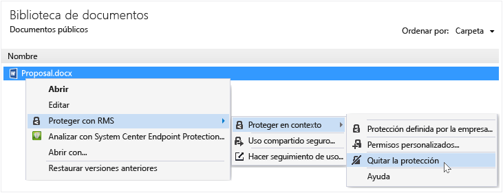

# Quitar la protecci&#243;n de un archivo mediante la aplicaci&#243;n Rights Management sharing
Para quitar la protección de un archivo (es decir, desproteger un archivo) que anteriormente se ha protegido mediante la aplicación RMS sharing, use la opción **Quitar protección** del Explorador de archivos.

> [!IMPORTANT]
> Debe ser un propietario del archivo para quitar la protección.

### Para quitar la protección de un archivo

1.  En el Explorador de archivos, haga clic con el botón derecho en el archivo (por ejemplo, Sample.ptxt), seleccione **Proteger con RMS**, haga clic en **Protección local** y, luego, haga clic en **Quitar protección**:

    

    Puede que se le pidan credenciales.

El archivo protegido original se elimina (por ejemplo, Sample.ptxt) y se reemplaza por un archivo que tiene el mismo nombre pero con la extensión de nombre de archivo desprotegido (por ejemplo, Sample.txt).

## Ejemplos y otras instrucciones
Para obtener ejemplos de cómo puede usar la aplicación para uso compartido de Rights Management e instrucciones de procedimientos, consulte las siguientes secciones de la guía de usuario de la aplicación para uso compartido de Rights Management:

-   [Ejemplos de uso de la aplicación RMS sharing](../Topic/Rights_Management_sharing_application_user_guide.md#BKMK_SharingExamples)

-   [¿Qué desea hacer?](../Topic/Rights_Management_sharing_application_user_guide.md#BKMK_SharingInstructions)

## Vea también
[Guía de usuario de la aplicación de uso compartido Rights Management](../Topic/Rights_Management_sharing_application_user_guide.md)

