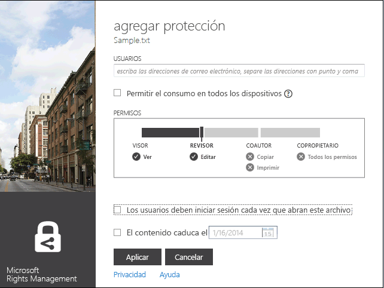

# Versi&#243;n revisada&#160;3: Gu&#237;a de la aplicaci&#243;n para uso compartido de Microsoft Rights Management
Use esta guía para la aplicación para uso compartido de Microsoft Rights Management (RMS) para Windows con el fin de mantener documentos e imágenes importantes a salvo de quienes no deberían verlos, aunque se envíen por correo electrónico o se guarden en otro dispositivo. Asimismo, esta aplicación permite abrir y usar los archivos que otros usuarios hayan protegido mediante la misma tecnología de Rights Management.

Esta aplicación para uso compartido proporciona protección para los archivos de las maneras siguientes:

-   Agrega funciones al Explorador de archivos (también llamado Explorador de Windows en Windows 7 y versiones anteriores) de modo que, al administrar los archivos de una carpeta, pueda proteger fácilmente un solo archivo, proteger masivamente varios archivos o proteger todos los archivos de una carpeta.

-   Proporciona protección para todos los tipos de archivo y tiene un visor integrado para los tipos de archivo de texto e imagen más usados.

-   Agrega el botón **Uso compartido seguro** a la barra de herramientas de Microsoft Office para Word, PowerPoint y Excel.

Lo único que necesita es un equipo que ejecute al menos Windows 7 o Windows 8 y una cuenta de administrador local para instalar la aplicación para uso compartido de RMS. A continuación, descargue e instale esta aplicación gratuita de Microsoft.

Si tiene preguntas que no se responden esta guía, consulte [Preguntas más frecuentes sobre la aplicación para uso compartido de Microsoft Rights Management para Windows](http://go.microsoft.com/fwlink/?LinkId=303971).

## Ejemplos de uso de la aplicación para uso compartido de RMS
Aquí solo se incluyen algunos ejemplos de cómo puede usar la aplicación para uso compartido de RMS para proteger los archivos.

|Escenario|Solución mediante la aplicación para uso compartido de RMS|
|-------------|--------------------------------------------------------------|
|**Quiero copiar de forma segura un documento confidencial de la empresa en otro dispositivo**<br /><br />Usa su equipo para trabajar en un documento de estrategia confidencial de la empresa y desea copiarlo en una unidad USB para poder seguir trabajando en él al salir de la oficina, ya que no tiene acceso a la red de la empresa.|Tiene instalada en el equipo y en el portátil la aplicación para uso compartido de RMS. Use el Explorador de archivos de su equipo para proteger el archivo con una plantilla, de modo que no sea accesible para los usuarios ajenos a su empresa. A continuación, copie el archivo en la unidad USB, conecte la unidad al portátil y siga trabajando en el documento. Si pierde la unidad USB o le roban el portátil, ninguna persona ajena a la empresa podrá acceder al documento.|
|**Quiero compartir de manera segura información financiera con una persona de confianza que no pertenece a la empresa**<br /><br />Trabaja con una empresa asociada y desea enviarle por correo electrónico una hoja de cálculo de Excel que contiene las cifras de ventas proyectadas. Desea que puedan ver las cifras pero no modificarlas.|Use el botón **Uso compartido seguro** de la cinta de opciones de Excel, escriba las direcciones de correo electrónico de las dos personas de la empresa asociada con las que trabaja, seleccione **Lector** en el control deslizante y haga clic en **Enviar**.<br /><br />Cuando el correo electrónico llegue a la empresa asociada, solo los destinatarios del correo electrónico podrán ver la hoja de cálculo, y no podrán guardarla, editarla, imprimirla o reenviarla.|
|**Necesito enviar de manera segura un diagrama de ingeniería por correo electrónico a una persona que usa un dispositivo iOS**<br /><br />Su empresa usa una aplicación personalizada de ingeniería y desea enviar por correo electrónico un diagrama altamente confidencial a un compañero de trabajo que, como bien sabe, consulta con regularidad el correo electrónico en su dispositivo iOS.|Use el Explorador de archivos para hacer clic con el botón derecho en el archivo y seleccione **Uso compartido seguro**. La aplicación para uso compartido de RMS reconoce que la extensión de archivo no es de una aplicación que admite de forma nativa RMS, por lo que, cuando adjunta el archivo a un mensaje de correo electrónico, lo convierte automáticamente en un archivo protegido de forma genérica y selecciona automáticamente la opción **Permitir el consumo en todos los dispositivos**.<br /><br />El destinatario recibe el correo electrónico en su dispositivo iOS, hace clic en el vínculo del correo electrónico que le indica cómo descargar la aplicación para uso compartido de RMS, instala la versión para dispositivos iOS y luego ve el diagrama.|
|**Mi empresa no usa Rights Management, pero recibí ningún mensaje de correo electrónico con un archivo adjunto protegido por RMS**<br /><br />El remitente del correo electrónico es una persona de confianza porque ya hicieron negocios juntos en el pasado y sospecha que podría haberle enviado información sobre una nueva oportunidad profesional en potencia.|Haga clic en el vínculo del correo electrónico que explica cómo descargar la aplicación para uso compartido de RMS en el equipo, instálela y regístrese en RMS para usuarios. Microsoft confirmará que su empresa no tiene una suscripción a Office 365 y le enviará un correo electrónico para completar el proceso de suscripción gratuita. Inicie sesión con la nueva cuenta. A continuación, puede abrir el archivo adjunto del correo electrónico para obtener información acerca de la nueva oportunidad profesional.|

## <a name="BKMK_Install"></a>Cómo descargar e instalar la aplicación para uso compartido de RMS
> [!IMPORTANT]
> Debe tener una cuenta de administrador local para instalar la aplicación para uso compartido de RMS. Si no inicia sesión como administrador local, puede usar la opción **Ejecutar como administrador** al ejecutar Setup.exe en el paso 3.

Para instalar la aplicación para uso compartido de RMS, siga estos pasos:

1.  Vaya a la página [Microsoft Rights Management](http://go.microsoft.com/fwlink/?LinkId=303970) del sitio web de Microsoft.

2.  En la sección **Equipos**, haga clic en el icono de **Aplicación RMS para Windows** y guarde el paquete de instalación de la aplicación para uso compartido de Microsoft Rights Management en el equipo.

3.  Haga doble clic en el archivo comprimido que se descargó y luego haga doble clic en **setup.exe**. Si se le solicita que continúe, haga clic en **Sí**.

4.  En la página **Instalar Microsoft RMS**, haga clic en **Siguiente** y espere a que finalice la instalación.

5.  Cuando finalice la instalación, haga clic en **Reiniciar** para reiniciar el equipo y completar la instalación. O bien, haga clic en **Cerrar** y reinicie el equipo más adelante para completar la instalación.

Ahora ya puede empezar a proteger sus archivos o leer archivos protegidos por otros usuarios.

## <a name="BKMK_UsingMSRMSApp"></a>¿Qué desea hacer?
Use las instrucciones siguientes para trabajar con los archivos protegidos.

### <a name="BKMK_CreatePTXT"></a>Crear un archivo de texto protegido
Puede convertir un archivo de texto normal (.txt) en un archivo protegido, que tiene una extensión de archivo .ptxt.

##### Para crear un archivo de texto protegido (.ptxt)

1.  En el Explorador de archivos, haga clic con el botón derecho en una carpeta, haga clic en **Nuevo** y luego en **Documento de texto**.

2.  Cambie el nombre del archivo (por ejemplo, Sample.txt).

3.  Haga doble clic en el archivo para abrirlo en el Bloc de notas.

4.  En el Bloc de notas, agregue unas cuantas líneas de texto al archivo y guárdelo: Puede usar las siguientes como texto de ejemplo.

    ```
    This is a sample text file.
    This is a sample text file.
    This is a sample text file.
    This is a sample text file. 
    This is a sample text file.
    This is a sample text file.
    ```

5.  Haga clic con el botón derecho en el archivo, haga clic en **Proteger en contexto** y seleccione una plantilla de la lista. Si es la primera vez que usa la aplicación para uso compartido de RMS, antes deberá seleccionar **Protección de la compañía**, que descarga las plantillas para su organización.

6.  En la pantalla **Aplicación para uso compartido de Microsoft Rights Management**, confirme la directiva que desea aplicar, haga clic en **Aplicar** y, una vez protegido el archivo, haga clic en **Cerrar**.

### <a name="BKMK_ViewPTXT"></a>Ver un archivo de texto protegido (.ptxt) o un archivo de imagen protegido
Para ver un archivo de texto protegido (.ptxt), en el Explorador de archivos, haga doble clic en el archivo (por ejemplo, Sample.ptxt). Puede que se le soliciten las credenciales. Cuando se abra el archivo, verá la directiva de protección del archivo en la parte superior del archivo.

Puede ver y abrir imágenes protegidas de la misma manera.

### <a name="BKMK_CreatePFILE"></a>Crear un archivo protegido genérico
Use el formato de archivo de protección genérica (.pfile) para ofrecer un nivel genérico de protección para los tipos de archivo que no son directamente compatibles con la aplicación para uso compartido de RMS o con otras aplicaciones que proporcionan protección integrada de tipo RMS. Puede usar la página [Microsoft Rights Management](http://go.microsoft.com/fwlink/?LinkId=303970) del sitio web de Microsoft para comprobar rápidamente las aplicaciones que admiten la protección integrada de RMS.

Por ejemplo, dado que Microsoft Visio no admite actualmente la protección integrada para RMS, puede usar la protección genérica para los archivos .vsd que cree con Microsoft Visio.

> [!TIP]
> ¿Cuál es la diferencia entre la protección integrada (nativa) y la protección genérica?
> 
> -   Al proteger un archivo de forma genérica, las personas no autorizadas no pueden abrirlo. Sin embargo, después de que las personas autorizadas hayan abierto el archivo, podrían reenviarlo desprotegido a otras personas o guardarlo en una ubicación a la que podrían tener acceso otros usuarios. No obstante, aparece un mensaje en la parte superior del archivo que les informa de los permisos que tienen para el archivo y se les solicita que los respeten, pero no se obliga al cumplimiento de esta protección. Además, al proteger un archivo de forma genérica, no es posible restringir los permisos más allá de autorización. Por ejemplo, si usa permisos personalizados, el control deslizante de la aplicación para uso compartido de RMS selecciona automáticamente **COPROPIETARIO** y no es posible cambiarlo a permisos más restrictivos, como **LECTOR** o **COAUTOR**.
> -   En cambio, cuando se usa la protección integrada de RMS con aplicaciones que la admiten (por ejemplo, archivos de Office), la protección se aplica al archivo aunque este se envíe a otra persona o se guarde en otra ubicación. Además, al proteger estos archivos, puede usar permisos restrictivos como de solo lectura, o el permiso para modificar pero no para imprimir o copiar. Por ejemplo, si usa permisos personalizados, el control deslizante de la aplicación para uso compartido de RMS selecciona automáticamente **REVISOR** para los permisos, que puede cambiar posteriormente para que sean más o menos restrictivos.

##### Ejemplo: Para crear un archivo protegido genérico (.pfile) a partir de un archivo de dibujo (.vsd) de Visio

1.  En el Explorador de archivos, haga clic con el botón derecho en una carpeta, haga clic en **Nuevo** y luego en **Nuevo documento de Visio**.

2.  Cambie el nombre del archivo (por ejemplo, Sample.vsd).

3.  Haga doble clic en el archivo para abrirlo en Visio.

4.  En Visio, agregue elementos al dibujo y, a continuación, guarde y cierre el archivo.

5.  Haga clic con el botón derecho en el archivo, haga clic en **Proteger en contexto** y seleccione una plantilla de directiva de la lista. Si es la primera vez que usa la aplicación para uso compartido de RMS, antes deberá seleccionar **Protección de la compañía**, que descarga las plantillas para su organización.

6.  En la pantalla **Aplicación para uso compartido de Microsoft Rights Management**, seleccione la directiva que quiere aplicar y haga clic en **Aplicar**.

7.  Un mensaje indica que se guardó el archivo protegido como archivo .pfile (por ejemplo, Sample.vsd.pfile). Se elimina el archivo original.

### <a name="BKMK_ViewPFILE"></a>Ver un archivo protegido genérico (.pfile)
Para ver un archivo protegido genérico (.pfile), en el Explorador de archivos, haga doble clic en el archivo protegido genérico (.pfile) (por ejemplo, Sample.vsd.pfile) y haga clic en **Abrir**.

### <a name="BKMK_Unprotect"></a>Quitar la protección de un archivo
Para quitar la protección (es decir, desproteger) de un archivo protegido anteriormente, use la opción **Quitar protección**:

1.  Haga clic en el archivo (por ejemplo, Sample.ptxt), haga clic en **Proteger en contexto** y luego en **Quitar protección**. Puede que se le soliciten las credenciales.

2.  El archivo protegido original se elimina (por ejemplo, Sample.ptxt) y se reemplaza con un archivo que tiene el mismo nombre pero la extensión de nombre de archivo desprotegido (por ejemplo, Sample.txt).

### <a name="BKMK_ProtectCustom"></a>Proteger un archivo con permisos personalizados
La manera más sencilla de proteger un archivo consiste en usar plantillas, pero también puede especificar sus propios permisos. Es lo que se denomina "protección creada por el usuario", y resulta útil en las siguientes situaciones:

-   Si desea limitar el acceso al archivo únicamente a una lista específica de usuarios individuales identificados por sus direcciones de correo electrónico.

-   Si desea limitar el uso del archivo únicamente a derechos específicos, como los derechos de solo lectura en un documento.

Para proteger un archivo con permisos creados por el usuario, haga clic con el botón derecho en el archivo, haga clic en **Proteger en contexto** y luego en **Permisos personalizados**. Verá la siguiente pantalla:



Escriba las direcciones de correo electrónico de los usuarios, use el control deslizante para seleccionar los permisos del archivo y haga clic en **Aplicar**.

### <a name="BKMK_UserDefined"></a>Usar archivos que tienen protección personalizada
La mayoría de los archivos que abra se habrán protegido mediante la aplicación de plantillas. Sin embargo, los usuarios también pueden proteger archivos usando sus propios permisos personalizados, lo que se denomina "protección creada por el usuario".

Para formatos de archivo de texto e imagen, este nivel de protección requiere que todas las aplicaciones que se usan para editar, guardar o restringir estos archivos estén diseñadas para admitir la protección de RMS e implementar las API de protección proporcionadas en el SDK de AD RMS.

Al ver un archivo de texto protegido al que se haya aplicado protección creada por el usuario, observará una ligera diferencia en los permisos que se muestran para el archivo con respecto a lo que se muestra en el ejemplo siguiente.

Para los archivos que están protegidos mediante el formato de archivo de protección genérica (.pfile), los derechos o permisos específicos que indicó el usuario aparecen en la pantalla de confirmación en lugar del nombre de la plantilla que se usó para proteger el archivo, como se muestra en la imagen siguiente.


### <a name="BKMK_ShareProtected"></a>Proteger contenido para compartirlo por correo electrónico
Para proteger el contenido que desea compartir mediante un mensaje de correo, haga clic con el botón derecho en el archivo y haga clic en **Uso compartido seguro**. Verá la siguiente pantalla:


Escriba las direcciones de correo electrónico de la lista de usuarios, use el control deslizante para seleccionar los permisos del archivo y haga clic en **Enviar**. A continuación, Outlook crea un mensaje de correo electrónico para los destinatarios con un breve mensaje que se puede cambiar y adjunta el archivo protegido. No se protegerá el archivo original.

Para permitir a los usuarios ver los archivos protegidos en dispositivos que no son de Windows, haga clic en **Permitir el consumo en todos los dispositivos**. Los usuarios podrían tener que descargar la aplicación para uso compartido de RMS en su dispositivo. El correo electrónico incluye un vínculo para hacerlo.

### <a name="BKMK_Multiple"></a>Aplicar protección a varios archivos y carpetas
Al usar el Explorador de archivos, no hace falta aplicar la protección a los archivos uno a uno. En su lugar, puede seleccionar varios archivos, o bien todos los archivos de una carpeta si todavía no están protegidos.

##### Para proteger varios archivos o todos los archivos de una carpeta seleccionada

1.  En el Explorador de archivos, seleccione varios archivos o una carpeta que contenga archivos para proteger.

2.  Haga clic con el botón derecho en la carpeta o los archivos seleccionados, haga clic en **Proteger en contexto** y seleccione una plantilla de la lista. Si es la primera vez que usa la aplicación para uso compartido de RMS, antes deberá seleccionar **Protección de la compañía**, que descarga las plantillas para su organización.

3.  En la pantalla **Aplicación para uso compartido de Microsoft Rights Management** , confirme que se protegieron los archivos.

> [!TIP]
> Si detecta algún error, consulte [Preguntas más frecuentes sobre la aplicación para uso compartido de Microsoft Rights Management para Windows](http://go.microsoft.com/fwlink/?LinkId=303971).

### <a name="BKMK_OfficeToolbar"></a>Usar el complemento de la barra de herramientas de Office
Puede proteger y compartir archivos de Word, PowerPoint y Excel directamente desde Microsoft Office usando el complemento de cinta de opciones de Office para la aplicación para uso compartido de Microsoft Rights Management.

En el grupo **Protección**, haga clic en **Uso compartido seguro** para iniciar la aplicación para uso compartido de Microsoft Rights Management.


### <a name="BKMK_AccessKeys"></a>Usar métodos abreviados de teclado
Presione la tecla **Alt** para ver las teclas de acceso disponibles y, a continuación, presione **Alt** y la tecla de acceso para seleccionar una opción.

Por ejemplo, en el cuadro de diálogo **Uso compartido seguro**, presione **Alt** para ver las teclas de acceso y presione **Alt + u** para seleccionar **Los usuarios deben iniciar sesión cada vez que abran este archivo**.


## Vea también
[Descarga de la aplicación para uso compartido de Microsoft Rights Management](http://go.microsoft.com/fwlink/?LinkId=303970)
 [Preguntas más frecuentes sobre la aplicación para uso compartido de Microsoft Rights Management para Windows](http://go.microsoft.com/fwlink/?LinkId=303971)

