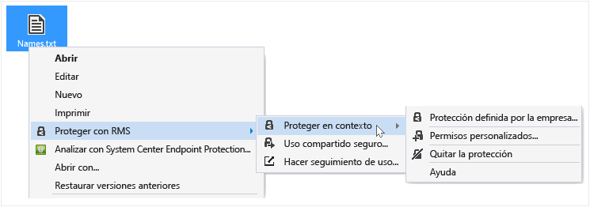
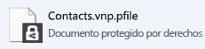
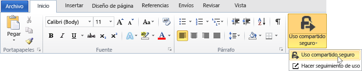
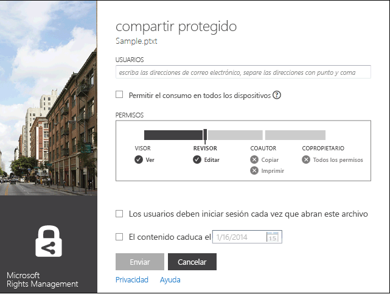
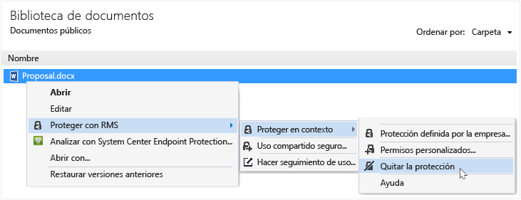

# Manual de usuario de la aplicaci&#243;n para uso compartido de Rights Management (revisi&#243;n para un solo tema)
La aplicación para uso compartido de Microsoft Rights Management (RMS) para Windows ayuda a mantener documentos e imágenes importantes a salvo de quienes no deberían verlos, aunque se envíen por correo electrónico o se guarden en otro dispositivo. También puede emplear esta aplicación para abrir y usar los archivos que otros usuarios hayan protegido mediante la misma tecnología de Rights Management.

Lo único que necesita es un equipo que ejecute como mínimo Windows 7 y una cuenta de administrador local para instalar la aplicación para uso compartido de RMS. A continuación, [descargue e instale](http://go.microsoft.com/fwlink/?LinkId=303970) esta aplicación gratuita de Microsoft.

Si tiene preguntas que no se responden esta guía, consulte [Preguntas más frecuentes sobre la aplicación para uso compartido de Microsoft Rights Management para Windows](http://go.microsoft.com/fwlink/?LinkId=303971).

Aquí solo se incluyen algunos ejemplos de cómo puede usar la aplicación de uso compartido para proteger los archivos.

|Deseo...|Cómo hacerlo|
|------------|----------------|
|**... compartir de manera segura información financiera con una persona de confianza que no pertenece a la empresa**  Trabaja con una empresa asociada y desea enviarle por correo electrónico una hoja de cálculo de Excel que contiene las cifras de ventas proyectadas. Desea que puedan ver las cifras pero no modificarlas.|Use el botón Uso compartido seguro de la cinta de opciones de Excel, escriba las direcciones de correo electrónico de las dos personas de la empresa asociada con las que trabaja, seleccione Lector en el control deslizante y haga clic en Enviar.  Cuando el correo electrónico llegue a la empresa asociada, solo los destinatarios del correo electrónico podrán ver la hoja de cálculo, y no podrán guardarla, editarla, imprimirla o reenviarla.  Detalles: Consulte **Proteger un archivo que se comparte por correo electrónico** en la sección [¿Qué desea hacer?](../Topic/Rights_Management_sharing_application_user_guide_-_revision_for_single_topic.md#BKMK_UsingMSRMSApp) de esta guía.|
|**... enviar de manera segura un documento por correo electrónico a una persona que usa un dispositivo iOS**  Desea enviar por correo electrónico un documento de Word altamente confidencial a un compañero de trabajo que, como bien sabe, consulta con regularidad el correo electrónico en su dispositivo iOS.|Use el Explorador de archivos para hacer clic con el botón derecho en el archivo y seleccione Uso compartido seguro. En la aplicación para uso compartido de RMS, seleccione la opción Permitir el consumo en todos los dispositivos y envíe el archivo como adjunto a su compañero de trabajo.  El destinatario recibe el correo electrónico en su dispositivo iOS, hace clic en el vínculo del correo electrónico que le indica cómo descargar la aplicación para uso compartido, instala la versión para dispositivos iOS y, a continuación, ve el documento.  Detalles: Consulte **Proteger un archivo que se comparte por correo electrónico** en la sección [¿Qué desea hacer?](../Topic/Rights_Management_sharing_application_user_guide_-_revision_for_single_topic.md#BKMK_UsingMSRMSApp) de esta guía.|
|**... leer un archivo adjunto recibido en un mensaje de correo electrónico, que contiene un archivo adjunto compartido de forma segura pero que no puedo leer porque mi empresa no usa Rights Management**  El remitente del correo electrónico es una persona de confianza porque ya hicieron negocios juntos en el pasado y sospecha que podría haberle enviado información sobre una nueva oportunidad profesional en potencia.|Siga las instrucciones del correo electrónico y haga clic en el vínculo para suscribirse a Microsoft Rights Management. Microsoft confirmará que su empresa no tiene una suscripción a Office 365 y le enviará un correo electrónico para completar el proceso de suscripción gratuita. Inicie sesión con la nueva cuenta. Haga clic en el segundo vínculo del correo electrónico para instalar la aplicación para uso compartido de Rights Management. Ahora podrá abrir los datos adjuntos al correo electrónico para informarse sobre las nuevas oportunidades profesionales.  Detalles: Consulte **Ver y usar los archivos protegidos por Rights Management** en la sección [¿Qué desea hacer?](../Topic/Rights_Management_sharing_application_user_guide_-_revision_for_single_topic.md#BKMK_UsingMSRMSApp) de esta guía.|
|**... proteger archivos confidenciales de la empresa en mi portátil, de modo que no puedan acceder usuarios ajenos a mi empresa**  Viaja mucho y usa su portátil para consultar y actualizar los archivos de una carpeta que debe estar protegida contra accesos no autorizados.|Tiene instalada en el portátil la aplicación para uso compartido de RMS. Use el Explorador de archivos para proteger los archivos mediante una plantilla, que permite proteger rápidamente los archivos. Si le roban el portátil, tendrá la tranquilidad de que nadie ajeno a la empresa puede acceder a estos documentos.  Detalles: Consulte **Proteger un archivo en un dispositivo (proteger en contexto)** en la sección [¿Qué desea hacer?](../Topic/Rights_Management_sharing_application_user_guide_-_revision_for_single_topic.md#BKMK_UsingMSRMSApp) de esta guía.|

## ¿Qué desea hacer?
Use las instrucciones siguientes para trabajar con los archivos protegidos.

### Descargar e instalar la aplicación para uso compartido de Rights Management

1.  Vaya a la página [Microsoft Rights Management](http://go.microsoft.com/fwlink/?LinkId=303970) del sitio web de Microsoft.

2.  En la sección **Equipos**, haga clic en el icono de **Aplicación RMS para Windows** y guarde el paquete de instalación de la aplicación para uso compartido de Microsoft Rights Management en el equipo.

3.  Haga doble clic en el archivo comprimido que se descargó y luego haga doble clic en **setup.exe**. Si se le solicita que continúe, haga clic en **Sí**.

    > [!TIP]
    > Puede que necesite desplazarse hasta el final de la lista en la carpeta actual para ver **setup.exe**.

4.  En la página **Instalar Microsoft RMS**, haga clic en **Siguiente** y espere a que finalice la instalación.

5.  Cuando finalice la instalación, haga clic en **Reiniciar** para reiniciar el equipo y completar la instalación. O bien, haga clic en **Cerrar** y reinicie el equipo más adelante para completar la instalación.

Ahora ya puede empezar a proteger sus archivos o leer archivos protegidos por otros usuarios.

#### Información adicional
Debe tener una cuenta de administrador local para instalar la aplicación de uso compartido. Si no inicia sesión como administrador local, puede usar la opción **Ejecutar como administrador** al ejecutar Setup.exe en el paso 3.

### Proteger un archivo en un dispositivo (proteger en contexto)

1.  En el Explorador de archivos, seleccione un archivo, una carpeta o varios archivos para proteger. Haga clic con el botón derecho y, a continuación, seleccione **Proteger en contexto**. Por ejemplo:

    

    > [!NOTE]
    > Si no ve la opción **Proteger en contexto**, es probable que la aplicación de uso compartido no esté instalada en el equipo o que sea necesario reiniciar el equipo para completar la instalación. Para obtener más información sobre cómo instalar la aplicación de uso compartido, consulte las instrucciones para **Descargar e instalar la aplicación para uso compartido de Rights Management** en la sección [¿Qué desea hacer?](../Topic/Rights_Management_sharing_application_user_guide_-_revision_for_single_topic.md#BKMK_UsingMSRMSApp) de esta guía.

2.  Realice alguna de las acciones siguientes:

    -   Seleccione una plantilla de directiva: Se trata de los permisos predefinidos que restringen el acceso y el uso de las personas de su empresa. Si es la primera vez que protege un archivo en este equipo, antes deberá seleccionar **Protección definida por la compañía** para descargar las plantillas. El nombre de las plantillas comienza con el nombre de la empresa y va seguido de un nombre descriptivo del permiso. Por ejemplo: **Contoso - Confidencial. Solo ver**

    -   Seleccione **Permisos personalizados**: Elija esta opción si las plantillas no proporcionan el nivel de protección que necesita. Por ejemplo, desea conceder acceso a personas ajenas a su empresa o desea establecer por su cuenta las opciones de protección. Especifique las opciones que desee para este archivo en el cuadro de diálogo **agregar protección** y, a continuación, haga clic en **Aplicar**.

        > [!NOTE]
        > Para obtener más información acerca de las opciones de este cuadro de diálogo, vea las instrucciones para **Especificar opciones en el cuadro de diálogo de Rights Management** en la sección [¿Qué desea hacer?](../Topic/Rights_Management_sharing_application_user_guide_-_revision_for_single_topic.md#BKMK_UsingMSRMSApp) de esta guía.

3.  Es posible que aparezca rápidamente un cuadro de diálogo que le indica que el archivo está protegido y que, a continuación, la atención regrese al Explorador de archivos. Los archivos seleccionados ahora están protegidos. En algunos casos (cuando al agregar la protección cambia la extensión del nombre de archivo), el archivo original del Explorador de archivos se reemplaza por un nuevo archivo que tiene el icono de bloqueo de protección de Rights Management. Por ejemplo:

    

Si posteriormente necesita quitar la protección de un archivo, consulte las instrucciones para **Quitar la protección de un archivo** en la sección [¿Qué desea hacer?](../Topic/Rights_Management_sharing_application_user_guide_-_revision_for_single_topic.md#BKMK_UsingMSRMSApp) de esta guía.

#### Información adicional
Cuando se protege un archivo en contexto, este reemplaza el archivo original sin protección. A continuación, puede dejar el archivo donde se encuentra, copiarlo a otra carpeta o dispositivo, o compartir la carpeta en la que se encuentra, ya que el archivo seguirá estando protegido. También puede adjuntar el archivo protegido a un mensaje de correo electrónico, aunque la manera recomendada de compartir un archivo protegido por correo electrónico consiste en hacerlo directamente desde el Explorador de archivos o una aplicación de Office (consulte **Proteger un archivo que se comparte por correo electrónico** en la sección [¿Qué desea hacer?](../Topic/Rights_Management_sharing_application_user_guide_-_revision_for_single_topic.md#BKMK_UsingMSRMSApp) de esta guía).

Puede usar la misma técnica para proteger varios archivos al mismo tiempo, o una carpeta. Cuando protege una carpeta, todos los archivos de esa carpeta se seleccionan automáticamente para la protección, pero los archivos nuevos que cree en esa carpeta no se protegerán automáticamente.

Si observa errores al intentar proteger archivos, consulte [Preguntas más frecuentes sobre la aplicación para uso compartido de Microsoft Rights Management para Windows](http://go.microsoft.com/fwlink/?LinkId=303971).

### Proteger un archivo que se comparte por correo electrónico

1.  Use una de las siguientes opciones:

    -   Para el Explorador de archivos: Haga clic con el botón derecho en el archivo y seleccione **Uso compartido seguro**:

        

    -   Para las aplicaciones de Office: Asegúrese en primer lugar de que ha guardado el archivo. A continuación, en el grupo **Protección**, haga clic en **Uso compartido seguro**.

        

    > [!NOTE]
    > Si no ve estas opciones para la protección de uso compartido, es probable que la aplicación de uso compartido no esté instalada en el equipo o que sea necesario reiniciar el equipo para completar la instalación. Para obtener más información sobre cómo instalar la aplicación de uso compartido, consulte las instrucciones para **Descargar e instalar la aplicación para uso compartido de Rights Management** en la sección [¿Qué desea hacer?](../Topic/Rights_Management_sharing_application_user_guide_-_revision_for_single_topic.md#BKMK_UsingMSRMSApp) de esta guía.

2.  Especifique las opciones que desee para este archivo en el cuadro de diálogo **Uso compartido seguro** y, a continuación, haga clic en **Enviar**.

    

    > [!NOTE]
    > Para obtener más información acerca de las opciones de este cuadro de diálogo, vea las instrucciones para **Especificar opciones en el cuadro de diálogo de Rights Management** en la sección [¿Qué desea hacer?](../Topic/Rights_Management_sharing_application_user_guide_-_revision_for_single_topic.md#BKMK_UsingMSRMSApp) de esta guía.

3.  Es posible que aparezca rápidamente un cuadro de diálogo que le indica que el archivo está protegido y que, a continuación, vea un mensaje de correo electrónico creado para la ocasión con el asunto **He compartido archivos de forma segura con usted**. En este mensaje de correo electrónico, el archivo que ha seleccionado está adjuntado y protegido, y el texto del correo contiene vínculos para lo siguiente:

    -   RMS para usuarios

    -   Aplicación para uso compartido de RMS

    -   Este manual de usuario

    Ejemplo:

    

4.  Opcional: puede cambiar todo lo que desee en este mensaje de correo. Por ejemplo, puede ampliar o cambiar el asunto o el texto del mensaje.

    > [!WARNING]
    > Aunque puede agregar o quitar usuarios de este mensaje de correo, esto no cambia los permisos del archivo adjunto especificados en el cuadro de diálogo **Uso compartido seguro**. Si desea cambiar los permisos, por ejemplo, si desea conceder permisos para abrir el archivo a otra persona, cierre el mensaje de correo sin guardarlo ni enviarlo y vuelva al paso 1.

5.  Envíe el mensaje de correo electrónico.

#### Información adicional
Cuando se protege un archivo que se comparte por correo electrónico, se crea una nueva versión del archivo original. El archivo original permanece desprotegido y se protege la nueva versión, que se adjunta automáticamente al correo electrónico que se envía a continuación.

El mensaje de correo electrónico tiene un asunto y texto predeterminados que puede cambiar antes de enviarlo.

Hay dos formas de proteger un archivo que se comparte por correo electrónico:

-   Desde el Explorador de archivos: este método funciona para todos los archivos.

-   Desde una aplicación de Office: este método funciona para las aplicaciones compatibles con la aplicación para uso compartido de Rights Management mediante el complemento de Office, de modo que se vea el grupo **Protección** en la cinta de opciones.

> [!NOTE]
> En esta versión de la aplicación para uso compartido de Rights Management, no hay ningún complemento para Outlook que le permita proteger los archivos y mensajes de correo electrónico directamente desde la aplicación de Outlook. En su lugar, siga el procedimiento indicado en esta sección.

### Ver y usar los archivos protegidos por Rights Management

#### Para ver un archivo protegido
En el Explorador de archivos o el mensaje de correo electrónico que contiene el archivo adjunto, haga doble clic en el archivo protegido y escriba sus credenciales si se le pide que lo haga. La manera en que se abre el archivo depende de cómo se protegió.

-   Si el archivo se protegió genéricamente (tiene una extensión de archivo .pfile):

    Verá el cuadro de diálogo **Archivo protegido** de la aplicación de uso compartido que indica la persona que protegió el archivo y le solicita que respete los permisos de copropietario. Se le informa de que, al abrir el archivo, esta acción se audita.

    

    Haga clic en **Abrir** para leer el archivo.

-   Si el archivo se protegió de forma nativa (no tiene una extensión de archivo .pfile):

    El archivo se abre con la aplicación que está asociada a la extensión de nombre de archivo original y se muestra una pancarta de restricción en la parte superior del archivo. La pancarta puede mostrar los permisos que se aplican al archivo o bien proporcionar un vínculo para mostrarlos. Por ejemplo, podría ver lo siguiente; debe hacer clic en **El permiso está restringido actualmente** para ver los permisos reales que se aplican al archivo y las personas que pueden tener acceso a él:

    

    Este archivo también se audita y permanece auditado mientras está protegido.

##### Información adicional
Para poder ver el archivo protegido, RMS debe confirmar primero que está autorizado para ver el archivo, lo que hace comprobando su nombre de usuario y contraseña. En algunos casos, esta información podría estar almacenada en memoria caché y no verá un mensaje que le solicite las credenciales. En otros casos, se le pedirá que proporcione las credenciales.

Si su empresa no usa Microsoft Azure Rights Management (Microsoft Azure RMS) o AD RMS, puede solicitar una cuenta gratuita que aceptará las credenciales de modo que pueda abrir archivos protegidos mediante RMS: Para solicitar esta cuenta, haga clic en el vínculo para solicitar [RMS para usuarios](http://go.microsoft.com/fwlink/?LinkId=309469).

#### Para usar archivos protegidos (por ejemplo, editar e imprimir el archivo)
Si el archivo protegido tiene una extensión de archivo .pfile:

-   Guarde el archivo abierto y asígnele una nueva extensión de nombre de archivo que esté asociada a la aplicación que desea usar.

    Por ejemplo, si un archivo se protegió con el nombre de archivo document.vsdx.pfile, visualice el archivo y, en el Explorador de archivos, guárdelo como document.vsdx.

    El archivo nuevo ya no está protegido. Si desea protegerlo, debe hacerlo manualmente. Para obtener instrucciones, consulte **Cómo proteger un archivo en un dispositivo (proteger en contexto) mediante la aplicación para uso compartido de Rights Management** en la sección [¿Qué desea hacer?](../Topic/Rights_Management_sharing_application_user_guide_-_revision_for_single_topic.md#BKMK_UsingMSRMSApp) de esta guía.

Si el archivo protegido originalmente no tenía una extensión .pfile:

-   Lo único que puede hacer es ver el archivo, a menos que tenga una aplicación que entienda Rights Management. Estas aplicaciones se denominan aplicaciones habilitadas para Rights Management. Las aplicaciones de Office 2013 y Office 2010 (como Word, Excel, PowerPoint y Outlook) son ejemplos de aplicaciones habilitadas para Rights Management. Sin embargo, también podrían estar habilitadas para Rights Management otras aplicaciones que no proceden de Microsoft, como las de otras compañías de software o sus propias aplicaciones de línea de negocio.

    Las aplicaciones habilitadas para Rights Management saben cómo abrir los archivos protegidos por otras aplicaciones habilitadas para Rights Management. También conservan la protección que se les aplicó, aun cuando se modifique el archivo o se guarde con otro nombre de archivo o en otra ubicación. Estas aplicaciones permiten usar el archivo según los permisos que tenga aplicados actualmente, de modo que, si el usuario dispone de permisos para usar el archivo, puede hacerlo. Por ejemplo, si el archivo se protegió como de solo lectura, no podrá realizar cambios o imprimir el archivo.

### Quitar la protección de un archivo
Desde el Explorador de archivos, haga clic con el botón derecho en el archivo (por ejemplo, Sample.ptxt), haga clic en **Proteger en contexto** y, a continuación, haga clic en **Quitar protección**:

Puede que se le soliciten las credenciales.

#### Información adicional
El archivo protegido original se elimina (por ejemplo, Sample.ptxt) y se reemplaza con un archivo que tiene el mismo nombre pero la extensión de nombre de archivo desprotegido (por ejemplo, Sample.txt).

Para quitar la protección (es decir, desproteger) de un archivo protegido anteriormente con la aplicación para uso compartido de RMS, use la opción **Quitar protección** en el Explorador de archivos.

> [!IMPORTANT]
> Debe ser propietario del archivo para quitar la protección.

### Usar métodos abreviados de teclado en la aplicación para uso compartido de Rights Management
Presione la tecla **Alt** para ver las teclas de acceso disponibles y, a continuación, presione **Alt** y la tecla de acceso para seleccionar una opción.

#### Información adicional
Por ejemplo, en el cuadro de diálogo **Uso compartido seguro**, presione **Alt** para ver las teclas de acceso y, a continuación, presione **Alt+U** para seleccionar el cuadro de diálogo **Los usuarios deben iniciar sesión cada vez que abran este archivo**.

### Especificar opciones en el cuadro de diálogo de Rights Management

|Option|Descripción|
|----------|---------------|
|**USUARIOS**|Escriba las direcciones de correo electrónico de las personas que desea que puedan abrir el archivo. Use punto y coma para escribir varias direcciones. Puede tratarse de direcciones de correo electrónico de dentro o fuera de su empresa.  Por ejemplo: janetm@contoso.com; pdover@fabricom.com|
|**Permitir el consumo en todos los dispositivos**|Cuando elige esta opción que permite a los usuarios abrir el archivo en dispositivos móviles como un iPad, los permisos se establecen automáticamente en **COPROPIETARIO** (todos los permisos) para que se use la protección genérica para proteger el archivo.|
|**PERMISOS**|Mueva el control deslizante al permiso que desee para este archivo.  En algunos casos, los permisos se establecen automáticamente como COPROPIETARIO y no se pueden cambiar. Esto sucede si selecciona **Permitir el consumo en todos los dispositivos**. También sucede si está protegiendo un archivo que no se puede proteger de forma nativa con RMS, por lo que es necesario protegerlo de forma genérica. La aplicación de uso compartido toma esta decisión, en función de la extensión de nombre de archivo. **Tip:** Puede usar la página de [Microsoft Rights Management](http://go.microsoft.com/fwlink/?LinkId=303970) en el sitio web de Microsoft para comprobar rápidamente las aplicaciones que admiten protección integrada.|
|**Los usuarios deben iniciar sesión cada vez que abran este archivo**|Seleccione esta opción cuando necesite mayor seguridad para un archivo, ya que requiere que los usuarios especificados se autentiquen cada vez que accedan a los archivos. Para ello, si sus credenciales no están almacenadas en caché, se les pedirá el nombre de usuario y la contraseña. Sin embargo, esta configuración requiere que estos usuarios siempre tengan acceso a Internet para abrir el archivo, y el hecho de que se les solicite desbloquear un archivo y esperar a que finalice el proceso de autenticación puede parecerles frustrante.|
|**El contenido expira en**|Seleccione esta opción solo para los archivos sujetos a limitación temporal que los usuarios que ha seleccionado no deben poder abrir después de la fecha que especifique. Usted seguirá pudiendo abrir el archivo original.|

#### Información adicional
Use la tabla para especificar las opciones de la aplicación de uso compartido en el cuadro de diálogo **Agregar protección** o **Uso compartido seguro**. Verá este cuadro de diálogo cuando proteja un archivo en contexto y elija permisos personalizados, o bien cuando proteja un archivo que desea compartir.

Para obtener más información sobre cómo proteger un archivo en contexto y cómo proteger un archivo para compartir, consulte la sección [¿Qué desea hacer?](../Topic/Rights_Management_sharing_application_user_guide_-_revision_for_single_topic.md#BKMK_UsingMSRMSApp) de esta guía.

## Vea también
[Guía de administrador de la aplicación de uso compartido Rights Management](../Topic/Rights_Management_sharing_application_administrator_guide.md)
 [Descarga de la aplicación para uso compartido de Microsoft Rights Management](http://go.microsoft.com/fwlink/?LinkId=303970)
 [Preguntas más frecuentes sobre la aplicación para uso compartido de Microsoft Rights Management para Windows](http://go.microsoft.com/fwlink/?LinkId=303971)

