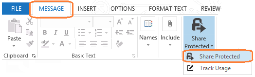
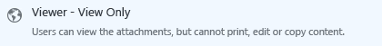
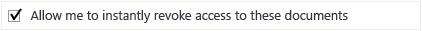

# Escenario: Uso compartido de un archivo de Office con usuarios de otra organizaci&#243;n
Esta sección contiene instrucciones para el administrador, una plantilla para obtener instrucciones de usuario y un ejemplo del aspecto de las instrucciones de usuario final.Debe completar las instrucciones para los administradores antes de asignar la documentación del usuario final a los usuarios.

## Instrucciones para administradores

Use estas instrucciones y la plantilla siguiente para crear sus propias instrucciones para el usuario final para ayudar a enviar por correo electrónico de forma segura un archivo de Office a personas de otra organización.Por ejemplo, el archivo de Office puede ser un documento de Word, una hoja de cálculo de Excel o una presentación de PowerPoint que contiene información de lista de precios para un partner, una lista de productos para un distribuidor o una lista de escalas de tiempo de entrega con clientes potenciales.Cuando los usuarios siguen las instrucciones, el archivo adjuntado al mensaje de correo electrónico lo protegerá Azure Rights Management.

Las instrucciones son adecuadas para el conjunto de circunstancias siguiente:

-   El empleado debe enviar la información fuera de la organización, en forma de un documento de Office.

-   El documento contiene información que no es pública, pero tampoco es exclusivamente para uso interno.

-   Los usuarios destinatarios no tienen ningún requisito para compartir esta información con otras personas, imprimirla o utilizarla como parte de su propia documentación.Si este no es el caso, puede cambiar las instrucciones de usuario de seleccionar permisos de solo vista a otra opción que permita al destinatario cambiar los datos adjuntos.

-   El empleado está interesado en saber cuándo el usuario externo abre este documento.

En las instrucciones del usuario siguientes, reemplace *&lt;nombre del tipo de documento Office&gt;* por el tipo de documento que van a enviar los usuarios.Use nombres que sean específicos y familiares a sus flujos de trabajo, por ejemplo, "lista de precios", "tiempos de entrega" y "propuesta de puja" en lugar de "Documento de Word" y "Hoja de cálculo de Excel".Además reemplace *&lt;detalles de contacto&gt;* por instrucciones de cómo los usuarios pueden ponerse en contacto con el departamento de soporte técnico, por ejemplo, un vínculo de sitio web, una dirección de correo electrónico o un número de teléfono.

Después realice las modificaciones adicionales que desea en las instrucciones y después entregue estas instrucciones a los usuarios.Por ejemplo, agregue el documento a un sitio de SharePoint o envíelo por correo electrónico.

Las modificaciones que desea realizar en las instrucciones:

-   En el paso 2, le sugerimos **Visor: solo ver** para los permisos, de tal forma que el documento adjunto (pero no el original) sea de solo lectura para los destinatarios.Si esta restricción no es adecuada para sus necesidades de negocio, cambie esta opción para otro conjunto de permisos, como **Revisor: ver y editar**.

-   En el paso 3, sugerimos la opción **Permítame revocar el acceso a estos documentos de forma instantánea** para que no hay ningún retraso si los usuarios revocan el documento más adelante, pero esta opción requiere que el destinatario siempre tenga una conexión a Internet para abrir el archivo adjunto.Este paso también requiere una suscripción que admita el seguimiento y la revocación de documentos.Elimine este paso si no es adecuado para los usuarios.

-   En el paso 4, se recomienda la opción **Enviarme un correo electrónico cuando alguien intente abrir estos documentos**.Si los usuarios realizan el seguimiento de sus documentos mediante el portal de seguimiento de documentos, puede decidir que la notificación de correo electrónico no es necesaria y eliminar este paso.

-   Los pasos no incluyen el establecimiento de una fecha de expiración.Si los datos adjuntos están sujetos a limitación temporal, agregue otro paso para establecer un tiempo de expiración adecuado, como 90 días desde el envío del mensaje de correo electrónico.

> [!NOTE]
> Para obtener más información sobre las opciones que pueden seleccionar los usuarios, consulte [Opciones del cuadro de diálogo para la aplicación Rights Management sharing](https://technet.microsoft.com/library/dn574738.aspx)

## Requisitos para este escenario
Para que funcionen las instrucciones de usuario para este escenario, debe disponer de lo siguiente:

|Check|Requisito|Si necesita más información|
|---------|-------------|-------------------------------|
||Ha preparado cuantas y grupos para Office 365 o Azure Active Directory|[Preparación de Azure Rights Management](https://technet.microsoft.com/library/jj585029.aspx)|
||Azure Rights Management no está activado|[Activar Rights Management de Azure](https://technet.microsoft.com/library/jj658941.aspx)|
||La aplicación Rights Management sharing se implementa en los equipos de los usuarios que ejecutan Windows|[Implementación automática de la aplicación Microsoft Rights Management sharing](https://technet.microsoft.com/library/dn339003%28v=ws.10%29.aspx)|
||Los usuarios tienen Outlook de Office 2013|Si los usuarios tienen Office 2010, reemplace la captura de pantalla por una versión equivalente para que la imagen coincida con lo que ven los usuarios.|
||La suscripción de Azure RMS incluye el seguimiento de documentos|Si su suscripción a Azure RMS no incluye la revocación y el seguimiento de documentos, los usuarios no podrán completar todos los pasos de las instrucciones de usuario.En este caso, compre una suscripción que admita estas características o modifique las instrucciones de usuario para quitar los pasos que utilizan estas características.  Para comprobar la compatibilidad de la suscripción: [Comparación de las ofertas de Rights Management Services (RMS)](https://technet.microsoft.com/dn858608).|

## Instrucciones para usuarios
Copie y pegue las instrucciones siguientes para los usuarios finales y modifíquelas según las instrucciones del administrador para este escenario.La documentación de ejemplo cómo ven los usuarios este conjunto de instrucciones, después de las personalizaciones.

#### Cómo compartir un &lt;nombre de tipo de documento de Office&gt;

1.  Cree el mensaje de correo electrónico especificando la dirección o direcciones de correo electrónico, escriba el mensaje y adjunte el *&lt;nombre de tipo de documento de Office&gt;* al mensaje de correo electrónico.A continuación, en la pestaña **MENSAJE**, en el grupo **RMS**, haga clic en **Compartir protegido** y después otra vez en **Compartir protegido**:

    

2.  En el cuadro de diálogo **compartir protegido**, seleccione **Visor: solo ver**:

    

3.  Seleccione **Permítame revocar el acceso a estos documentos de forma instantánea**:

    

4.  Seleccione **Enviarme un correo electrónico cuando alguien intente abrir estos documentos**:

    

5.  Haga clic en **Enviar ahora**:

    

Cuando alguien en las líneas **Para**, **CC** o **CCO** recibe este correo electrónico, ve un mensaje que le da las instrucciones de cómo leer el archivo adjunto *&lt;nombre de tipo de documento de Office&gt;*.Se puede leer el documento en varios dispositivos, como tabletas y teléfonos iPad, iPhone y Android, equipos Mac y equipos Windows.

Utilice el [portal de seguimiento de documentos](https://track.azurerms.com/) para realizar el seguimiento cuando abran el &lt;nombre de tipo de documento de Office&gt; adjunto.Considere la posibilidad de ponerse en contacto por teléfono poco después de ver que ha abierto el &lt;nombre de tipo de documento de Office&gt;.

**¿Necesita ayuda?**

-   Para obtener información adicional:

    -   [Proteger un archivo que comparte por correo electrónico](https://technet.microsoft.com/library/dn574735%28v=ws.10%29.aspx)

    -   [Realizar el seguimiento y revocar los documentos](https://technet.microsoft.com/library/dn986611.aspx)

-   Póngase en contacto con el departamento de soporte técnico:

    -   *&lt;detalles de contacto&gt;*

### Documentación de usuario de ejemplo

##### Cómo compartir una lista de precios con el cliente

1.  Cree el mensaje de correo electrónico especificando la dirección o direcciones de correo electrónico, escriba el mensaje y adjunte la lista de precios más reciente al mensaje de correo electrónico.A continuación, en la pestaña **MENSAJE**, en el grupo **RMS**, haga clic en **Compartir protegido** y después otra vez en **Compartir protegido**:

    

2.  En el cuadro de diálogo **compartir protegido**, seleccione **Visor: solo ver**:

    

3.  Seleccione **Permítame revocar el acceso a estos documentos de forma instantánea**:

    

4.  Seleccione **Enviarme un correo electrónico cuando alguien intente abrir estos documentos**:

    

5.  Haga clic en **Enviar ahora**:

    

Cuando alguien en las líneas **Para**, **CC** o **CCO** recibe este correo electrónico, ve un mensaje que le da las instrucciones de cómo leer la lista de precios adjunta.Se puede leer el documento en varios dispositivos, como tabletas y teléfonos iPad, iPhone y Android, equipos Mac y equipos Windows.

Utilice el [portal de seguimiento de documentos](https://track.azurerms.com/) para realizar el seguimiento cuando abran la lista de precios adjunta.Considere la posibilidad de ponerse en contacto por teléfono poco después de ver que ha abierto la lista de precios.

**¿Necesita ayuda?**

-   Para obtener información adicional:

    -   [Proteger un archivo que comparte por correo electrónico](https://technet.microsoft.com/library/dn574735%28v=ws.10%29.aspx)

    -   [Realizar el seguimiento y revocar los documentos](https://technet.microsoft.com/library/dn986611.aspx)

-   Póngase en contacto con el departamento de soporte técnico:

    -   Correo electrónico: helpdesk@vanarsdelltd.com

