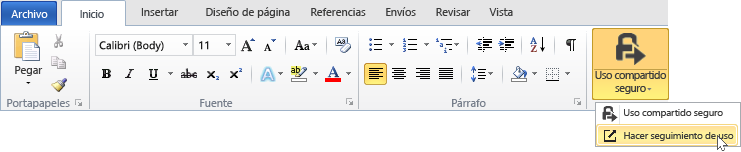
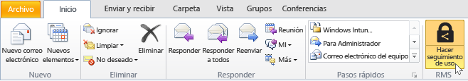
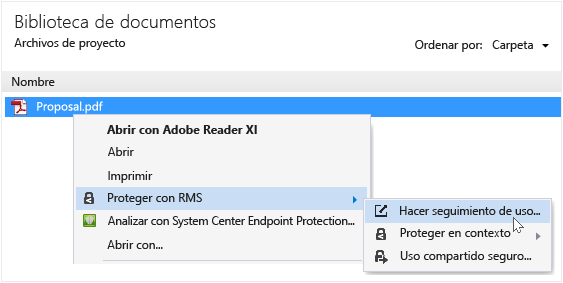
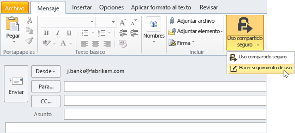

# Seguimiento y revocaci&#243;n de documentos cuando se utiliza la aplicaci&#243;n RMS sharing
Una vez que haya protegido sus documentos mediante la aplicación de uso compartido de RMS, si su organización usa Azure Rights Management en lugar de Active Directory Rights Management Services, podrá hacer un seguimiento del uso que se hace de sus documentos protegidos. Si es necesario, también puede revocar el acceso a estos documentos cuando ya no desee seguir compartiéndolos. Para ello, use el **sitio de seguimiento de documentos**, al que puede tener acceso desde equipos Windows, equipos Mac e incluso tabletas y teléfonos.

> [!TIP]
> Vídeo de dos minutos: [Revocación y seguimiento de documentos de Azure RMS](http://channel9.msdn.com/Series/Information-Protection/Azure-RMS-Document-Tracking-and-Revocation)

Cuando tenga acceso a este sitio, inicie sesión para hacer un seguimiento de sus documentos. La provisión a su organización tiene una [suscripción que admite el seguimiento y la revocación de documentos](https://technet.microsoft.com/dn858608.aspx) y se le asigna una licencia para esta suscripción. Así, puede ver quién intentó abrir los documentos que protegió y si lo lograron (se autenticaron correctamente) o no. las veces que intentaron acceder al documento y su ubicación en el tiempo. Además:

-   Si quiere dejar de compartir un documento: Haga clic en **Revocar el acceso**, anote el período de tiempo que el documento seguirá estando disponible y decida si va a dejar que la gente sepa que va a revocar el acceso al documento anteriormente compartido. También, proporcione un mensaje personalizado.

-   Si quiere exportar a Excel: Haga clic en **Abrir en Excel**, para que luego pueda modificar los datos y crear sus propias vistas y gráficos.

-   Si quiere configurar notificaciones por correo electrónico: Haga clic en **Configuración** y seleccione cómo, y si, se le notificará por correo electrónico cuando se acceda al documento.

-   Si tiene alguna pregunta o quiere proporcionar comentarios sobre el sitio de seguimiento de documentos: Haga clic en el icono de ayuda para obtener acceso a [P+F sobre el seguimiento de documentos](http://go.microsoft.com/fwlink/?LinkId=523977).

## Uso de Office para tener acceso al sitio de seguimiento de documentos

-   Para las aplicaciones de Office, Word, Excel y PowerPoint: En la pestaña **Inicio** del grupo **RMS**, haga clic en **Uso compartido seguro** y luego haga clic en **Hacer seguimiento de uso**.

    

-   En Outlook: En la pestaña **Inicio**, en el grupo  **RMS**, haga clic en **Hacer seguimiento de uso**:

    

Si no ve estas opciones de RMS, es probable que la aplicación RMS sharing no esté instalada en el equipo, que no esté instalada la última versión o que el equipo deba reiniciarse para completar la instalación. Para obtener más información sobre cómo instalar la aplicación RMS sharing, consulte [Descargar e instalar la aplicación para uso compartido de Rights Management](../Topic/Download_and_install_the_Rights_Management_sharing_application.md).

### Otras maneras de realizar el seguimiento de los documentos y revocarlos
Además de realizar el seguimiento de los documentos en equipos Windows mediante aplicaciones de Office, también puede usar estas alternativas:

-   **Usar un explorador web**: Este método funciona en todos los dispositivos admitidos.

-   **Usar el Explorador de archivos**: Este método funciona en equipos Windows.

-   **Usar un mensaje de correo electrónico de Outlook**: Este método funciona en equipos Windows.

##### Uso de un explorador web para obtener acceso al sitio de seguimiento de documentos

-   Mediante un explorador compatible, vaya al [sitio de seguimiento de documentos](http://go.microsoft.com/fwlink/?LinkId=529562).

    Exploradores admitidos: Se recomienda usar por lo menos la versión 10 de Internet Explorer, pero puede usar cualquiera de los siguientes exploradores para el sitio de seguimiento de documentos:

    -   Internet Explorer: La versión 10 como mínimo

    -   Internet Explorer 9 con al menos MS12-037: Actualización de seguridad acumulativa para Internet Explorer: 12 de junio de 2012

    -   Mozilla Firefox: La versión 12 como mínimo

    -   Apple Safari 5: La versión 5 como mínimo

    -   Google Chrome: La versión 18 como mínimo

##### Uso del Explorador de archivos para obtener acceso al sitio de seguimiento de documentos

-   Haga clic con el botón derecho en el archivo, seleccione **Proteger con RMS** y, luego, seleccione **Uso compartido seguro**.

    

##### Uso de un mensaje de correo electrónico de Outlook para obtener acceso al sitio de seguimiento de documentos

-   En un mensaje de correo electrónico, en la pestaña **Mensaje**, vaya al grupo  **RMS** y haga clic en **Uso compartido protegido** y, luego, en **Hacer seguimiento de uso**:

    

## Ejemplos y otras instrucciones
Para obtener ejemplos de cómo puede usar la aplicación para uso compartido de Rights Management e instrucciones de procedimientos, consulte las siguientes secciones de la guía de usuario de la aplicación para uso compartido de Rights Management:

-   [Ejemplos de uso de la aplicación RMS sharing](../Topic/Rights_Management_sharing_application_user_guide.md#BKMK_SharingExamples)

-   [¿Qué desea hacer?](../Topic/Rights_Management_sharing_application_user_guide.md#BKMK_SharingInstructions)

## Vea también
[Guía de usuario de la aplicación de uso compartido Rights Management](../Topic/Rights_Management_sharing_application_user_guide.md)

