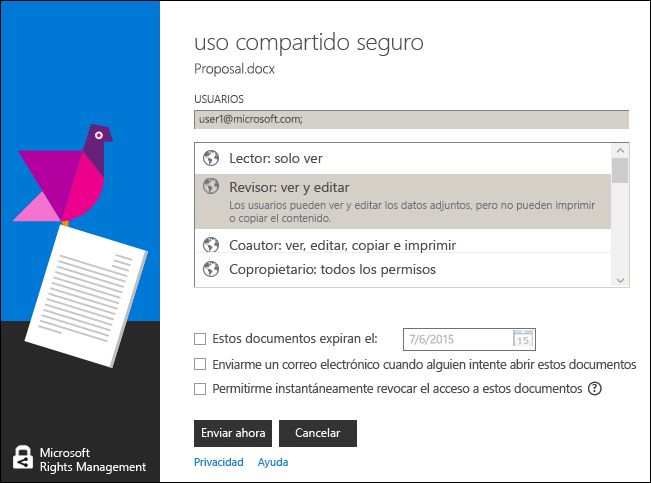

# Usar m&#233;todos abreviados de teclado en la aplicaci&#243;n Rights Management sharing
Cuando use la aplicación RMS sharing, presione la tecla **Alt** para ver las teclas de acceso disponibles y, luego, presione **Alt** + la tecla de acceso para seleccionar una opción.

Por ejemplo, en el cuadro de diálogo **Uso compartido seguro**, presione **Alt** para ver las claves de acceso y, luego, presione **Alt + m** para activar la casilla **Enviarme un correo electrónico cuando alguien intente abrir estos documentos**.

## Ejemplos y otras instrucciones
Para obtener ejemplos de cómo puede usar la aplicación para uso compartido de Rights Management e instrucciones de procedimientos, consulte las siguientes secciones de la guía de usuario de la aplicación para uso compartido de Rights Management:

-   [Ejemplos de uso de la aplicación RMS sharing](../Topic/Rights_Management_sharing_application_user_guide.md#BKMK_SharingExamples)

-   [¿Qué desea hacer?](../Topic/Rights_Management_sharing_application_user_guide.md#BKMK_SharingInstructions)

## Vea también
[Guía de usuario de la aplicación de uso compartido Rights Management](../Topic/Rights_Management_sharing_application_user_guide.md)

