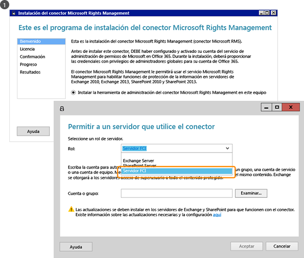
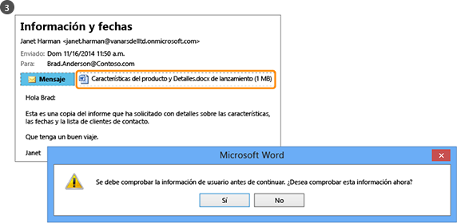
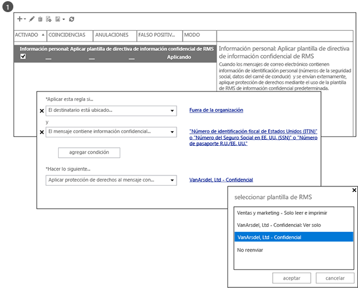

# &#191;Qu&#233; es Rights Management de Azure?
Administración de los derechos de Azure (Azure RMS) es una solución de protección de información para organizaciones que desean proteger sus datos en el desafiante entorno de trabajo actual.

Entre estos desafíos se encuentra la necesidad de estar conectado a Internet, con usuarios que llevan su dispositivo personal al trabajo, que acceden a datos de la compañía en casa y en desplazamientos, y que comparten información confidencial con importantes socios empresariales. Como parte de su trabajo diario, los usuarios comparten información mediante correo electrónico, sitios de uso compartido de archivos y servicios en la nube. En estos escenarios, los controles de seguridad tradicionales (como las listas de control de acceso y los permisos NTFS) y los firewalls tienen una eficacia limitada si desea proteger los datos de su compañía a la vez que se permite a los usuarios trabajar con eficiencia.

En comparación, Azure RMS puede proteger la información confidencial de la compañía en todos estos escenarios. Usa directivas de cifrado, identidad y autorización para ayudar a proteger sus archivos y correo electrónico y funciona en varios dispositivos (teléfonos, tabletas y PC). La información se puede proteger tanto dentro como fuera de su organización porque dicha protección permanece con los datos, incluso cuando sale de los límites de su organización. Por ejemplo, los empleados podrían enviar un documento por correo electrónico a una empresa asociada o guardar un documento en su unidad en la nube. La protección persistente que ofrece Azure no solo ayuda a proteger los datos de su compañía, sino que también puede ser legalmente obligatoria para requisitos de cumplimiento y descubrimiento legal, o simplemente como buenas prácticas de administración de la información.

Sin embargo, lo que es muy importante, las personas y los servicios autorizados (como búsqueda e indización) pueden continuar leyendo e inspeccionando los datos que Azure RMS protege, lo que no se logra fácilmente con otras soluciones de protección de la información que usan el cifrado punto a punto. Esta capacidad se denomina a menudo “razonamiento encima de los datos” y es un elemento crucial en el mantenimiento del control de los datos de su organización.

La siguiente imagen muestra de qué manera Azure RMS funciona como una solución de Rights Management para Office 365 así como para servicios y servidores locales. Asimismo, verá que admite populares dispositivos de usuario final que ejecutan Windows, Mac OS, iOS, Android y Windows Phone.

> [!TIP]
> En este momento, puede encontrar útiles los recursos adicionales:
> 
> -   Vídeo de dos minutos: [¿Qué es Rights Management de Microsoft Azure?](http://technet.microsoft.com/dn833005.aspx)
> -   Tutorial de cinco pasos: [Tutorial de inicio rápido de Azure Rights Management](../Topic/Quick_Start_Tutorial_for_Azure_Rights_Management.md)
> -   Requisitos de Azure RMS, incluidas las opciones de suscripción para comprar o evaluar: [Requisitos de Azure Rights Management](../Topic/Requirements_for_Azure_Rights_Management.md)

Use las secciones siguientes para obtener más información acerca de Azure RMS:

-   [¿Qué problemas resuelve Azure RMS?](../Topic/What_is_Azure_Rights_Management_.md#BKMK_RMSrequirements)

    -   [Requisitos de seguridad, normativos y regulatorios](../Topic/What_is_Azure_Rights_Management_.md#BKMK_RMScompliance)

-   [Azure RMS en acción: Qué ven los administradores y los usuarios](../Topic/What_is_Azure_Rights_Management_.md#BKMK_RMSpictures)

    -   [Activación y configuración de Rights Management](../Topic/What_is_Azure_Rights_Management_.md#BKMK_Example_ManagementPortal)

    -   [Protección automática de archivos en los servidores de archivos con Windows Server y la infraestructura de clasificación de archivos](../Topic/What_is_Azure_Rights_Management_.md#BKMK_Example_FCI)

    -   [Proteger automáticamente los correos electrónicos con Exchange Online y directivas de prevención de pérdida de datos](../Topic/What_is_Azure_Rights_Management_.md#BKMK_Example_DLP)

    -   [Protección automática de archivos con SharePoint Online y las bibliotecas protegidas](../Topic/What_is_Azure_Rights_Management_.md#BKMK_Example_SharePoint)

    -   [Uso compartido seguro de datos adjuntos con los usuarios móviles](../Topic/What_is_Azure_Rights_Management_.md#BKMK_Example_SharingApp)

-   [¿Cómo funciona Azure RMS? En segundo plano](../Topic/What_is_Azure_Rights_Management_.md#BKMK_HowRMSworks)

    -   [Controles criptográficos usados por Azure RMS: Longitudes de clave y algoritmos](../Topic/What_is_Azure_Rights_Management_.md#BKMK_RMScrytographics)

    -   [Tutorial de cómo funciona Azure RMS: Primer uso, protección de contenido, consumo de contenido](../Topic/What_is_Azure_Rights_Management_.md#BKMK_Walthrough)

-   [Pasos siguientes](../Topic/What_is_Azure_Rights_Management_.md#BKMK_NextSteps)

## ¿Qué problemas resuelve Azure RMS?
Use la tabla siguiente para identificar problemas o requisitos empresariales que puede tener su organización y de qué manera puede tratarlos Azure RMS.

|Requisito o problema|Resuelto por Azure RMS|
|------------------------|--------------------------|
|Proteger todos los tipos de archivos|√ En la implementación anterior de Rights Management, solo se podían proteger los archivos de Office, con la protección nativa. Ahora, la [protección genérica](https://technet.microsoft.com/library/dn574738%28v=ws.10%29.aspx) significa que se admiten todos los tipos de archivos.|
|Proteger los archivos en cualquier lugar|√ Cuando un archivo se guarda en una ubicación ([protección in situ](https://technet.microsoft.com/library/dn574733%28v=ws.10%29.aspx)), la protección permanece con el archivo, aunque se copia en almacenamiento que no se encuentra bajo el control de TI, como un servicio de almacenamiento en la nube.|
|Compartir archivos de manera segura por correo electrónico|√ Cuando un archivo se comparte por correo electrónico ([protección compartida](https://technet.microsoft.com/library/dn574735%28v=ws.10%29.aspx)), el archivo se protege como datos adjuntos de un mensaje de correo electrónico, con instrucciones sobre cómo abrir los datos adjuntos protegidos. El texto del mensaje de correo electrónico no está cifrado, por lo que el destinatario siempre puede leer estas instrucciones. Sin embargo, dado que el documento adjunto está protegido, solo podrán abrirlo los usuarios autorizados, aunque se reenvíe el documento o mensaje de correo electrónico a otras personas.|
|Auditoría y supervisión|√ Puede [auditar y supervisar el uso](https://technet.microsoft.com/library/dn529121.aspx) de sus archivos protegidos, incluso después de que estos archivos salgan de los límites de su organización.  Por ejemplo, puede trabajar para Contoso, Ltd. Está trabajando en un proyecto conjunto con 3 empleados de Fabrikam, Inc. Envía por correo electrónico a estos 3 empleados un documento que protege y restringe a solo lectura. La auditoría de Azure RMS puede proporcionar la siguiente información:  -   Si las personas que ha especificado en Fabrikam ha abierto el documento y cuándo. -   Si otras personas que no ha especificado han intentado (sin éxito) abrir el documento, quizá porque se reenvió o se guardó en una ubicación compartida a la que otros usuarios podían acceder. -   Si cualquiera de las personas especificadas ha intentado (y no ha logrado) imprimir o cambiar el documento.|
|Soporte para todos los dispositivos usados comúnmente, no solo equipos Windows|√ Entre los [dispositivos admitidos](https://technet.microsoft.com/library/dn655136.aspx) se incluyen:  -   Equipos y teléfonos con Windows -   Equipos Mac -   Tabletas y teléfonos iOS -   Tabletas y teléfonos Android|
|Soporte para colaboración de negocio a negocio|√ Debido a que Azure RMS es un servicio en la nube, no hay que configurar de manera explícita las confianzas con otras organizaciones para poder compartir contenido protegido con ellas. Si ya tiene un directorio de Office 365 o Azure AD, la colaboración entre organizaciones se admite automáticamente. Si no lo hace, los usuarios podrán registrarse para la suscripción a [RMS para usuarios](https://technet.microsoft.com/library/dn592127.aspx) gratuita.|
|Soporte para servicios locales, así como Office 365|√ Además de funcionar [sin problemas con Office 365](https://technet.microsoft.com/library/jj585004.aspx), también puede usar Azure RMS con los siguientes servicios locales al implementar el [conector RMS](https://technet.microsoft.com/library/dn375964.aspx):  -   Exchange Server -   Servidor de SharePoint -   Windows Server que ejecuta la Infraestructura de la clasificación de archivos|
|Activación sencilla|√ [La activación del servicio de Rights Management](https://technet.microsoft.com/library/jj658941.aspx) para los usuarios solo requiere que hagan un par de clics en el Portal de Azure clásico.|
|Capacidad de escalar en la organización, según sea necesario|√ Dado que Azure RMS se ejecuta como servicio en la nube con la elasticidad de Azure para escalar verticalmente y horizontalmente, no tiene que aprovisionar o implementar servidores locales adicionales.|
|Capacidad para crear directivas simples y flexibles|√ Las [plantillas de directivas de derechos personalizadas](https://technet.microsoft.com/library/dn642472.aspx) proporcionan una solución rápida y sencilla para que los administradores apliquen las directivas y para que los usuarios apliquen el nivel correcto de protección para cada documento y restrinjan el acceso a las personas dentro de la organización.  Por ejemplo, para que se comparta un documento estratégico de toda la compañía con todos los empleados, podría aplicar una directiva de solo lectura a todos los empleados internos. A continuación, para un documento más confidencial, como un informe financiero, podría restringir el acceso solo a ejecutivos.|
|Amplia compatibilidad de aplicaciones|√ Azure RMS tiene una integración estrecha con aplicaciones y servicios de Microsoft Office, y amplía la compatibilidad con otras aplicaciones mediante la aplicación de RMS sharing.  √ El [SDK de Microsoft Rights Management](https://msdn.microsoft.com/library/hh552972%28v=vs.85%29.aspx) proporciona a los desarrolladores internos y a los proveedores de software las API para escribir aplicaciones personalizadas que admiten Azure RMS.  Para obtener más información, vea [Cómo son compatibles las aplicaciones con Azure Rights Management](../Topic/How_Applications_Support_Azure_Rights_Management.md).|
|TI debe mantener el control de los datos|√ Las organizaciones pueden elegir administrar su propia clave de inquilino y usar su solución "[traiga su propia clave](https://technet.microsoft.com/library/dn440580.aspx)" (BYOK) y almacenar su clave de inquilino en los módulos de seguridad de hardware (HSM).  √ Soporte para auditoría y [registro de uso](https://technet.microsoft.com/library/dn529121.aspx) para que pueda analizar información empresarial, supervisar el abuso y (si tiene fuga de información) realizar análisis forenses.  √ El acceso delegado mediante la [característica de superusuario](https://technet.microsoft.com/library/mt147272.aspx) asegura que TI siempre puede acceder al contenido protegido, aunque un documento estuviera protegido por un empleado que haya dejado la organización. En comparación, las soluciones de cifrado punto a punto se arriesgan a perder acceso a los datos de la compañía.  √ Sincronice [solo los atributos de directorio que Azure RMS necesita](https://azure.microsoft.com/documentation/articles/active-directory-aadconnectsync-attributes-synchronized/) para admitir una identidad común para sus cuentas de Active Directory locales, mediante una [herramienta de sincronización de directorios](https://azure.microsoft.com/documentation/articles/active-directory-aadconnect-get-started-tools-comparison/), como Azure AD Connect.  √ Habilite el inicio de sesión único sin replicar contraseñas a la nube, mediante AD FS.  √ Las organizaciones siempre tienen la opción de dejar de usar Azure RMS sin perder el acceso a contenido anteriormente protegido por Azure RMS. Para obtener información acerca de las opciones de retirada, consulte [Retirada y desactivación de Azure Rights Management](../Topic/Decommissioning_and_Deactivating_Azure_Rights_Management.md). Además, las organizaciones que hayan implementado Active Directory Rights Management Services (AD RMS) pueden [migrar a Azure RMS](https://technet.microsoft.com/library/dn858447.aspx) sin perder el acceso a los datos protegidos anteriormente por AD RMS.|
> [!TIP]
> Si está familiarizado con la versión local de Rights Management, Active Directory Rights Management Services (AD RMS), puede que esté interesado en la tabla de comparación de [Comparación entre Azure Rights Management y AD RMS](../Topic/Comparing_Azure_Rights_Management_and_AD_RMS.md).

### Requisitos de seguridad, normativos y regulatorios
Azure RMS admite los siguientes requisitos de seguridad, normativos y regulatorios:

√ Uso de criptografía estándar del sector y admite FIPS 140-2. Para obtener más información, consulte la sección [Controles criptográficos usados por Azure RMS: Longitudes de clave y algoritmos](../Topic/What_is_Azure_Rights_Management_.md#BKMK_RMScrytographics) de este tema.

√ Soporte para que los módulos de seguridad de hardware (HSM) de Thales almacenen su clave de inquilino en centros de datos de Microsoft Azure. Azure RMS utiliza espacios de seguridad independientes para sus centros de datos en América del Norte, EMEA (Europa, Oriente Medio y África) y Asia, para que sus claves solo se puedan usar en su región.

√ Certificado para lo siguiente:

-   ISO/IEC 27001:2013 (incluye [ISO/IEC 27018](http://azure.microsoft.com/blog/2015/02/16/azure-first-cloud-computing-platform-to-conform-to-isoiec-27018-only-international-set-of-privacy-controls-in-the-cloud/))

-   Atestaciones de SOC 2 SSAE 16/ISAE 3402

-   HIPAA BAA

-   Cláusula del modelo de la UE

-   FedRAMP como parte de Azure Active Directory en la certificación de Office 365, FedRAMP Agency Authority to Operate emitido por HHS

-   PCI DSS nivel 1

Para obtener más información sobre estas certificaciones externas, consulte el [Centro de confianza de Azure](http://azure.microsoft.com/support/trust-center/compliance/).

## Azure RMS en acción: Qué ven los administradores y los usuarios
Las imágenes de esta sección muestran algunos ejemplos típicos de cómo los administradores y los usuarios ven y pueden usar Azure RMS para ayudar a proteger la información importante o confidencial.

> [!NOTE]
> En todos estos ejemplos de protección de datos con Azure RMS, el propietario del contenido sigue teniendo pleno acceso a los mismos (archivo o correo electrónico), incluso aunque la protección aplicada conceda permisos a un grupo del que el propietario no sea miembro o esta incluya una fecha de expiración.
> 
> Asimismo, el departamento de TI siempre podrá tener acceso a los datos protegidos sin restricciones mediante la característica de superusuario de Rights Management, que concede acceso delegado a los usuarios o servicios autorizados que especifique. Además, TI puede realizar un seguimiento y supervisar el uso de los datos protegidos, por ejemplo, quién tiene acceso a estos y cuándo.

Para ver otras capturas de pantalla y vídeos que muestran RMS en acción, compruebe el [portal de servicios de Microsoft Rights Management](http://www.microsoft.com/rms), el [blog del equipo de Microsoft Rights Management (RMS)](http://blogs.technet.com/b/rms) y [contenido protegido para Azure RMS en el sitio de Curah!](http://curah.microsoft.com/Search?query="Azure%20RMS").

### Activación y configuración de Rights Management
Aunque puede usar Windows PowerShell para activar y configurar Azure RMS, es más fácil hacerlo desde el portal de administración. Al activar el servicio, tendrá dos plantillas predeterminadas que los administradores y los usuarios pueden seleccionar para aplicar la protección de la información a los archivos de forma rápida y fácil. También puede crear sus propias plantillas personalizadas para contar con opciones adicionales.

|||
|-|-|
|  [Imagen más grande](http://technet.microsoft.com/98d53a12-3b19-4622-bb1e-75ef56df5438) (de forma predeterminada, en la misma ventana del explorador)|Puede usar el centro de administración de Office 365 (primera imagen) o el Portal de Azure clásico (segunda imagen) para activar RMS.  Con un solo clic para activar y otro para confirmar, la protección de la información se habilita para los administradores y los usuarios de la organización.|
|  [Imagen más grande](http://technet.microsoft.com/596e4fec-124c-41b1-8efd-63d5179193fb) (de forma predeterminada, en la misma ventana del explorador)|Tras la activación, habrá dos plantillas de directivas de derechos automáticamente disponibles para la organización. Una de ellas es de solo lectura (**Solo vista confidencial** se incluye en el nombre) y la otra puede leerse y modificarse (**Confidencial**).  Cuando estas plantillas se aplican a archivos o mensajes de correo electrónico, restringen el acceso a los usuarios de la organización. Se trata de una forma muy rápida y sencilla de ayudar a evitar que los datos de la compañía pasen a personas externas a la organización. **Tip:** Estas plantillas predeterminadas pueden reconocerse fácilmente porque automáticamente tienen como prefijo el nombre de la organización. En nuestro ejemplo, **VanArsdel, Ltd**. Si no quiere que los usuarios vean estas plantillas o bien quiere crear las suyas propias, puede hacerlo desde el Portal de Azure clásico. Como se muestra en esta imagen, un asistente le guiará por el proceso de creación de plantillas personalizadas.|
|  [Imagen más grande](http://technet.microsoft.com/f5df80e5-efc9-4c0f-91be-060225977356) (de forma predeterminada, en la misma ventana del explorador)|El acceso sin conexión, la configuración de la expiración y la publicación o no de la plantilla de inmediato (hacer que aparezca en las aplicaciones que admiten Rights Management) son algunas de las opciones de configuración disponibles si decide crear sus propias plantillas.|
|  [Imagen más grande](http://technet.microsoft.com/597a3402-fd5a-4bcf-b5e6-5c983dbde697) (de forma predeterminada, en la misma ventana del explorador)|Como resultado de la publicación de estas plantillas, ahora los usuarios puedan seleccionarlas en aplicaciones como el Explorador de archivos y Microsoft Word:  -   Un usuario puede elegir la plantilla predeterminada, **VanArsdel, Ltd – Confidencial**. A partir de entonces, solo los empleados de la organización VanArsdel podrán abrir y usar este documento, aunque se envíe posteriormente por correo electrónico a un usuario externo a la organización o se guarde en una ubicación pública. -   Un usuario podría elegir la plantilla personalizada creada por el administrador, **Ventas y marketing – Solo leer e imprimir**. Al hacerlo, el archivo no solo se protege frente a usuarios externos a la organización, sino que además su uso se restringe a los empleados del departamento de Ventas y marketing. Asimismo, estos empleados no tienen plenos derechos en el documento, solo de lectura e impresión. Por ejemplo, no pueden modificarlo ni copiar su contenido.|
Para obtener más información, vea [Activar Rights Management de Azure](../Topic/Activating_Azure_Rights_Management.md) y [Configuración de plantillas personalizadas para Azure Rights Management](../Topic/Configuring_Custom_Templates_for_Azure_Rights_Management.md).

Para ayudar a los usuarios a proteger los archivos empresariales importantes, consulte [Ayudar a los usuarios a proteger archivos mediante la Administración de permisos de Azure](../Topic/Helping_Users_to_Protect_Files_by_Using_Azure_Rights_Management.md).

A continuación se muestran algunos ejemplos de cómo los administradores pueden aplicar las plantillas para configurar automáticamente la protección de la información para archivos y correos electrónicos.

### Protección automática de archivos en los servidores de archivos con Windows Server y la infraestructura de clasificación de archivos
En este ejemplo se muestra cómo usar Azure RMS para proteger archivos automáticamente en los servidores de archivos que ejecutan como mínimo Windows Server 2012 y están configurados para usar la infraestructura de clasificación de archivos.

Hay muchas formas de aplicar valores de clasificación a los archivos. Por ejemplo, puede inspeccionar el contenido de los archivos y aplicar clasificaciones integradas en consecuencia, como Confidencialidad e Información de identificación personal. Sin embargo, en este ejemplo, un administrador crea una clasificación personalizada de **Marketing** que se aplica automáticamente a todos los documentos de usuario se guarden en la carpeta **Marketing Promotions**. Aunque esta carpeta está protegida con permisos NTFS que restringen el acceso a los miembros del grupo Marketing, el administrador sabe que dichos permisos pueden perderse si alguien del grupo cambia de ubicación o envía los archivos por correo electrónico. En ese caso, usuarios no autorizados podrían tener acceso a la información de los archivos.

|||
|-|-|
|  [Imagen más grande](http://technet.microsoft.com/cf18c56b-c301-4640-8d9e-9e677e494091) (de forma predeterminada, en la misma ventana del explorador)|El administrador instala y configura el conector de Rights Management (RMS), que actúa como punto de retransmisión entre los servidores locales y Azure RMS.|
|  [Imagen más grande](http://technet.microsoft.com/ba3e247d-ea5e-4009-8eac-74f70270ece0) (de forma predeterminada, en la misma ventana del explorador)|En el servidor de archivos, el administrador configura las tareas y las reglas de clasificación para que todos los archivos de usuario de la carpeta **Marketing Promotions** se clasifiquen automáticamente como **Marketing** y se protejan mediante cifrado RMS.  Asimismo, selecciona la plantilla personalizada de RMS creada en el primer ejemplo, que restringe el acceso a los miembros del departamento de Ventas y marketing: **Ventas y marketing - Solo leer e imprimir**  Como resultado, todos los documentos de esa carpeta se configuran automáticamente con la clasificación de Marketing y se protegen mediante la plantilla de Ventas y marketing de RMS.|
|  [Imagen más grande](http://technet.microsoft.com/ad666594-68df-4289-835a-235b2af9bf4b) (de forma predeterminada, en la misma ventana del explorador)|Cómo ayuda RMS a evitar la filtración de datos a personas que no deben tener acceso a información importante o confidencial:  -   Una empleada del departamento de Marketing envía por correo electrónico un informe confidencial de la carpeta Marketing Promotions. Este informe, solicitado por un compañero que se encuentra actualmente en viaje de negocios, contiene nuevas características del producto y planes publicitarios. Sin embargo, la empleada lo envía por error a la persona equivocada al no darse cuenta de que accidentalmente seleccionó un destinatario con un nombre parecido, perteneciente a otra compañía.     El destinatario no puede leer el informe confidencial porque no es miembro del grupo de ventas y marketing.|
Para obtener más información, vea [Implementación del conector de Azure Rights Management](../Topic/Deploying_the_Azure_Rights_Management_Connector.md).

### Proteger automáticamente los correos electrónicos con Exchange Online y directivas de prevención de pérdida de datos
En el ejemplo anterior se mostraba cómo pueden protegerse automáticamente los archivos que contienen información importante o confidencial, pero ¿qué ocurre si la información no está en un archivo, sino en un mensaje de correo electrónico? Aquí es donde entran en juego las directivas de prevención de pérdida de datos (DLP) de Exchange Online, ya sea solicitando a los usuarios que apliquen la protección de la información (mediante las sugerencias de directiva) o aplicándola automáticamente (mediante reglas de transporte).

En este ejemplo, el administrador configura una directiva para ayudar a la organización a cumplir las normativas de EE. UU. sobre protección de la información de identificación personal, pero también pueden configurarse reglas para otras normativas de conformidad o bien reglas personalizadas definidas por el usuario.

|||
|-|-|
|  [Imagen más grande](http://technet.microsoft.com/58461319-3981-4b7f-a195-956a1778e907) (de forma predeterminada, en la misma ventana del explorador)|La plantilla de Exchange denominada **EE. UU. U.S. Personally Identifiable Information (PII) Data** (Información de identificación personal de EE. UU.) para crear y configurar una nueva directiva DLP. Esta plantilla busca información en los mensajes de correo electrónico como los números de la seguridad social y del permiso de conducción.  Las reglas están configuradas de forma que se aplique automáticamente la protección de derechos a los mensajes de correo electrónico que contengan esta información y se envíen fuera de la organización mediante una plantilla de RMS que restrinja el acceso únicamente a los empleados de la empresa.  En este caso, la regla está configurada para usar una de las plantillas predeterminadas del primer ejemplo, **VanArsdel, Ltd – Confidencial**. Sin embargo, también puede ver que las opciones de plantillas incluyen todas las plantillas personalizadas que ha creado, así como la opción **No reenviar** específica de Exchange.|
|  [Imagen más grande](http://technet.microsoft.com/bfb0762d-06fb-42e4-beff-eb391f4bedf0) (de forma predeterminada, en la misma ventana del explorador)|El jefe de contratación escribe un mensaje de correo electrónico que contiene el número de seguridad social de un empleado contratado recientemente y lo envía a una empleada del departamento de recursos humanos.|
|  [Imagen más grande](http://technet.microsoft.com/59e3b68e-4bed-4962-bb1e-e82d82f8000a) (de forma predeterminada, en la misma ventana del explorador)|Si este mensaje de correo electrónico se envía o reenvía a cualquier usuario externo a la organización, la regla DLP aplica automáticamente la protección de derechos.  El mensaje de correo electrónico se cifra al salir de la infraestructura de la organización, por lo que el número de la seguridad social incluido en este no se podrá leer mientras esté en tránsito o se encuentre en la bandeja de entrada del destinatario. El destinatario no podrá leer el mensaje a menos que sea empleado de VanArsdel.|
Para obtener más información, consulte las secciones siguientes:

-   [Exchange Online y Exchange Server](../Topic/How_Applications_Support_Azure_Rights_Management.md#BKMK_ExchangeIntro) en el tema [Cómo son compatibles las aplicaciones con Azure Rights Management](../Topic/How_Applications_Support_Azure_Rights_Management.md).

-   [Exchange Online: Configuración de IRM](../Topic/Configuring_Applications_for_Azure_Rights_Management.md#BKMK_ExchangeOnline) en el tema [Configuración de aplicaciones para Azure Rights Management](../Topic/Configuring_Applications_for_Azure_Rights_Management.md).

### Protección automática de archivos con SharePoint Online y las bibliotecas protegidas
Aquí se muestra cómo proteger los documentos fácilmente al usar SharePoint Online y las bibliotecas protegidas.

En este ejemplo, el administrador de SharePoint en Contoso ha creado una biblioteca para cada departamento destinada a almacenar y desproteger los documentos de forma centralizada para el control de versiones y la edición. Así, hay una biblioteca para Ventas, otra para Marketing, otra para Recursos humanos, etc. Al cargar o crear un nuevo documento en una de estas bibliotecas protegidas, este hereda la protección de la biblioteca (no es necesario seleccionar ninguna plantilla de directiva de derechos) y queda protegido automáticamente, incluso aunque se mueva fuera de la biblioteca de SharePoint.

|||
|-|-|
|  [Imagen más grande](http://technet.microsoft.com/2fc90989-9289-4431-9e6a-07740b7f6e5a) (de forma predeterminada, en la misma ventana del explorador)|El administrador habilita Information Rights Management para el sitio de SharePoint.|
|  [Imagen más grande](http://technet.microsoft.com/a18f2e99-5ac4-4103-a88c-527846374091) (de forma predeterminada, en la misma ventana del explorador)|A continuación, habilita Rights Management para una biblioteca. Aunque hay opciones adicionales, esta sencilla configuración suele ser lo único requerido.  Al descargarse ahora los documentos de esta biblioteca, Rights Management los protege automáticamente, heredando así la protección configurada para la biblioteca.|
|  [Imagen más grande](http://technet.microsoft.com/0ebd6806-0190-441e-84db-72ac4b97e4a2) (de forma predeterminada, en la misma ventana del explorador)|Si un empleado del departamento de ventas desprotege este informe de ventas de la biblioteca, podrá ver claramente en el banner informativo de la parte superior que es un documento protegido con acceso restringido.  El documento permanece protegido aunque el usuario cambie el nombre, lo guarde en otra ubicación o lo comparta mediante correo electrónico. Independientemente del nombre del archivo, su ubicación de almacenamiento o el uso compartido de este por correo electrónico, solo los miembros del departamento de ventas podrán leerlo.|
Para obtener más información, consulte las secciones siguientes:

-   [SharePoint Online y SharePoint Server](../Topic/How_Applications_Support_Azure_Rights_Management.md#BKMK_SharePointIntro) en el tema [Cómo son compatibles las aplicaciones con Azure Rights Management](../Topic/How_Applications_Support_Azure_Rights_Management.md).

-   [SharePoint Online y OneDrive para la Empresa: Configuración de IRM](../Topic/Configuring_Applications_for_Azure_Rights_Management.md#BKMK_SharePointOnline) en el tema [Configuración de aplicaciones para Azure Rights Management](../Topic/Configuring_Applications_for_Azure_Rights_Management.md).

### Uso compartido seguro de datos adjuntos con los usuarios móviles
En los ejemplos anteriores se ha mostrado cómo los administradores pueden aplicar automáticamente la protección de la información a los datos importantes y confidenciales. Sin embargo, es posible que en algunas ocasiones los usuarios tengan que aplicar esta protección por sí mismos. Por ejemplo, cuando colaboren con asociados de otra organización y necesiten valores o permisos personalizados no definidos en las plantillas para situaciones ad hoc no cubiertas por los ejemplos anteriores. En estos casos, los usuarios pueden aplicar las plantillas de RMS por sí mismos o configurar permisos personalizados.

En este ejemplo se muestra cómo los usuarios pueden compartir fácilmente un documento con un empleado de otra compañía con el que colaboren y aun así proteger dicho documento y estar seguros de que el destinatario pueda leerlo, incluso desde un dispositivo móvil de uso extendido. En este escenario se usa la aplicación de uso compartido Rights Management, que puede implementarse automáticamente a los equipos Windows de la organización o bien instalarla los usuarios.

En este ejemplo, una empleada de Contoso envía por correo electrónico un documento confidencial de Word a un empleado de Fabrikam. Este lee el documento en su iPad, pero también podría leerlo fácilmente en un iPhone, una tableta o teléfono Android, un equipo Mac o bien un teléfono o equipo Windows.

|||
|-|-|
|  [Imagen más grande](http://technet.microsoft.com/feeef78d-3c2e-432b-817d-d06f784be226) (de forma predeterminada, en la misma ventana del explorador)|La empleada crea un mensaje de correo electrónico estándar y adjunta a un documento en su PC de Windows.  Hace clic en **Uso compartido seguro** en la cinta de opciones, lo que carga el cuadro de diálogo **Uso compartido seguro** de la aplicación para uso compartido de RMS.  Desea aplicar restricciones al empleado de Fabrikam para ver y modificar el documento y que no pueda copiarlo o imprimirlo, por lo que selecciona **REVISOR - Ver y editar**. También desea recibir un mensaje de correo electrónico cuando alguien intenta abrir el documento y tiene la capacidad de revocar el documento más adelante si es necesario y sabe que la revocación surtirá efecto de inmediato.|
|  [Imagen más grande](http://technet.microsoft.com/e748fd78-8bba-4168-96cf-f96def078283) (de forma predeterminada, en la misma ventana del explorador)|El empleado ve el correo electrónico en su iPad.  Además del mensaje y los datos adjuntos recibidos, se incluyen instrucciones que este sigue para registrarse e instalar la aplicación para uso compartido de RMS en su iPad.|
|  [Imagen más grande](http://technet.microsoft.com/7dba5ff9-a61d-4a83-8adc-d6ffb0e85df6) (de forma predeterminada, en la misma ventana del explorador)|Ahora puede abrir los datos adjuntos. En primer lugar se le pide que inicie sesión para confirmar que es el destinatario correcto.  Al ver el documento, también ve la información de acceso restringido que le indica que puede ver y editar el documento, pero no copiarlo o imprimirlo.|
|  [Imagen más grande](http://technet.microsoft.com/9f642a2e-58ad-44ab-9f81-f890d15380f9) (de forma predeterminada, en la misma ventana del explorador)|La empleada de Contoso recibe un mensaje de correo electrónico que le indica que el empleado de Fabrikam ha abierto correctamente el documento que le envió y cuándo obtuvo acceso al mismo.  Aunque este reenvíe el correo electrónico con los datos adjuntos, lo guarde en una ubicación a la que tengan acceso otras personas o se intercepte en la red, el documento no lo podrán leer otros usuarios.|
Para obtener más información, consulte los temas para [proteger un archivo compartido por correo electrónico](https://technet.microsoft.com/library/dn574735.aspx) y [ver y usar archivos protegidos](https://technet.microsoft.com/library/dn574741.aspx) de la [guía de usuario de la aplicación de uso compartido Rights Management](https://technet.microsoft.com/library/dn339006.aspx).

Además, [Tutorial de inicio rápido de Azure Rights Management](../Topic/Quick_Start_Tutorial_for_Azure_Rights_Management.md) incluye instrucciones paso a paso para este escenario.

Ahora que ha visto algunos ejemplos de lo que Azure RMS puede hacer, es posible que le interese cómo lo hace. Para obtener información técnica acerca de cómo funciona Azure RMS, consulte la sección siguiente.

## ¿Cómo funciona Azure RMS? En segundo plano
Una cuestión importante que hay que comprender acerca de cómo funciona Azure RMS es que el servicio de Rights Management (y Microsoft) no ve ni almacena sus datos como parte del proceso de protección de la información. La información que protege nunca se envía a Azure, ni se almacena allí, a menos que la almacene de manera explícita en Azure o use otro servicio en la nube que la almacene en Azure. Azure RMS simplemente hace que los datos de un documento sean ilegibles para cualquiera que no sea un usuario y servicio autorizado:

-   Los datos se cifran en el nivel de aplicación e incluyen una directiva que define el uso autorizado para ese documento.

-   Cuando se usa un documento protegido por un usuario legítimo o se procesa por un servicio autorizado, se descifran los datos del documento y se aplican derechos definidos en la directiva.

En un nivel alto, puede ver la manera en que funciona este proceso en la imagen siguiente. Se protege un documento que contiene la fórmula secreta y luego lo abre correctamente un usuario o servicio autorizado. El documento se protege con una clave de contenido (la clave verde de esta imagen). Es única para cada documento y se coloca en el encabezado de archivo donde se protege por su clave raíz de inquilino de RMS (la clave roja de esta imagen). Su clave de inquilino se puede generar y administrar por Microsoft o bien, puede generar y administrar su propia clave de inquilino.

A lo largo del proceso de protección cuando Azure RMS está cifrando y descifrando, y aplicando restricciones, autorizando y aplicando restricciones, la fórmula secreta nunca se envía a Azure.

Para obtener una descripción detallada de lo que está sucediendo, consulte la sección [Tutorial de cómo funciona Azure RMS: Primer uso, protección de contenido, consumo de contenido](../Topic/What_is_Azure_Rights_Management_.md#BKMK_Walthrough) de este tema.

Para consultar detalles técnicos acerca de las longitudes de claves y algoritmos que usa Azure RMS, vea la siguiente sección.

### Controles criptográficos usados por Azure RMS: Longitudes de clave y algoritmos
Aunque no tenga que saber usted mismo cómo funciona RMS, puede que se le pregunte acerca de los controles criptográficos que usa, para asegurarse de que la protección de seguridad es estándar en el sector.

|||
|-|-|
|Método de protección de documentación:|Algoritmo: AES  Longitud de clave: 128 bits y 256 bits 1|
|Método de protección de clave:|Algoritmo: RSA  Longitud de clave: 2048 bits|
|Firma de certificado:|Algoritmo: SHA-256|
1 256 bits se usa por la aplicación de uso compartido Rights Management para la protección genérica y la protección nativa cuando el archivo tiene una extensión de nombre de archivo .ppdf o es un archivo de imagen o texto protegido (como .ptxt o .pjpg).

### Tutorial de cómo funciona Azure RMS: Primer uso, protección de contenido, consumo de contenido
Para comprender con más detalle la manera en que funciona Azure RMS, recorramos un flujo típico cuando [se active el servicio de Azure RMS](https://technet.microsoft.com/library/jj658941.aspx) y cuando un usuario use por primera vez RMS en su equipo Windows (un proceso conocido a veces como **inicialización del entorno del usuario** o arranque), **protege el contenido** (un documento o correo electrónico) y después **consume** (abre y usa) contenido que se ha protegido por otra persona.

Una vez se inicializa el entorno del usuario, dicho usuario puede proteger entonces documentos o consumir documentos protegidos en dicho equipo.

> [!NOTE]
> Si este usuario se mueve a otro equipo Windows, u otro usuario emplea este mismo equipo Windows, se repite el proceso de inicialización.

#### Inicialización del entorno de usuario
Para que un usuario pueda proteger contenido o consumir contenido protegido en un equipo Windows, el entorno del usuario debe estar preparado en el dispositivo. Este es un proceso único y ocurre de manera automática sin intervención del usuario cuando un usuario trata de proteger o de consumir contenido protegido:

|||
|-|-|
||El cliente RMS del equipo conecta primero con Azure RMS y autentica el usuario mediante su cuenta de Azure Active Directory.  Cuando la cuenta del usuario está federada con Azure Active Directory, esta autenticación es automática y al usuario no se le solicitan credenciales.|

|||
|-|-|
||Cuando se autentica el usuario, la conexión se redirige automáticamente al inquilino de RMS de la organización, que emite certificados que permiten al usuario autenticar a Azure RMS para consumir contenido protegido y para proteger contenido sin conexión.  Se almacena una copia del certificado del usuario en Azure RMS de manera que si el usuario se mueve a otro dispositivo, los certificados se crean usando las mismas claves.|

#### Protección de contenido
Cuando un usuario protege un documento, el cliente de RMS lleva a cabo las siguientes acciones en un documento desprotegido:

|||
|-|-|
||El cliente de RMS crea una clave aleatoria (la clave de contenido) y descifra el documento con esta clave con el algoritmo de cifrado simétrico de AES.|

|||
|-|-|
||El cliente de RMS crea a continuación un certificado que incluye una directiva para el documento, basándose en una plantilla o especificando derechos concretos para el documento. Esta directiva incluye los derechos para diferentes usuarios o grupos y otras restricciones, como una fecha de expiración.  El cliente de RMS usa a continuación la clave de la organización que se obtuvo cuando se inicializó el entorno del usuario y usa esta clave para cifrar la directiva y la clave de contenido simétrico. El cliente de RMS también firma la directiva con el certificado del usuario que se obtuvo cuando se inicializó el entorno del usuario.|

|||
|-|-|
||Por último, el cliente de RMS incrusta la directiva en un archivo con el cuerpo del documento cifrado anteriormente, que en conjunto, constituyen un documento protegido.  Este documento se puede almacenar en cualquier lugar o compartir mediante cualquier método y la directiva siempre permanece con el documento cifrado.|

#### Consumo de contenido
Cuando un usuario quiere consumir un documento protegido, el cliente de RMS se inicia solicitando acceso al servicio de Azure RMS:

|||
|-|-|
||El usuario autenticado envía la directiva del documento y los certificados del usuario a Azure RMS. El servicio descifra y evalúa la directiva y crea una lista de derechos (de haberlos) que el usuario tiene para el documento.|

|||
|-|-|
||El servicio extrae a continuación la clave de contenido de AES desde la directiva descifrada. Esta clave se cifra a continuación con la clave de RSA pública del usuario que se obtuvo con la solicitud.  La clave de contenido que se ha vuelto a cifrar se incrusta a continuación en una licencia de uso cifrada con la lista de derechos de usuario, que se devuelve a continuación al cliente de RMS.|

|||
|-|-|
||Por último, el cliente de RMS toma la licencia de uso cifrada y la descifra con su propia clave privada de usuario. Esto permite al cliente de RMS descifrar el cuerpo del documento cuando se necesita y representarlo en la pantalla.  El cliente también descifra la lista de derechos y los pasa a la aplicación, que aplica dichos derechos en la interfaz del usuario de la aplicación.|

#### Variaciones
Los tutoriales anteriores cubren los escenarios estándar pero hay algunas variaciones:

-   **Dispositivos móviles**: Cuando los dispositivos móviles protegen o consumen archivos con Azure RMS, los flujos del proceso son mucho más sencillos. Los dispositivos móviles no recorren primero el proceso de inicialización de usuario porque en su lugar, cada transacción (para proteger o consumir contenido) es independiente. Como con equipos de Windows, los dispositivos móviles se conectan al servicio de Azure RMS y autentican. Para proteger contenido, los dispositivos móviles envían una directiva y Azure RMS les envía una licencia de publicación y clave simétrica para proteger el documento. Para consumir contenido, cuando los dispositivos móviles se conectan al servicio de Azure RMS y autentican, envían la directiva del documento a Azure RMS y solicitan una licencia de usuario para consumir el documento. En respuesta, Azure RMS envía las restricciones y las claves necesarias a los dispositivos móviles. Ambos procesos usan TLS para proteger el intercambio de claves y otras comunicaciones.

-   **Conector RMS**: cuando se usa Azure RMS con el conector RMS, los flujos del proceso no cambian. La única diferencia es que el conector actúa como una retransmisión entre los servicios locales (como Exchange Server y SharePoint Server) y Azure RMS. El propio conector no lleva a cabo ninguna operación, como la inicialización del entorno del usuario, o cifrado o descifrado. Retransmite simplemente la comunicación que iría normalmente a un servidor AD RMS, controlando la traducción entre los protocolos que se usan en cada lado. Este escenario le permite usar Azure RMS con los servicios locales.

-   **Protección genérica (.pfile)**: cuando Azure RMS protege un archivo genéricamente, el flujo es básicamente el mismo para protección de contenido excepto en que el cliente de RMS crea una directiva que concede todos los derechos. Cuando se consume el archivo, se descifra antes de pasarse a la aplicación de destino. Este escenario le permite proteger todos los archivos, aunque no admitan RMS de manera nativa.

-   **PDF protegido (.ppdf)**: cuando Azure RMS protege de manera nativa un archivo de Office, también crea una copia de dicho archivo y lo protege de la misma manera. La única diferencia es que la copia del archivo se encuentra en formato PPDF, que la aplicación de uso compartido RMS sabe cómo abrir solo para visualización. Este escenario le permite enviar datos adjuntos protegidos mediante correo electrónico, sabiendo que el destinatario de un dispositivo móvil siempre podrá leerlos aunque el dispositivo móvil no tenga una aplicación que admita de manera nativa archivos de Office protegidos.

## Pasos siguientes
Para obtener más información acerca de Azure RMS, use los demás temas de la sección [Introducción a Azure Rights Management](../Topic/Getting_Started_with_Azure_Rights_Management.md), como [Cómo son compatibles las aplicaciones con Azure Rights Management](../Topic/How_Applications_Support_Azure_Rights_Management.md) para aprender de qué manera las aplicaciones existentes se pueden integrar con Azure RMS para proporcionar una solución de protección de la información. Revise [Terminología de Azure Rights Management](../Topic/Terminology_for_Azure_Rights_Management.md) para familiarizarse con los términos que se puede encontrar a medida que configure y use Azure RMS, y asegúrese de comprobar también [Requisitos de Azure Rights Management](../Topic/Requirements_for_Azure_Rights_Management.md) antes de empezar su implementación. Si desea profundizar y probar por usted mismo, utilice [Tutorial de inicio rápido de Azure Rights Management](../Topic/Quick_Start_Tutorial_for_Azure_Rights_Management.md).

Si está listo para comenzar a implementar Azure RMS para su organización, use [Plan para la implementación de Azure Rights Management](../Topic/Azure_Rights_Management_Deployment_Roadmap.md) para ver los pasos de implementación y los vínculos con instrucciones de procedimiento.

> [!TIP]
> Para obtener información y ayuda adicionales, use los recursos y vínculos de [Información y servicio de atención de Azure Rights Management](../Topic/Information_and_Support_for_Azure_Rights_Management.md).

## Vea también
[Introducción a Azure Rights Management](../Topic/Getting_Started_with_Azure_Rights_Management.md)

